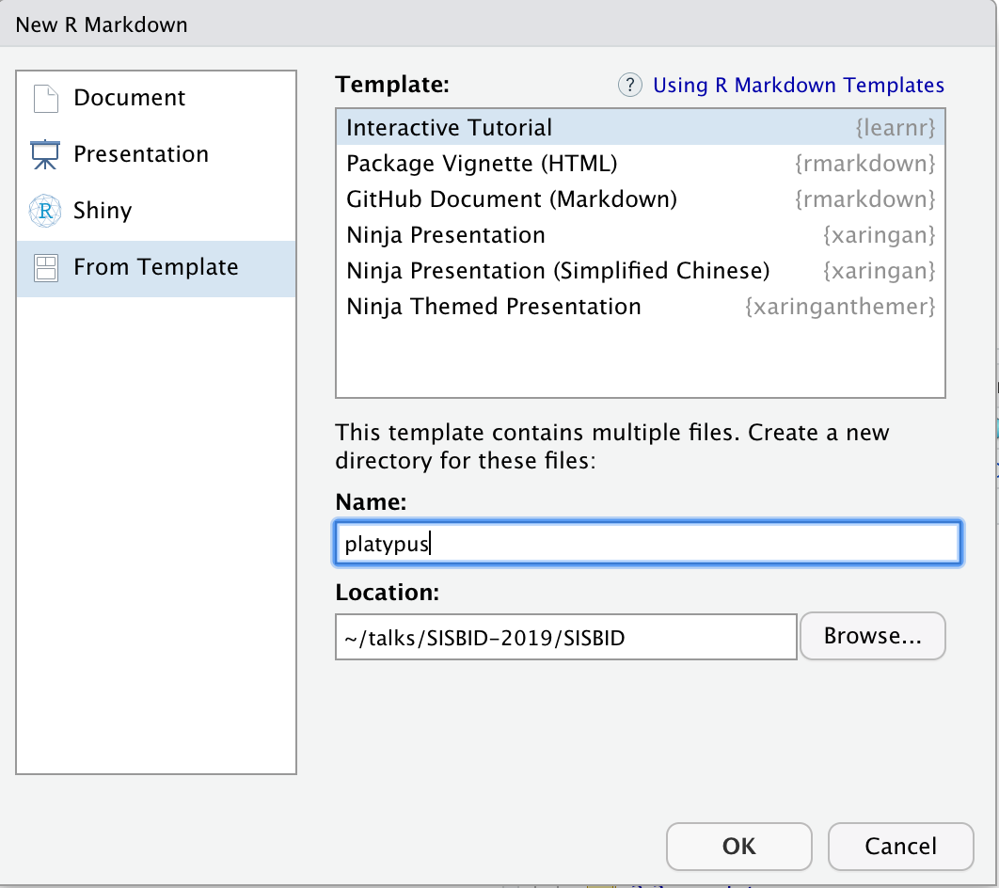
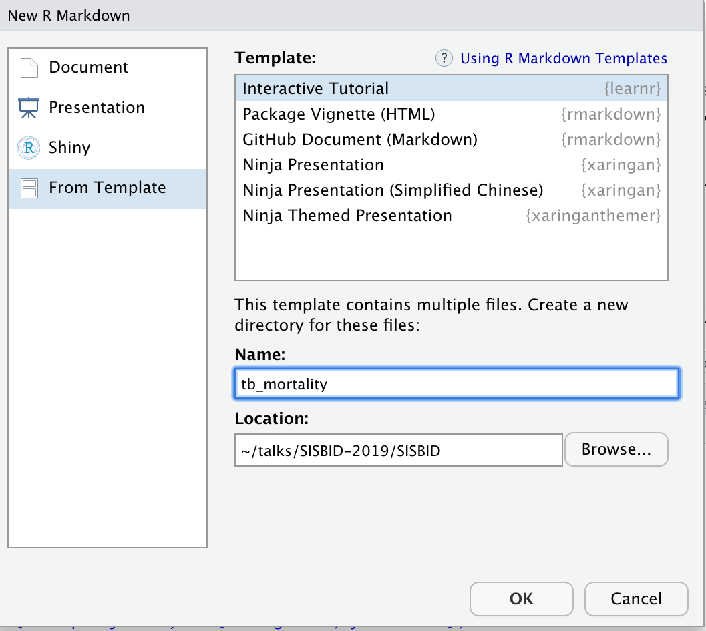

```{r echo = FALSE}
knitr::opts_chunk$set(
  message = FALSE,
  warning = FALSE,
  collapse = TRUE,
  comment = "#>",
  fig.height = 4,
  fig.width = 8,
  fig.align = "center",
  cache = FALSE
)
```

```{r load packages, echo=FALSE}
library(tidyverse)
library(ggmap)
library(plotly)
library(gganimate)
```

# Types of interactive documents

- tutorial using `learnr`
- flexdashboard
- shiny app

---
class: inverse middle

# Interactive tutorial

A set of notes with interactive plots, quizzes, and coding exercises.

---
# `learnr` interactive tutorial

.pull-left[
This is a really simple way to build your plots into an online document. It has some great features like interactive multiple choice quizzes, coding exercises, and can incorporate interactive shiny elements like scrollbars on plots.

To get started, make sure you have the `learnr` package installed on your computer.

```
install.packages("learnr")
```

Then create a "New R Markdown" document, "From Template", "Interactive Tutorial". 
]
.pull-right[

]
---
# Basic tutorial

- Check that the document compiles, by clicking `Run Document`
- Modify the title and author 

```
---
title: "TB Incidence Around the Globe"
author: "Di Cook"
output: learnr::tutorial
runtime: shiny_prerendered
---
```
---

- Set the first section to be a description of the data

```
## Data description

This is current tuberculosis data taken from [WHO](http://www.who.int/tb/country/data/download/en/), the case notifications table. It is read into R using this code:

tb <- read_csv(here::here("data/TB_notifications_2019-07-01.csv")) %>% 
  select(country, iso3, year, g_whoregion, new_sp_m04:new_sp_fu) %>%
  gather(stuff, count, new_sp_m04:new_sp_fu) %>%
  separate(stuff, c("stuff1", "stuff2", "sexage")) %>%
  select(-stuff1, -stuff2) %>%
  mutate(sex=substr(sexage, 1, 1), 
         age=substr(sexage, 2, length(sexage))) %>%
  select(-sexage) %>%
  filter(year > 1996, year < 2013) %>%
  filter(!(age %in% c("04", "014", "514", "u")))
```
---
# Writing the data description


.pull-left[
- Creating the tutorial produced a folder in your project.  
- Add a data directory to this folder, that contains the `TB_notifications_2019-07-01.csv` data.  This keeps your tutorial self-contained.

]
.pull-right[
- Add a code chunk to 
    - read in the TB data
    - plot the aggregated counts by region
    
`r anicon::nia("Remember to load the appropriate libraries", colour="#FA700A", anitype="hover")`

- Knit the document again
]

---
# Polishing the data description

Loading the libraries generates some messages and warnings on the page. This is good interactively, but it is distracting in the web page. 

```
## ── Attaching packages ──────────────────────────────────────────── tidyverse 1.2.1 ──
## ✔ ggplot2 3.2.0     ✔ purrr   0.3.2
## ✔ tibble  2.1.3     ✔ dplyr   0.8.3
...
## Google's Terms of Service: https://cloud.google.com/maps-platform/terms/.
## Please cite ggmap if you use it! See citation("ggmap") for details.
## Warning: Removed 619 rows containing missing values (geom_point).
```

We need to change the setup chunk options to turn these off:

```
library(learnr)
knitr::opts_chunk$set(
  echo = FALSE,
  message = FALSE, 
  warning = FALSE,
  error = FALSE)
```

---
# Building quizzes

An example quiz is provided in the template. Note that the format of the R code is 

- `quiz()` wraps a set of questions.
- `question()` contains the text of the question, and is coupled with multiple `answer()` elements with possible choices. 
- At least one of the answers needs to be noted as correct with `, correct = TRUE`. There can be more than one correct answer. 

```
quiz(
  question("Which package contains functions for installing other R packages?",
    answer("base"),
    answer("tools"),
    answer("utils", correct = TRUE),
    answer("codetools")
  )
)
```

`r anicon::nia("Try making a question about the TB data on the data description tab.", colour="#FA700A", anitype="hover")`


---
# Exercises in coding

Adding `exercise = TRUE` on a code chunk provides an R console window where readers can type R code, and check for correctness. The template provides several example exercises.

1. Move these into a second section of the document. 
2. Add a coding challenge that asks the reader to make a filter for the data to select just a single year. Click the "Run document" to make sure it works
3. Add a hint, "you want to use the filter function" 
4. Change the hint to a solution, that provides the correct code

---
# Adding a shiny element

Because this is an html document, interactive graphics can be incorporated. We'll add a section to use interactive plots to examine the temporal trend in TB incidence. 

```
library(plotly)
p <- tb %>% filter(iso3 == "IND") %>% 
  filter(!is.na(count)) %>%
  ggplot() + 
  geom_point(aes(x=year, y=count, colour=sex, frame=age, label=iso3)) +
  geom_smooth(aes(x=year, y=count, colour=sex, frame=age),  se=FALSE) + 
  scale_colour_brewer(palette = "Dark2") +
  ylim(c(0, 100000))
ggplotly(p)
```

---

```{r echo=FALSE, fig.width=10, fig.height=8, out.width="100%"}
tb <- read_csv(here::here("data/TB_notifications_2019-07-01.csv")) %>% 
  select(country, iso3, year, g_whoregion, new_sp_m04:new_sp_fu) %>%
  gather(stuff, count, new_sp_m04:new_sp_fu) %>%
  separate(stuff, c("stuff1", "stuff2", "sexage")) %>%
  select(-stuff1, -stuff2) %>%
  mutate(sex=substr(sexage, 1, 1), 
         age=substr(sexage, 2, length(sexage))) %>%
  select(-sexage) %>%
  filter(year > 1996, year < 2013) %>%
  filter(!(age %in% c("04", "014", "514", "u")))
p <- tb %>% filter(iso3 == "IND") %>% 
  filter(!is.na(count)) %>%
  ggplot() + 
  geom_point(aes(x=year, y=count, colour=sex, frame=age, label=iso3)) +
  geom_smooth(aes(x=year, y=count, colour=sex, frame=age),  se=FALSE) + 
  scale_colour_brewer(palette = "Dark2") +
  ylim(c(0, 100000))
ggplotly(p)
```

---
# Styling and cuteness

Use your emoji and anicon skills to add some friendly elements to the notes. 

```
set.seed(20190709)
emo::ji("fantasy")
emo::ji("clock")
```

```
anicon::nia("You've got 30 seconds!", colour="#FA700A", anitype="hover")
anicon::faa("hand-paper", animate="spin", grow=20, color="#B78ED2",
  position=c(0,0,0,200))
```
---
class: inverse middle

# Data dashboard

A `flexdashboard` is an Rmarkdown format shiny app. It adds more control over plot elements and is more focused on the data analysis than on a study or instructional materials. 

---
# Data dashboard 

.pull-left[
A `flexdashboard` allows you to create an interactive interface to a data set, that allows communicating a lot of information visually and numerically, and the flexibility for the user to explore their own choice of aspects of the data.

To get started, make sure you have the `flexdashboard` package installed on your computer.

```
install.packages("flexdashboard")
```
]
.pull-right[
Then create a "New R Markdown" document, "From Template", "Interactive Tutorial". 


]

---
# Basic dashboard

- Check that the document compiles, by clicking `Knit`
- Modify the title and author 

```
---
title: "TB incidence around the globe"
author: "by Di Cook"
output: 
  flexdashboard::flex_dashboard:
    orientation: columns
    vertical_layout: fill
---
```

---
# Components

.pull-left[
This creates a box or a pane for a plot or results

```
### Chart 1
```

This sets up columns

```
Column {data-width=600}
-------------------------------------
```
]
.pull-right[

## Your turn!

- Change the default layout in your flexdashboard to have two plots in the left column.
- Make each column equal width
- Pick four countries and create the interactive chart of temporal trend. (We used India in the learnr tutorial. You can copy this code, and choose another three.)
- Change the tab titles to reflect what country is displayed.
- Add several sentences on each pane about the data, and some things they should learn about TB incidence in that country.
]

---
# Adding pages and tabs

A new page (tab) can be added using

```
Page 1
===================================== 
```

Add a second page to your flexdashboard that focuses on one country and has

- a data table showing counts for year, age, sex 
- a facetted barchart of counts by year, by age and sex

---
# Resources

- [Introducing learnr, Garret Grolemund](https://blog.rstudio.com/2017/07/11/introducing-learnr/)
- [flexdashboard: Easy interactive dashboards for R](https://rmarkdown.rstudio.com/flexdashboard/)
- [R Markdown](https://rmarkdown.rstudio.com/)
- [Interactive web-based data visualization with R, plotly, and shiny, Carson Sievert](https://plotly-r.com/index.html)

---
# Share and share alike

<a rel="license" href="http://creativecommons.org/licenses/by-nc-sa/4.0/"></a><br />This work is licensed under a <a rel="license" href="http://creativecommons.org/licenses/by-nc-sa/4.0/">Creative Commons Attribution-NonCommercial-ShareAlike 4.0 International License</a>.
