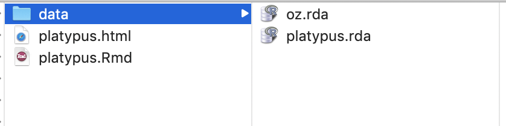

```{r echo = FALSE}
knitr::opts_chunk$set(
  message = FALSE,
  warning = FALSE,
  collapse = TRUE,
  comment = "#>",
  fig.height = 4,
  fig.width = 8,
  fig.align = "center",
  cache = FALSE
)
```

```{r echo=FALSE}
library(ggplot2)
library(tidyr)
library(dplyr)
library(lubridate)
library(scales)
library(readr)
library(ggmap)
library(HLMdiag)
library(RColorBrewer)
library(gridExtra)
library(plotly)
library(gganimate)
```

# Types of interactive documents

- tutorial using `learnr`
- flexdashboard
- shiny app

---
# `learnr` interactive tutorial

This is a really simple way to build your plots into an online document. It has some great features like interactive multiple choice quizzes, coding exercises, and can incorporate interactive shiny elements like scrollbars on plots.

To get started, make sure you have the `learnr` package installed on your computer.

```
install.packages("learnr")
```

Then create a "New R Markdown" document, "From Template", "Interactive Tutorial". 


---
# Basic tutorial

- Check that the document compiles, by clicking `Run Document`
- Modify the title and author 

```
---
title: "Where do I find a platypus in Australia"
subtitle: "outside of the zoo"
author: "Di Cook"
output: learnr::tutorial
runtime: shiny_prerendered
---
```

- Set the first section to be a description of the data

```
## Data description

The platypus is a very strange animal, one of just two mammals in the worl to lay eggs! They are found exclusively in Australia. 

The data used in this tutorial is downloaded from [Atlas of Living Australia](https://www.ala.org.au), using this code:

library(ALA4R)
l <- specieslist("platypus")
platypus <- occurrences("Ornithorhynchus anatinus", download_reason_id=10)
save(platypus, file="data/platypus.rda")
```
---
# Writing the data description

- Creating the tutorial produced a folder in your project.  
- Add a data directory to this folder, that contains the `platypus.rda` and the `oz.rda` data.  



- Add a code chunk to 
    - read in the platypus data
    - read in the map data
    - plot the sightings on the map
    
`r anicon::nia("Remember to load the appropriate libraries", colour="#FA700A", anitype="hover")`

- Knit the document again

---
# Polishing the data description

Loading the libraries generates some messages and warnings on the page. This is good interactively, but it is distracting in the web page. 

```
## ── Attaching packages ──────────────────────────────────────────── tidyverse 1.2.1 ──
## ✔ ggplot2 3.2.0     ✔ purrr   0.3.2
## ✔ tibble  2.1.3     ✔ dplyr   0.8.3
...
## Google's Terms of Service: https://cloud.google.com/maps-platform/terms/.
## Please cite ggmap if you use it! See citation("ggmap") for details.
## Warning: Removed 619 rows containing missing values (geom_point).
```

We need to change the setup chunk options to turn these off:

```
library(learnr)
knitr::opts_chunk$set(
  echo = FALSE,
  message = FALSE, 
  warning = FALSE,
  error = FALSE)
```

---
# Building quizzes

An example quiz is provided in the template. Note that the format of the R code is 

- `quiz()` wraps a set of questions.
- `question()` contains the text of the question, and is coupled with multiple `answer()` elements with possible choices. 
- At least one of the answers needs to be noted as correct with `, correct = TRUE`. There can be more than one correct answer. 

```
quiz(
  question("Which package contains functions for installing other R packages?",
    answer("base"),
    answer("tools"),
    answer("utils", correct = TRUE),
    answer("codetools")
  )
)
```

`r anicon::nia("Try making a question about the platypus data on the data description tab.", colour="#FA700A", anitype="hover")`


---
# Exercises in coding

Adding `exercise = TRUE` on a code chunk provides an R console window where readers can type R code, and check for correctness. The template provides several example exercises.

1. Move these into a second section of the document. 
2. Add a coding challenge that asks the reader to make a filter for the data to select just the platypus sightings since 2010. Click the "Run document" to make sure it works
3. Add a hint, "you want to use the filter function" 
4. Change the hint to a solution, that provides the correct code

---
# Adding a shiny element

---
# Styling and cuteness

---
# Progressive reveal


---
# Resources

- [Introducing learnr, Garret Grolemund](https://blog.rstudio.com/2017/07/11/introducing-learnr/)

---
# Share and share alike

<a rel="license" href="http://creativecommons.org/licenses/by-nc-sa/4.0/"></a><br />This work is licensed under a <a rel="license" href="http://creativecommons.org/licenses/by-nc-sa/4.0/">Creative Commons Attribution-NonCommercial-ShareAlike 4.0 International License</a>.
