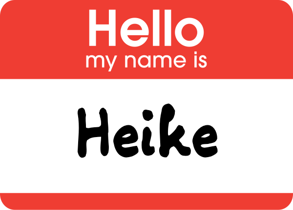
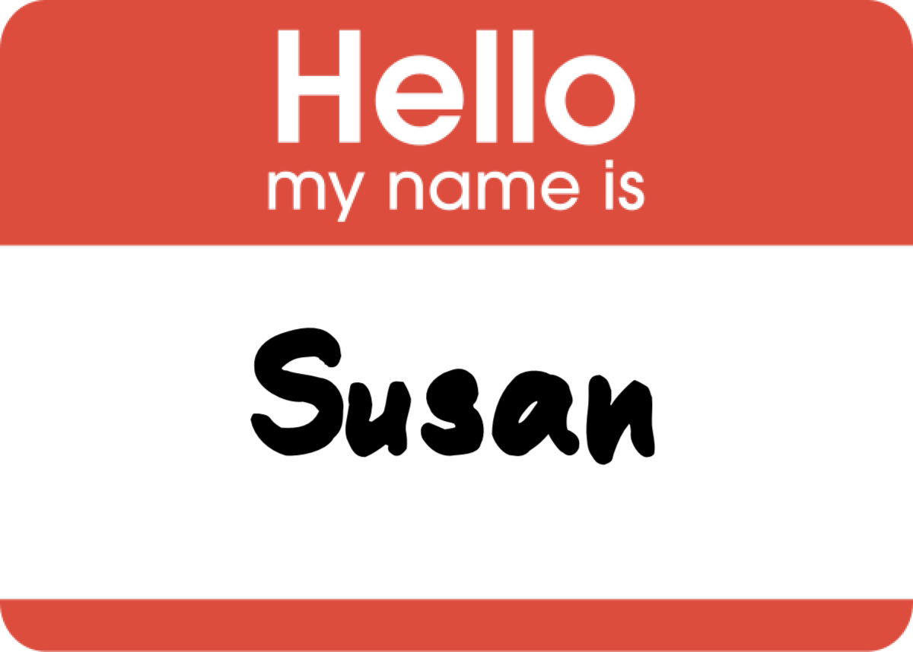
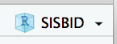
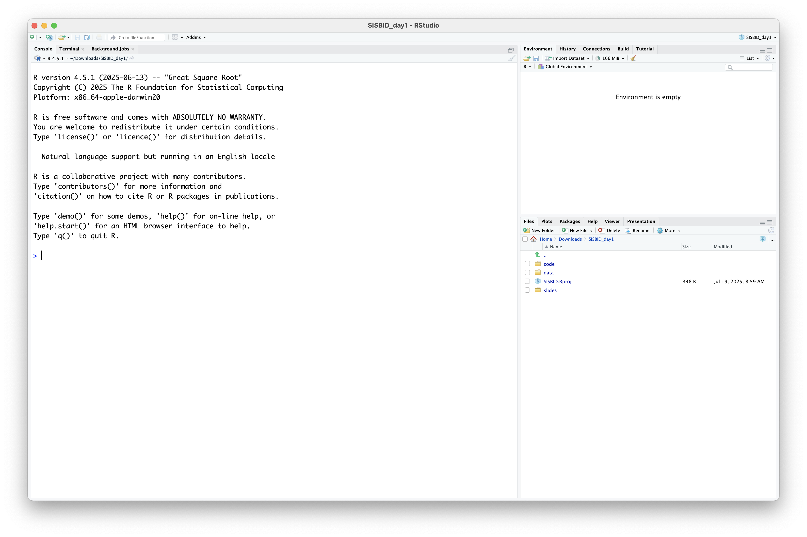

```{r}
#| echo: false
#| message: false
#| warning: false
#| warning: false
knitr::opts_chunk$set(
  message = FALSE,
  warning = FALSE,
  error = FALSE, 
  collapse = TRUE,
  comment = "",
  fig.height = 8,
  fig.width = 12,
  fig.align = "center",
  cache = FALSE,
  echo=TRUE
)
```

```{r}
#| eval: false
#| echo: false
# THIS CODE IS NOT TO BE RUN
# These packages are only used to make the slides prettier
install.packages("remotes")
remotes::install_github("hadley/emo")
remotes::install_github("mitchelloharawild/icons")
remotes::install_github("emitanaka/anicon")
remotes::install_github("dicook/gretchenalbrecht")
remotes::install_github("gadenbuie/countdown")
```
##

{width="80%"}

##

{width="80%"}

##

{width="80%"}

## Interactive Sessions

We will be using breakout rooms throughout the class

-   4-6 people in each room
-   at the end of the time you will be 'zoomed back' into the main session
-   ... if you get disconnected, just log back into the Zoom session and we will get you back to your group.

<br> Let's try this!

## Your turn: meet the class! `r set.seed(20190709); emo::ji("fantasy")` `r set.seed(20190712); emo::ji("fantasy")` `r set.seed(20190711); emo::ji("fantasy")` {.inverse}

We are going to break into three groups, you'll be with either Heike, Susan and Di.

Find out:

1. What is your favorite data plot?
2. What are you hoping to learn from this workshop?
3. What type of data are you often working with?
4. Is there some analysis task that you have found really hard?

::: {.content-visible when-format="revealjs"}
`r countdown::countdown(5)` [You've got 5 minutes - timer is running!]{.yellow}
:::

## Datavis module logistics {.smaller}

-   Website: <https://dicook.github.io/SISBID/>
-   Zoom
    -   Sessions will be recorded and links will be made available via Slack
    -   Please remember to mute when not speaking
    -   In case of bandwidth issues, try turning off your camera
-   Questions
    -   Zoom chat and Slack are both good places to ask questions
-   R cloud link available from website & slack in case of technical problems

## Your turn: Course materials {.inverse .middle}

::: {.smaller}
All materials at <https://github.com/dicook/SISBID>

- __Download__ `SISBID_day1.zip` (a zip archive). This contains all 
    - the code files, 
    - `qmd` files, 
    - and data for day 1 of this workshop. 
- __Unzip the file__ Windows user: use **extract**, don't just double-click
- __Double-click__ `SISBID.Rproj`. The R project helps organise your work over these next few days. 
:::

## What's in the zip?

-   `.R` file of code, one for each module of the course, use this to follow along
-   `data` folder containing data sets used in the course
-   `SISBID.Rproj` for starting RStudio in your course working directory

`r anicon::nia("Please run, edit and change the code as we go! Experiment, break and fix.", colour="#B78ED2", anitype="hover")`

## Check your R setup

> ["If R were an airplane, RStudio would be the airport"\
> [Julie Lowndes, Openscapes](http://jules32.github.io/resources/RStudio_intro/)]{.orange}

{width="200%"}

## R package locations:

CRAN

```{r}
#| eval: false
install.packages("nullabor")
```

Bioconductor

```{r}
#| eval: false
if (!requireNamespace("BiocManager", quietly = TRUE))
    install.packages("BiocManager")

BiocManager::install("bigPint")
```

Github

```{r}
#| eval: false
remotes::install_github("wmurphyrd/fiftystater")
```

[Code to install all packages required for the course](../r-pkg-deps.R) is available on course website. 

## Resources

-   [RStudio cheatsheets](https://www.rstudio.com/resources/cheatsheets/)
-   Q/A site: <http://stackoverflow.com>

::: bottom
[<a rel="license" href="http://creativecommons.org/licenses/by-nc-sa/4.0/"></a> This work is licensed under a <a rel="license" href="http://creativecommons.org/licenses/by-nc-sa/4.0/">Creative Commons Attribution-NonCommercial-ShareAlike 4.0 International License</a>.]{style="display:inline-block;"}
:::
