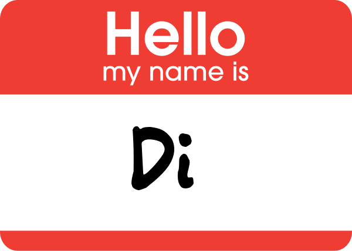

```{r, echo = FALSE, message = FALSE, warning = FALSE, warning = FALSE}
source(here::here("knitr-setup.R"))
```


class: hide-count

<center>

</center>

---
class: hide-count

<center>

</center>

---
class: hide-count

<center>

</center>

---
class: inverse middle  hide-count
# Your turn: meet the class!

`r set.seed(20190709); emo::ji("fantasy")` `r set.seed(20190712); emo::ji("fantasy")` `r set.seed(20190711); emo::ji("fantasy")`

We are going to break into three groups, you'll be with either Heike, Susan and Di.

In this group we'd like you to answer the following questions:

1. What is your favorite data plot?
2. What are you hoping to learn from this workshop?
3. What type of data are you often working with?
4. Is there some analysis task that you have found really hard?

`r anicon::faa("hand-paper", animate="spin", grow=20, color="#B78ED2", position=c(0,0,0,200))` `r anicon::faa("handshake", animate="shake", grow=20, color="#F33816", position=c(0,0,0,250))` `r anicon::faa("hand-spock", animate="wrench", grow=20, color="#0774E4", position=c(0,0,0,300))`


.large[.yellow[We've got 5 minutes for this!]]

`r countdown::countdown(5)`

---
# Datavis module logistics

Website

- https://dicook.github.io/SISBID/

Zoom

- We are using zoom for the sessions - sessions will be recorded and links will be made available.
- Please remember to mute yourself when you don't speak 
- In case you are having trouble with bandwidth consider to turn off the camera

Asking questions

- You can ask questions in Zoom
- We are also using slack for questions

<!-- R cloud setup -->

<!-- - R cloud link available from website & slack in case of technical problems -->

---
class: inverse middle 
# Your turn: Course materials

.large[All materials are available from [https://github.com/dicook/SISBID](https://github.com/dicook/SISBID)]

- __Download__ `SISBID_day1.zip` (a zip archive). This contains all 
    - the code files, 
    - Rmarkdown files, 
    - and data for day 1 of this workshop. 
- __Unzip the file__ Windows user: use **extract**, don't just double-click
- __Double-click__ `SISBID.Rproj`. The R project helps organise your work over these next few days. 


---
# What's in the zip?

- `r anicon::nia(".r file of code, one for each module of the course, use this to follow along", colour="#FA700A", anitype="hover")`
- `data` folder containing data sets used in the course
- `SISBID.Rproj` for starting RStudio in your course working directory

<br><br>

.large[`r anicon::nia("Please run, edit and change the code as we go! Experiment, break and fix.", colour="#B78ED2", anitype="hover")`]

---
class: middle


**Check your R setup**

.orange["If R were an airplane, RStudio would be the airport"] [Julie Lowndes, Openscapes](http://jules32.github.io/resources/RStudio_intro/)


---
# Refresher

The three main locations that we will draw packages from are CRAN, Bioconductor and github.

From CRAN

```{r eval=FALSE}
install.packages("nullabor")
```


From bioconductor

```{r eval=FALSE}
if (!requireNamespace("BiocManager", quietly = TRUE))
    install.packages("BiocManager")

BiocManager::install("ggbio")
```

From github repos

```{r eval=FALSE}
remotes::install_github("lindsayrutter/bigPint")
```

---
# List of packages

Do you have these packages installed? (Note: this list is from the course website https://dicook.github.io/SISBID/)

```{r eval=FALSE}
# CRAN packages
packages <- c("tidyr", "dplyr", "readr", "ggplot2", "stringr", "ggmap", "here", "leaflet", "lubridate", 
              "plotly", "RColorBrewer", "gridExtra", "dichromat", "conflicted", "scales", "broom", 
              "broom.mixed", "lme4", "GGally", "palmerpenguins", "corrgram", "tourr", "htmltools", 
              "ggthemes", "maps", "viridis", "nullabor", "splitstackshape", "forecast", "readxl", 
              "MASS", "datasauRus", "cranlogs", "gapminder", "shiny", "shinydashboard", "learnr", 
              "ggmosaic", "gganimate", "remotes", "mapproj")

install.packages(packages, dep=TRUE, repos = "https://cloud.r-project.org/")

# github packages
remotes::install_github("lindsayrutter/bigPint")
remotes::install_github("wmurphyrd/fiftystater")
remotes::install_github("heike/vinference")
remotes::install_github("hollylkirk/ochRe")

# For sharing web apps, 
# but you need adminstrator rights to your computer:

install.packages("rsconnect")
```

---
# Resources


- [posit cheatsheets](https://posit.co/resources/cheatsheets/)
- Q/A site: [http://stackoverflow.com](http://stackoverflow.com)

---
# Share and share alike

Materials for this workshop build on slides provided by several people, but primarily Hadley Wickham and Carson Sievert. 

<a rel="license" href="http://creativecommons.org/licenses/by-nc-sa/4.0/"></a><br />This work is licensed under a <a rel="license" href="http://creativecommons.org/licenses/by-nc-sa/4.0/">Creative Commons Attribution-NonCommercial-ShareAlike 4.0 International License</a>.
