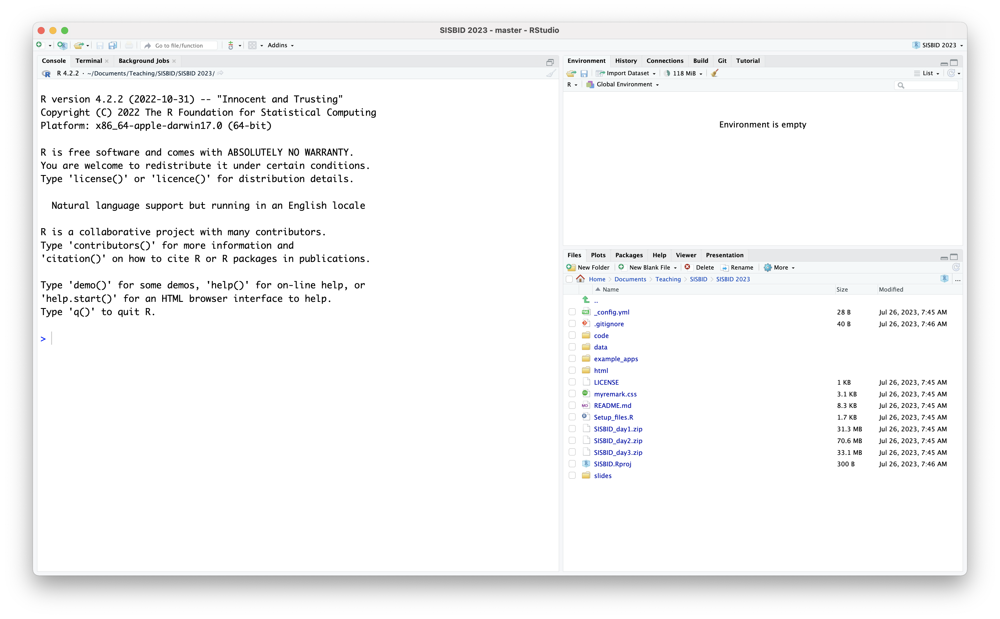

```{r, echo = FALSE, message = FALSE, warning = FALSE, warning = FALSE}
knitr::opts_chunk$set(
  message = FALSE,
  warning = FALSE,
  error = FALSE, 
  collapse = TRUE,
  comment = "",
  fig.height = 8,
  fig.width = 12,
  fig.align = "center",
  cache = FALSE
)
```

```{r eval=FALSE, echo=FALSE}
# THIS CODE IS NOT TO BE RUN
# These packages are only used to make the slides prettier
install.packages("remotes")
install.packages("xaringan")
remotes::install_github("hadley/emo")
remotes::install_github("mitchelloharawild/icons")
remotes::install_github("emitanaka/anicon")
remotes::install_github("dicook/gretchenalbrecht")
remotes::install_github("gadenbuie/countdown")
```

class: hide-count

<center>

</center>

---
class: hide-count

<center>

</center>

---
# Talking to people in  the class

We will be using breakout rooms throughout the class

4-6 people in each room

at the end of the time you will be 'zoomed back' into the main session


... in cases you get disconnected, just log back into the Zoom session and we get you back to your group.

<br><br><br><br><br>
Let's try this!


---
class: inverse middle  hide-count
# Your turn: meet the class!

`r set.seed(20190709); emo::ji("fantasy")` `r set.seed(20190712); emo::ji("fantasy")` `r set.seed(20190711); emo::ji("fantasy")`

Introduce yourself to the people around you. Find out a little about them: where they come from, why they chose to do the workshop, what sort of data they usually work with, whether they have used R before, and a fun fact! 

`r anicon::faa("hand-paper", animate="spin", grow=20, color="#B78ED2", position=c(0,0,0,200))` `r anicon::faa("handshake", animate="shake", grow=20, color="#F33816", position=c(0,0,0,250))` `r anicon::faa("hand-spock", animate="wrench", grow=20, color="#0774E4", position=c(0,0,0,300))`


.large[.yellow[You've got 5 minutes - timer is running!]]

`r countdown::countdown(5)`

---
# Datavis module logistics

Website

- https://dicook.github.io/SISBID/

Zoom

- We are using zoom for the sessions - sessions will be recorded and links will be made available.
- Please remember to mute yourself when you don't speak 
- In case you are having trouble with bandwidth consider to turn off the camera

Asking questions

- You can ask questions in Zoom
- We are also using slack for questions

R cloud setup

- R cloud link available from website & slack in case of technical problems

---
class: inverse middle 
# Your turn: Course materials

.large[All materials are available from [https://github.com/dicook/SISBID](https://github.com/dicook/SISBID)]

- __Download__ `SISBID_day1.zip` (a zip archive) of the workshop files which contains all the code files, Rmarkdown files, and data for day 1 of this workshop. __Unzip the file__.
- __Double-click__ `SISBID.Rproj`. The R project helps organise your work over these next few days. 


---
# What's in the zip?

- `r anicon::nia(".r file of code, one for each module of the course, use this to follow along", colour="#FA700A", anitype="hover")`
- `data` folder containing data sets used in the course
- `SISBID.Rproj` for starting RStudio in your course working directory

<br><br>

.large[`r anicon::nia("Please run, edit and change the code as we go! Experiment, break and fix.", colour="#B78ED2", anitype="hover")`]

---
class: middle


**Check your R setup**

.orange["If R were an airplane, RStudio would be the airport"] [Julie Lowndes, Openscapes](http://jules32.github.io/resources/RStudio_intro/)



---
# Refresher

The three main locations that we will draw packages from are CRAN, Bioconductor and github.

From CRAN

```{r eval=FALSE}
install.packages("ggenealogy")
```


From bioconductor

```{r eval=FALSE}
if (!requireNamespace("BiocManager", quietly = TRUE))
    install.packages("BiocManager")

BiocManager::install("bigPint")
```

From github repos

```{r eval=FALSE}
remotes::install_github("heike/vinference")
```

---
# List of packages

Do you have these packages installed?

```{r eval=FALSE}
# CRAN packages
packages <- c("tidyverse", "ggmap", "RColorBrewer", "gridExtra", "dichromat", 
              "janitor", "forcats", "ggthemes", "here", "wordcloud", "lubridate", 
              "plotly", "broom", "GGally", "gapminder", "nullabor", "shiny", 
              "ggenealogy", "ggmosaic", "HLMdiag",  "gganimate", "remotes",
              "naniar", "htmltools", "mapproj", "leaflet", "broom.mixed", "lme4")

install.packages(packages, dep=TRUE, repos = "https://cloud.r-project.org/")

# github packages
remotes::install_github("wmurphyrd/fiftystater")
```

---
# Resources


- [RStudio cheatsheets](https://www.rstudio.com/resources/cheatsheets/)
- Q/A site: [http://stackoverflow.com](http://stackoverflow.com)

---
# Share and share alike

Materials for this workshop build on slides provided by several people, but primarily Hadley Wickham and Carson Sievert. 

<a rel="license" href="http://creativecommons.org/licenses/by-nc-sa/4.0/"></a><br />This work is licensed under a <a rel="license" href="http://creativecommons.org/licenses/by-nc-sa/4.0/">Creative Commons Attribution-NonCommercial-ShareAlike 4.0 International License</a>.
