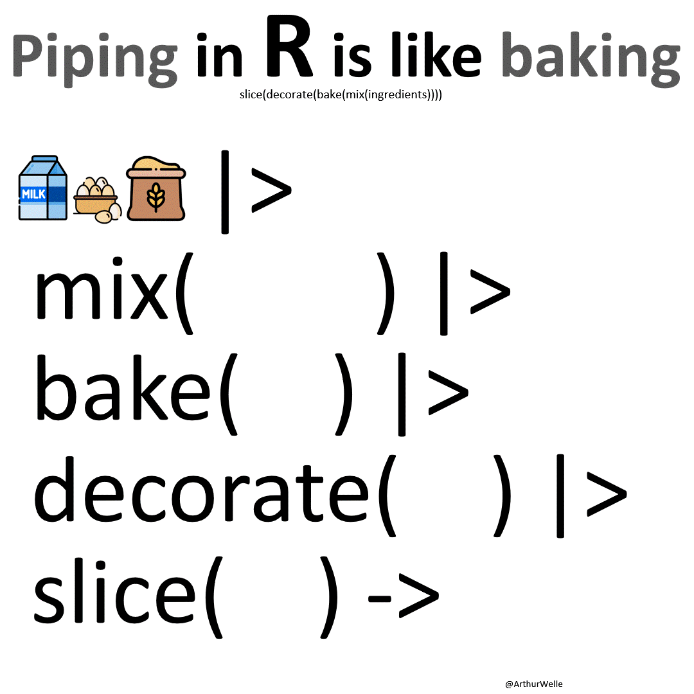

```{r setup}
#| echo: false
#| message: false
#| warning: false
source(here::here("knitr-setup.R"))
source(here::here("libraries.R"))
```

# Using `tidyr`, `dplyr`
::: columns
::: {.column  width="90%"}

- Writing readable code using **pipes**
- What is **tidy data**? Why do you want tidy data? Getting your data into tidy form using tidyr.
- Reading different **data formats**
- String operations, working with **text**

:::
::: {.column width="10%"}


:::
:::

## The pipe operator `%>%` or `|>`

::: columns
::: {.column width="70%"}
- read as `then` 
- `x %>% f(y)` and `x |> f(y)` is the same as `f(x, y)`
- `%>%` is part of the `dplyr` package (really, `magrittr`), 
`|>` is part of base R 
- pipes structure code as *sequence of operations* -- as opposed to function order `g(f(x))`
:::

::: {.column width="30%"}

:::
:::

## The pipe operator `%>%` or `|>`

- `%>%` is part of `dplyr` package (or more precisely, the `magrittr` package)
- R 4.1 introduced the `|>` base pipe (no package necessary)
- An explanation of the (subtle) differences between the pipes can be found [here](https://towardsdatascience.com/understanding-the-native-r-pipe-98dea6d8b61b)

## Pipe Example

<div style="font-size: 85%;">

::: panel-tabset
### Using `%>%` {-}
```{r}
#| include: false

library(readr)
```

```{r}
#| label: read TB incidence data and check
#| results: hide
tb <- read_csv(here::here("data/TB_notifications_2026-07-20.csv"))
tb   %>%                                # first we get the tb data
  filter(year == 2024) %>%              # then we focus on the most recent year
  group_by(country) %>%                 # then we group by country
  summarize(
    cases = sum(c_newinc, na.rm=TRUE)   # to create a summary of all new cases
    ) %>%
  arrange(desc(cases))                  # then we sort countries to show highest number of new cases first
```

### Using `|>` {-}
```{r}
#| label: read TB incidence data and check base pipe
#| results: hide
tb <- read_csv(here::here("data/TB_notifications_2026-07-20.csv"))
tb |>                                  # first we get the tb data
  filter(year == 2024) |>              # then we focus on the most recent year
  group_by(country) |>                 # then we group by country
  summarize(
    cases = sum(c_newinc, na.rm=TRUE)   # to create a summary of all new cases
    ) |> 
  arrange(desc(cases))                  # then we sort countries to show highest number new cases first
```

:::


```{r}
#| label: show-results
#| echo: false
tb <- read_csv(here::here("data/TB_notifications_2026-07-20.csv"))
tb |>                                   # first we get the tb data
  filter(year == 2024) |>               # then we focus on the most recent year
  group_by(country) |>                  # then we group by country
  summarize(
    cases = sum(c_newinc, na.rm=TRUE)   # to create a summary of all new cases
    ) |> 
  arrange(desc(cases))                  # then we sort countries to show highest number of new cases first
```

</div>

## What is tidy data? 

::: columns

::: {.column width="30%"}
](images/tidy-quote.jpg){width="100%"}
:::

::: {.column width="70%"}

- What do we expect tidy data to look like?
- maybe easier: what are sources of messiness?
:::

:::

##  `r set.seed(20190709); emo::ji("fantasy")` `r set.seed(20190712); emo::ji("fantasy")` `r set.seed(20190711); emo::ji("fantasy")` **TWO MINUTE CHALLENGE** {.inverse}

- What are aspects of messiness in data that you have encountered?

Go to menti.com and enter code 6630 2740

##

<div style='position: relative; padding-bottom: 56.25%; padding-top: 35px; height: 0; overflow: hidden;'><iframe sandbox='allow-popups allow-scripts allow-same-origin allow-presentation' allowfullscreen='true' allowtransparency='true' frameborder='0' height='315' src='https://www.mentimeter.com/app/presentation/aljjh6s6sxadt9kzy8uqz2824d3ezhuo/embed' style='position: absolute; top: 0; left: 0; width: 100%; height: 100%;' width='420'></iframe></div>

## Varying degree of messiness

<div style="font-size: 85%;">

::: panel-tabset
### Cryptic Names


What are the variables? Where are they located?

```{r}
#| label: example 1 What are the variables
#| echo: false
grad <- read_csv(here::here("data/graduate-programs.csv"))
head(grad[c(2,3,4,6)])
```

::: notes
in the columns, subject, Inst, AvNumPubs, ...
:::

### More cryptic

What's in the column names of this data? What are the experimental units? What are the measured variables?

```{r}
#| label: example 2 whats in the column names
#| echo: false
genes <- read_csv(here::here("data/genes.csv"))
head(genes)
```

::: notes
the experimental design is coded into the variable names, genotype:WI/WM, time:6/12, rep:1/2/4
:::


### Most

What are the variables? What are the records?

```{r}
#| label: example 3 what are the variables and records
#| echo: false
melbtemp <- read.fwf(here::here("data/ASN00086282.dly"), 
   c(11, 4, 2, 4, rep(c(5, 1, 1, 1), 31)), fill=T)
head(melbtemp[,c(1,2,3,4,seq(5,100,4))])
```

::: notes
variables are TMAX, TMIN, PRCP, year, month, day, stationid. 

Each row contains the values for one month!
:::

### Too_much_info

What are the variables? What are the experimental units?

```{r}
#| label: example 4 what are the variables and experimental units
#| echo: false
tb <- read_csv(here::here("data/tb.csv"))
tail(tb)
#colnames(tb)
```

### Tables

What are the variables? What are the observations?

```{r}
#| label: example 4 what are the variables and observations
#| echo: false
pew <- read.delim(
  file = "http://stat405.had.co.nz/data/pew.txt",
  header = TRUE,
  stringsAsFactors = FALSE,
  check.names = F
)
pew[1:5, 1:5]
```


### Gross on repeat

10 week sensory experiment, 12 individuals assessed taste of french fries on several scales (how potato-y, buttery, grassy, rancid, paint-y do they taste?), fried in one of 3 different oils, replicated twice. 

First few rows:

```{r}
#| label: example 6 what are the factors measurements and experimental units
#| echo: false
load(here::here("data/french_fries.rda"))
head(french_fries, 4)
```

What is the experimental unit? What are the factors of the experiment? What was measured? What do you want to know?

:::

</div>

## Messy data patterns

There are various features of messy data that one can observe in practice. Here are some of the more commonly observed patterns:

- Column headers are not just variable names, but also contain values
- Variables are stored in both rows and columns, contingency table format
- One type of experimental unit stored in multiple tables
- Dates in many different formats

## Tidy Data Conventions

1. Data is contained in a single table
2. Each observation forms a row (no data info in column names)
3. Each variable forms a column (no mashup of multiple pieces of information)


## Long and Wide

- Long form: **one** measured value per row. All other variables are descriptors (key variables) - good for modelling, terrible for most other analyses, e.g. correlation matrix

- Widest form: **all** measured values for an entity are in a single row. 

- Wide form: measurements are arranged by *some of the descriptors* in columns (for direct comparisons)


##

](images/tidy-workflow-assembly.jpg)


## Tidy verbs

- `pivot_longer`: get information out of names into columns 
- `pivot_wider`: make columns of observed data for levels of design variables (for comparisons)
- `separate`/`unite`: split and combine columns
- `nest`/`unnest`: make/unmake variables into sub-data frames of a list variable

## Pivot to long form

::: columns
::: {.column width=80%}

```
data |> pivot_longer(cols, names_to = "name", values_to = "value", ...)
```

- `pivot_longer` turns a wide format into a long format

- two new variables are introduced (in key-value format): **name** and **value**

- `col` defines which variables should be combined
:::
::: {.column width=20%}

[tidyr cheat sheet](https://rstudio.github.io/cheatsheets/tidyr.pdf)

](https://github.com/gadenbuie/tidyexplain/raw/main/images/tidyr-pivoting.gif)
:::
:::
  


## Pivoting: an example

```{r}
#| label: setup a simple example
#| echo: false
dframe <- data.frame(id = 1:2, trtA=c(2.5,4.6), trtB = c(45, 35))
```


```{r}
#| label: gather the example data into long form
# wide format
dframe

# long format
dframe |> pivot_longer(trtA:trtB, names_to="treatment", values_to="outcome")
```

## Variable Selectors

- `data |> pivot_longer(cols, names_to = "key", values_to = "value", ...)`

- `cols` argument identifies variables that should be combined.

- **Pattern Selectors** can be used to identify variables by **name**, **position**, a range (using `:`), a pattern, or a combination of all.

## Examples of pattern selectors

  - `starts_with(match, ignore.case = TRUE, vars = NULL)`

  - other select functions: `ends_with`, `contains`, `matches`.

  - For more details, see `?tidyselect::language`


## TB notifications
  
New notifications of TB have the form `new_sp_<sex><age group>`:
  
```{r}
#| label: read in and process the TB data
read_csv(here::here("data/TB_notifications_2026-07-20.csv")) |> 
  dplyr::select(country, iso3, year, starts_with("new_sp_")) |>
  na.omit() |>
  head()
```

## Pivot Longer: TB notifications
  
create two new variables: `name` and `value`

- `name` contains all variable names starting with "new_sp_" 
- `value` contains all values of the selected variables
  
```{r}
#| label: turn TB data into long form
tb1 <- read_csv(here::here("data/TB_notifications_2026-07-20.csv")) |> 
  dplyr::select(country, iso3, year, starts_with("new_sp_")) |>
  pivot_longer(starts_with("new_sp_")) 

tb1 |> na.omit() |> head()
```

## Separate columns
  
```
data |> separate_wider_delim (col, delim, names, ...)
```

- split column `col` from data frame `frame` into a set of columns as specified in `names`
- `delim` is the delimiter at which we split into columns, splitting separator. 


## Separate TB notifications
  
Work on `name`: 
  
```{r}
#| label: extract variable names from original column names
tb2 <- tb1 |>
  separate_wider_delim(
    name, delim = "_", 
    names=c("toss_new", "toss_sp", "sexage")) 

tb2 |> na.omit() |> head()
```

## Separate columns
  
`data %>%  separate_wider_position(col, widths, ...)`

- split column `col` from `frame` into a set of columns specified in `widths`
- `widths` is named numeric vector where the names become column names; unnamed components will be matched but not included. 

## Separate TB notifications again
  
Now split `sexage` into first character (m/f) and rest.

  
```{r}
#| label: continue extracting variable names
tb3 <- tb2 %>% dplyr::select(-starts_with("toss")) |> # remove the `toss` variables
  separate_wider_position(
    sexage,
    widths = c(sex = 1, age = 4),
    too_few = "align_start"
  )

tb3 |> na.omit() |> head()
```


## Your turn {.inverse}

Read the genes data from folder `data`. Column names contain data and are kind of messy. 

```{r}
genes <- read_csv(here::here("data/genes.csv"))

names(genes)
```

Produce the data frame called `gtidy` as shown below:

```{r}
#| label: code solution to genes wrangling
#| echo: false
gtidy <- genes |>
pivot_longer(-id, names_to="variable", values_to="expr") |>
separate_wider_delim(variable, names=c("trt", "leftover"), delim = "-") |>
separate_wider_delim(leftover, names=c("time", "rep"), delim = ".") |>
mutate(trt = sub("W", "", trt)) |>
mutate(rep = sub("R", "", rep))
```

```{r}
head(gtidy)
```

<!-- Break into zoom rooms, clock is ticking `r emo::ji("smile")` -->
<!-- `r countdown::countdown(10)` -->

## Plot the genes data overlaid with group means

::: columns
::: column
```{r}
#| label: compute group means
#| fig-show: hide
gmean <- gtidy |> 
  group_by(id, trt, time) |> 
  summarise(expr = mean(expr))
gtidy |> 
  ggplot(aes(x = trt, y = expr, colour=time)) +
  geom_point() +
  geom_line(data = gmean, aes(group = time)) +
  facet_wrap(~id) +
  scale_colour_brewer("", palette="Set1")
```
:::
::: column
```{r}
#| label: plot the genes data overlais with group means
#| echo: false
#| fig-width: 5
#| fig-height: 5
gtidy |> 
  ggplot(aes(x = trt, y = expr, colour=time)) +
  geom_point() +
  geom_line(data = gmean, aes(group = time)) +
  facet_wrap(~id) +
  scale_colour_brewer("", palette="Set1")
```
:::
:::

## Resources

- [The tidy tools manifesto](https://cran.r-project.org/web/packages/tidyverse/vignettes/manifesto.html)
- [Posit cheatsheets](https://posit.co/resources/cheatsheets/)
- [Wickham (2007) Reshaping data](https://www.jstatsoft.org/article/view/v021i12)
- [broom vignettes, David Robinson](https://cran.r-project.org/web/packages/broom/vignettes/broom.html)


::: bottom
<span style="display:inline-block;"><a rel="license" href="http://creativecommons.org/licenses/by-nc-sa/4.0/"></a></span><span style="display:inline-block;"> This work is licensed under a <a rel="license" href="http://creativecommons.org/licenses/by-nc-sa/4.0/">Creative Commons Attribution-NonCommercial-ShareAlike 4.0 International License</a>.</span>
:::
