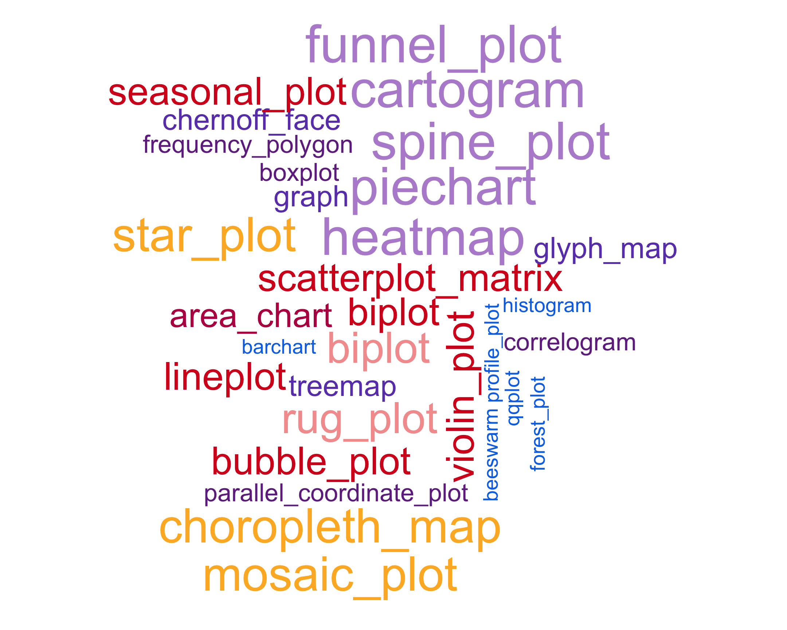

```{r, echo = FALSE, message = FALSE, warning = FALSE, warning = FALSE}
# source(here::here("knitr-setup.R"))
# source(here::here("libraries.R"))
library(readr)
library(here)
library(dplyr)
library(tidyr)
library(stringr)
library(ggplot2)
library(dichromat)
library(scales)
library(RColorBrewer)
theme_set(theme_bw())

data(diamonds, package="ggplot2")
diamonds <- diamonds |>
  mutate(clarity = factor(clarity, levels = c("I1", "SI2", "SI1", "VS2", "VS1", "VVS2", "VVS1", "IF"), ordered = T))
```

## Game: Which plot wears it better? {.smaller}

:::: columns
::: column

```{r read TB data and wrangle and subset to USA, echo = FALSE}
tb <- read_csv(here::here("data/TB_notifications_2025-07-22.csv")) |> 
  dplyr::select(country, iso3, year, new_sp_m04:new_sp_fu) |>
  pivot_longer(cols=new_sp_m04:new_sp_fu, names_to="sexage", values_to="count") |>
  mutate(sexage = str_replace(sexage, "new_sp_", "")) |>
  mutate(sex=substr(sexage, 1, 1), 
         age=substr(sexage, 2, length(sexage))) |>
  dplyr::select(-sexage)

# Filter years between 1997 and 2012 due to missings
tb_kn <- tb |> 
  filter(country == "Kenya") |>
  filter(!(age %in% c("04", "014", "514", "u"))) |>
  filter(!is.na(count)) |>
  mutate(age = str_replace(age, "(\\d{2})(\\d{2})", "\\1-\\2") |>
           str_replace("65", "65+"))
```

Coming up: **2 different plots** of 2012 TB incidence (e.g. newly diagnosed cases) in Kenya, based on variables:

```{r}
tb_kn |> 
  filter(year == 2012) |> 
  dplyr::select(sex, age, count) |>
  head()
```
:::
::: column

- In arrangement A, separate plots are made for age, and sex is mapped to the x axis. 
- Conversely, in arrangement B, separate plots are made for sex, and age is mapped to the x axis. 


> [At which age(s) are the counts for males and females relatively the same?]{.orange} 

Which plot makes this question easier to answer?

:::
::::

::: notes

We're going to start out with an example of why perception and effective plot construction are related. 

I will show you two different plots of the same data -- newly diagnosed TB cases in Kenya in 2012 -- with variables sex, age, and count (# diagnosed cases). 

In the first plot, you'll see facets for each age, with sex on the x-axis and count on the y-axis.

In the second plot, you'll see separate facets for sex, with age on the x-axis and count on the y-axis. 

Your goal is to figure out which plot is better for identifying which ages had approximately the same numbers of males and females diagnosed with TB. 

Ready?

:::

## TWO MINUTE CHALLENGE `r set.seed(20190709); emo::ji("fantasy")` `r set.seed(20190712); emo::ji("fantasy")` `r set.seed(20190711); emo::ji("fantasy")` {.inverse}

::: {layout-ncol=2}

```{r focus on one year gender side-by-side bars of males females, fig.height=3, echo=FALSE}
tb_kn |> filter(year == 2012) |>
  ggplot(aes(x=sex, y=count, fill=sex)) +
  geom_bar(stat="identity", position="dodge") + 
  facet_wrap(~age, ncol=6) +
  scale_fill_manual("Sex", values = c("#DC3220", "#005AB5")) +
  ggtitle("Arrangement A")
```

```{r focus on one year age side-by-side bars of age group, fig.height=3, echo=FALSE}
tb_kn |> filter(year == 2012) |>
  ggplot(aes(x=age, y=count, fill=age)) +
  geom_bar(stat="identity", position="dodge") + 
  facet_wrap(~sex, ncol=6) +
  scale_fill_brewer("", palette="Dark2") +
  ggtitle("Arrangement B")
```
:::

[At which age(s) are the counts relatively similar across sex?]{.orange} 

Which plot makes this easier? 
What do we learn from each? What's the focus? What's easy? What's harder? 

::: notes

Take two minutes and answer the main question, but also think about what you might use each plot for, and what each plot's focus is.

- Arrangement A makes it easier to directly compare male and female counts, separately for each age group.
    - Generally, male counts are higher than female counts. 
    - There is a big difference between counts in the 25-34 age group, and over 65 counts are almost the same.
- Arrangement B makes it easier to directly compare counts by age group, separately, for females and males. 
    - For females, incidence drops in the middle years much more strongly than it does for males. 

:::

## TWO MINUTE CHALLENGE `r set.seed(20190709); emo::ji("fantasy")` `r set.seed(20190712); emo::ji("fantasy")` `r set.seed(20190711); emo::ji("fantasy")` {.inverse}

:::: columns
::: column

`r anicon::nia("Write out a question that would be easier to answer from arrangement B.", animate="float")` 

Go to www.menti.com and use the code 2979 2396. 

:::
::: column

<div style='position: relative; padding-bottom: 56.25%; padding-top: 35px; height: 0; overflow: hidden;'><iframe sandbox='allow-scripts allow-same-origin allow-presentation' allowfullscreen='true' allowtransparency='true' frameborder='0' height='315' src='https://www.mentimeter.com/embed/c7464477c3f1274f23886cf21c41ec89/ad3e75b80c75' style='position: absolute; top: 0; left: 0; width: 100%; height: 100%;' width='420'></iframe></div>

:::
::::

::: {layout-ncol=2}

```{r ref.label='focus on one year gender side-by-side bars of males females', fig.height=3, echo=F}
```

```{r ref.label='focus on one year age side-by-side bars of age group', fig.height=3, echo=F}
```

:::

::: notes

What question would be easier to answer from arrangement B?

:::

## Three Variables {.smaller}

:::: columns
::: column
Next, we have **two different plots** of TB incidence in Kenya, based on three variables:

```{r}
tb_kn |> select(year, sex, age, count) |> head(10)
```
:::

::: column
- In plot type A, a line plot of counts is drawn separately by age and sex, and year is mapped to the x axis. 
- Conversely, in plot type B, counts for sex, and age are stacked into a bar chart, separately by age and sex, and year is mapped to the x axis

[Is the trend for females generally decreasing over time?]{.orange} Which plot makes this easier? 
:::
::::

::: notes

Let's make this just a bit harder by adding another variable - age. 

We'll have two plots again 

- the first plot will be a line chart, with facets by age and separate lines drawn for males and females.
- the second plot will be a stacked bar chart, with facets by age. The counts for females will be shown on top of the counts for males.

Your goal is to determine which chart makes it easier to identify the direction of the trend for females. 

You'll have about two minutes.

:::

## TWO MINUTE CHALLENGE `r set.seed(20190709); emo::ji("fantasy")` `r set.seed(20190712); emo::ji("fantasy")` `r set.seed(20190711); emo::ji("fantasy")` {.inverse .smaller}

::: {layout-ncol=2}

```{r use a line plot instead of bar, fig.height=3, echo = F}
ggplot(tb_kn, aes(x=year, y=count, colour=sex)) +
  geom_line() + geom_point() +
  facet_wrap(~age, ncol=6) +
  scale_color_manual(
    "Sex", 
    values = c("#DC3220", "#005AB5")) +
  ggtitle("Type A")
```

```{r colour and axes fixes, fig.height=3, echo = F}
# This uses a color blind friendly scale
ggplot(tb_kn, aes(x=year, y=count, fill=sex)) +
  geom_bar(stat="identity") + 
  facet_wrap(~age, ncol=6) +
  scale_fill_manual("Sex", values = c("#DC3220", "#005AB5")) +
  ggtitle("Type B")
```
:::

Which type of plot makes it easier to answer  

> [Is the trend for females generally decreasing over time?]{.orange}


::: {.content-visible when-format="revealjs"}
```{r, echo=F}
countdown::countdown(1,50)
```
:::


::: notes

- Plot type A makes it easier to examine trend for each group. 
    - This plot should probably have used 0 as the lower limit.
- Plot type  B is really only allowing the overall trend in count to be examined separately by age. 
    - It is possible to see trend for males. 
    - Trend for females is buried because the bars start at irregular heights. 
    - The separated bars distract a bit from digesting the overall count. 
    
:::

## TWO MINUTE CHALLENGE `r set.seed(20190709); emo::ji("fantasy")` `r set.seed(20190712); emo::ji("fantasy")` `r set.seed(20190711); emo::ji("fantasy")` {.inverse}

What are the pros and cons of each way of displaying the same information? Should specific limits on axes be made?

`r anicon::nia("Should the limits of the y axis in plot A include 0 (zero)?", animate="float")` 

::: {layout-ncol=2}

```{r ref.label='use a line plot instead of bar', fig.height=3, echo = F}
```

```{r ref.label='colour and axes fixes', fig.height=3, echo = F}
```
:::

::: {.content-visible when-format="revealjs"}

```{r, echo=F}
countdown::countdown(0, 30)
```
:::

::: notes

- Plot type A makes it easier to examine trend for each group. 
    - This plot should probably have used 0 as the lower limit.
- Because plot B shows bars, 0 is automatically included.
- It might be helpful to have plot B with different scales by facet, if our goal is to be able to see any trend at all for older age groups.
    - This would be useful alongside the plot with the same axes for all facets, not instead of that plot. 

:::

## TWO MINUTE CHALLENGE `r set.seed(20190709); emo::ji("fantasy")` `r set.seed(20190712); emo::ji("fantasy")` `r set.seed(20190711); emo::ji("fantasy")` {.inverse}

Plot A shows the proportion as a line plot.     
Plot B shows stacked bars scaled to 100% for females and males. 

> [Is there an age effect in the proportion of incidence by gender? Is there a temporal trend in the proportions?]{.orange}

::: {.content-visible when-format="revealjs"}
```{r, echo=F}
countdown::countdown(1, 5)
```
:::

::: {layout-ncol=2}

```{r use a line plot for proportions, fig.height=3, echo = F}
tb_kn |> group_by(year, age) |> 
  summarise(p = count[sex=="m"]/sum(count)) |>
  ggplot(aes(x=year, y=p)) +
  geom_hline(yintercept = 0.50, colour="grey70", size=2) +
  geom_line() + geom_point() +
  facet_wrap(~age, ncol=6) +
  ylab("proportion of males") +
  ggtitle("Type A")
```

```{r compare proportions of males females, fig.height=4, echo = F}
# Fill the bars, note the small change to the code
ggplot(tb_kn, aes(x=year, y=count, fill=sex)) +
  geom_bar(stat="identity", position="fill") + 
  facet_wrap(~age, ncol=6) +
  scale_fill_manual("Sex", values = c("#DC3220", "#005AB5")) + ylab("proportion") +
  ggtitle("Type B") + theme(legend.position = "bottom")
```
:::

::: notes

- Plot A makes it easier to examine the trend in proportion. 
  - It is easy to miss that all the proportions are greater than 0.5, despite having a guideline (grey) at 0.5. 
    - It could be argued that setting the vertical axis limits could alleviate this.  
  - The fluctuations from year to year are more visible.
    - Maybe adding a trend model could be helpful, to reduce this noise. 
  - Without colour, the plot is less visually appealing.
- Plot B makes it easier to see that the proportion for males is almost always higher than for females. 
  - It also suggests that there is a very minor temporal trend, because the small fluctuations between years is less visible. 
  - Having colour makes it more visually appealing. 
  - There is less data processing.
  
:::

## Perceptual principles

- Hierarchy of mappings
- Pre-attentive: some elements are noticed before you even realise it.
- Color palettes: qualitative, sequential, diverging.
- Proximity: Place elements for primary comparison close together. 
- Change blindness: When focus is interrupted differences may not be noticed.

::: notes

In the plots we just discussed, there were several perceptual principles at play:

- There is a hierarchy of mappings between variables and geometric objects

- Perception happens in a sequence: some things are perceived without attention, and others require attention and intentional focus.

- Color palettes (or lack thereof) can make a big difference in how we perceive the data!

- It's helpful to have things we want to compare next to each other -- proximity matters

- If we have to pivot between different facets of a chart, it's harder to see any differences in the data

:::

## Hierarchy of mappings

:::: columns
::: {.column width="60%"}

1. Position - common scale (BEST)
2. Position - nonaligned scale
3. Length, direction, angle
4. Area
5. Volume, curvature
6. Shading, color (WORST)

[(Cleveland, 1984; Heer and Bostock, 2009)]{.smaller}

:::

::: {.column width="40%"}

:::
::::

::: notes

The hierarchy of mappings is drawn primarily from research by Cleveland & McGill in the 1980s on basic perception. 

It's important to know that this hierarchy applies to **estimation accuracy**, but not necessarily to speed, accuracy of the "gist" of the plot, or relative magnitude judgments. 

It's much easier to compare aligned quantities -- think of two bars placed next to each other, where the bottom is aligned to the axis - you're essentially just comparing the position of the top of the bar. 
When the bars are no longer aligned, as in a stacked bar chart, it's a bit harder to estimate the size of the bar correctly -- this is one example of a nonaligned scale; another would be making comparisons between facets that don't share a scale. 

Then comes a 3-way tie between length, angle, and direction -- these are easy enough to *see*, but not as easy to estimate the magnitude.

As we increase the dimensionality of the geometric object, we lose accuracy -- area is less accurate than length, and volume is less accurate than area. 
This is one really good reason not to add extra dimensions to your bar charts (looking at you, MS Excel!)

Finally, we have color and shading. Remember, this is for estimation accuracy -- color and shading are both useful, but it's much harder to get an exact numerical estimate from the legend. 
Sometimes, people add a third dimension to a plot using color, and this hierarchy should tell you that if you're going to do that, you want to use the least important numerical variable to show using color... save the important ones for the $x$ and $y$ axes, which use position. 

:::

## TWO MINUTE CHALLENGE `r set.seed(20190709); emo::ji("fantasy")` `r set.seed(20190712); emo::ji("fantasy")` `r set.seed(20190711); emo::ji("fantasy")` {.inverse}

Come up with a plot type for each of the mappings.

:::: columns
::: {.column .smaller .tightlist width="60%"}

1. Position - common scale (BEST)
2. Position - nonaligned scale
3. Length, direction, angle
4. Area
5. Volume, curvature
6. Shading, color (WORST)

[(Cleveland, 1984; Heer and Bostock, 2009)]{.smaller}

:::

::: {.column width="40%"}

:::
::::

::: {.content-visible when-format="revealjs"}
```{r, echo=F}
countdown::countdown(1, 40, top=100, right=100)
```
:::

::: notes

Take a couple of minutes and come up with a chart that uses each type of mapping


1. scatterplot, barchart
2. side-by-side boxplot, stacked barchart
3. piechart, rose plot, gauge plot, donut, wind direction map, starplot
4. treemap, bubble chart, mosaicplot
5. chernoff face
6. choropleth map

:::

## Color palettes 

:::: columns
::: column
```{r show different types of color palettes, fig.height=7, fig.width=12, echo=TRUE, fig.show='hide'}
display.brewer.all()
```

- Sequential, 
- Diverging, 
- Qualitative

[Color Brewer](http://colorbrewer2.org/#type=sequential&scheme=BuGn&n=3) annotates palettes with attributes.

:::
::: column
```{r ref.label='show different types of color palettes', fig.height=7, fig.width=12}
```

:::
::::

::: notes

Next, we should talk about color -- when to use it, what type of scale you should use for different types of variables, and how to ensure that your audience can perceive your color scale.

The colorbrewer project is helpful, because it provides some useful scales as well as attributes for those scales. 
It's good to realize that these attributes apply to maps -- they may work well enough for other types of charts, but they may not. Everything has limitations.

Colorbrewer helpfully divides their palettes into different types: 

- Sequential, a scale that increases the saturation (amount of color) to show magnitude
- Diverging, a scale that has two directions of saturation, shown using different hues. This type of scale is useful for showing e.g. temperature, deviation from the mean, etc., where the direction is just as relevant as the value.
- Qualitative scales are used for categorical variables. With qualitative scales, it's important to keep the number of categories low enough that we can remember what color matches what value. 

:::

## Sequential 

:::: columns
::: column

```{r mapping numbers to rainbow sequential scale, echo=TRUE, fig.width=7, fig.height=4}
dsamp <- diamonds |>
  sample_n(1000)
(d <- ggplot(
  dsamp, aes(carat, price)) +
  geom_point(aes(
    colour = clarity)))
```
:::

::: column

- Emphasize one side of the spectrum

- `viridis` package palette
    - maps to uniform grey scale

:::
::::

::: notes

Quantitative values should be mapped to a directional scale indicating high or low  -- which direction will depend on what is important for your data.

If you want to use a quantitative scheme that is multi-hued, you can use the `viridis` palette to do so: the schemes in that package will reduce to greyscale in black and white -- as a result, they also happen to be much more safe for colorblind people.

In this case, we have an ordered categorical variable mapped to color -- clarity. The categories are ordered according to the clarity of the stone, with I1 being worst and IF being best.

:::

## Sequential

```{r mapping numbers to sequential scale, echo=TRUE, fig.width=7, fig.height=4}
d + scale_colour_brewer(direction = -1)
```

- Default brewer sequential scale, blues. 

- Focus is on the dark blue. 

::: notes

Quantitative values should be mapped to a directional scale indicating high or low  -- which direction will depend on what is important for your data.

Here, I've mapped the dark blue to the lower clarity, with the idea that clear and white are similar. This does put the focus on the lower-clarity diamonds, though. 
:::

## Diverging

```{r mapping numbers to diverging scale, echo=TRUE, fig.width=7, fig.height=4, out.width="60%"}
d + scale_colour_brewer(palette="PRGn")
```

- Emphasize both ends, high AND low
- De-emphasize middle

::: notes
If we want to put the focus on both ends of the spectrum, we can use a diverging scale, like this purple-green scale. 

When you use a diverging scale, the safest is actually purple to orange through a very light color like white -- this is accessible to all major types of colorblindness.
:::

## Qualitative

```{r mapping numbers to qualitative palette, echo=TRUE, , fig.width=7, fig.height=4, out.width="60%"}
d + scale_colour_brewer(palette="Set1")
```

Map qualitative variables to most differentiated set of colors. 

It's possible to have too many colours to perceive differences.

::: notes

Your working memory is limited to 7 plus-or-minus 2 items - between 5 and 9 things. You run up against this when you try to remember a phone number after looking it up but before typing it in -- an unfamiliar area code can really make that task difficult because it puts you up to 10 items to remember.

When we have more than 9 categories, it makes it hard to remember what color corresponds to what value... it can also make the legend really big. 
It can be helpful to have an "other" category that you group smaller values into, if you're mostly interested in the main categories. 

:::

## TWO MINUTE CHALLENGE `r set.seed(20190709); emo::ji("fantasy")` `r set.seed(20190712); emo::ji("fantasy")` `r set.seed(20190711); emo::ji("fantasy")`  {.inverse}

Of the previous four colour schemes on the same data, which would be the most appropriate? Why?

- `viridis`
- `ColorBrewer` sequential `Blues`
- `ColorBrewer` Diverging `PRGn`
- `ColorBrewer` Categorical `Set1`

::: {.content-visible when-format="revealjs"}
```{r, echo=F}
countdown::countdown(0, 50, right=50, bottom=0)
```
:::

## Color blind-proofing

```{r using the dichromat package to check color blind appearance, echo=TRUE, eval = F}
clrs <- hue_pal()(9)
d + theme(legend.position = "none")

clrs <- dichromat(hue_pal()(9))
d + 
  scale_colour_manual("", values=clrs) + 
  theme(legend.position = "none")
```

- Online checking tool [coblis](https://www.color-blindness.com/coblis-color-blindness-simulator/): upload an image and it will re-map the colors for different colour perception issues. 
- The package `colorblind` has color blind friendly palettes    [(Susan: but the colours are awful `r emo::ji("sob")`).]{.smaller}

::: notes

There are colorblindness simulators, but I've never found one that actually matches what I see, because there are many different mutations that can cause color deficiency, and so it exists along a spectrum for each of the 3 cones we have.

Roughly 5% of the population (10% of men, 0.2% of women) are colorblind. 

The `viridis` package claims to be colorblind friendly. The `colorblind` package has some color deficiency friendly palettes, but they can be a bit ugly. 

Whatever route you go, the safest way to make something colorblind-friendly is to make it so you could show it in greyscale with no issues. 
This also helps with publishing and not having to pay for color figures, as well as lowering printing costs in the office if you are working with hard copies.

:::


## Color blind Simulation

:::: columns
::: column
Original colours

```{r show the default colour scheme, echo=FALSE, fig.width=4, fig.height=4, out.width="100%"}
clrs <- hue_pal()(9)
p1 <- d + theme(legend.position = "none") + scale_color_discrete()
p1
```
:::
::: column
Color blind view

```{r show the dichromat adjusted colors, echo=FALSE, fig.width=4, fig.height=4, out.width="100%"}
clrs <- dichromat(hue_pal()(9))
p2 <- d + scale_color_manual("", values=clrs) + theme(legend.position = "none")

p2
```
:::
::::

::: notes

This is what the default discrete color scale in ggplot2 apparently looks like if you do not have a functioning green cone. Not so great, right? You can basically see direction but not much more. 

:::


## Pre-attentive

Can you find the odd one out?

```{r is shape preattentive, echo=FALSE, fig.width=4, fig.height=4}
set.seed(20190715)
df <- data.frame(x=runif(100), y=runif(100), cl=sample(c(rep("A", 1), rep("B", 99))))
ggplot(data=df, aes(x, y, shape=cl)) + theme_bw() + 
  geom_point(size=3) +
  theme(legend.position="None", aspect.ratio=1, axis.text = element_blank(), axis.ticks=element_blank(), axis.title = element_blank()) 
```

## Pre-attentive

Is it easier now?

```{r is color preattentive, echo=FALSE, fig.width=4, fig.height=4}
ggplot(data=df, aes(x, y, colour=cl)) + 
  geom_point(size=3) +
  theme_bw() + 
  scale_colour_brewer(palette="Set1") +
  theme(legend.position="None", aspect.ratio=1, axis.text = element_blank(), axis.ticks=element_blank(), axis.title = element_blank()) 
```

::: notes

Some features, like shape and color, are processed pre-attentively - you don't have to look at every point to see which one doesn't match. This is parallel processing at work, and when you can take advantage of it, you should.

A combination of pre-attentive features that are used to encode different variables must be processed serially -- you have to look at each point separately. So make sure you take advantage of this, but don't get greedy!

Dual-encoding points by using both shape and color to show the same variable can make your plots more accessible and easier to read.

:::

## Proximity

Place elements that you want to compare close to each other. 
If there are multiple comparisons to make, you need to decide which one is most important.

::: {layout-ncol=2}

```{r a line plot on sex, fig.height=3, fig.width = 8, echo = F}
ggplot(tb_kn, aes(x=year, y=count, colour=sex)) +
  geom_line() + geom_point() +
  facet_wrap(~age, ncol=6) +
  scale_color_manual("Sex", values = c("#DC3220", "#005AB5"))  +
  ggtitle("Arrangement A")
```

```{r a line plot on age, fig.height=3, fig.width=8, echo = F}
ggplot(tb_kn, aes(x=year, y=count, colour=age)) +
  geom_line() + geom_point() +
  facet_wrap(~sex, ncol=6) +
  scale_colour_brewer("", palette="Dark2") +
  ggtitle("Arrangement B")
```
:::

::: notes

Earlier, we demonstrated the importance of proximity for making comparisons -- when you design your chart, put the most important things close to each other so that they're easy to compare. If you want the viewer to compare sex effects, then use arrangement A. If it's more important for the viewer to  compare age effects, use B. 

You do have to pick, but you can also make multiple charts to illustrate different aspects of the data.
:::

## Mapping and proximity

:::: columns
::: column
Same proximity is used, but different geoms. 

- Which is better to determine the relative ratios of males to females by age?
:::
::: column
```{r side-by-side bars of males females, fig.height=3, echo = F}
tb_kn |> filter(year == 2012) |>
  ggplot(aes(x=sex, y=count, fill=sex)) +
  geom_bar(stat="identity", position="dodge") + 
  facet_wrap(~age, ncol=6) +
  scale_fill_manual("Sex", values = c("#DC3220", "#005AB5"))  +
  ggtitle("Position - common scale ")
```

```{r piecharts of males females, fig.height=3, echo = F}
tb_kn |> filter(year == 2012) |>
  ggplot(aes(x=1, y=count, fill=sex)) +
  geom_bar(stat="identity", position="fill") + 
  facet_wrap(~age, ncol=6) +
  scale_fill_manual("Sex", values = c("#DC3220", "#005AB5")) +
  ggtitle("Angle") + xlab("") + ylab("") +
  coord_polar(theta = "y")
```
:::
::::

::: notes

Geom is also important. Which plot works better for showing relative ratios of male/female for each age group?

We could probably achieve the same effect by using a stacked bar chart -- pie charts use angle or area, while stacked bars use length. 
:::

## Mapping and proximity

:::: columns
::: column
Same proximity is used, but different geoms. 

Which is better to determine the relative ratios of ages by sex?
:::

::: column
```{r side-by-side bars of age, fig.height=3, echo = F}
tb_kn |> filter(year == 2012) |>
  ggplot(aes(x=age, y=count, fill=age)) +
  geom_bar(stat="identity", position="dodge") + 
  facet_wrap(~sex, ncol=6) +
  scale_fill_brewer("", palette="Dark2") +
  ggtitle("Position - common scale ")
```

```{r piecharts of age, fig.height=3, echo = F}
tb_kn |> filter(year == 2012) |>
  ggplot(aes(x=1, y=count, fill=age)) +
  geom_bar(stat="identity", position="fill") + 
  facet_wrap(~sex, ncol=6) +
  scale_fill_brewer("", palette="Dark2") +
  ggtitle("Angle") + xlab("") + ylab("") +
  coord_polar(theta = "y")
```

```{r stacked bars of age, fig.height=3, echo = F}
tb_kn |> filter(year == 2012) |>
  ggplot(aes(x=1, y=count, fill=age)) +
  geom_bar(stat="identity", position="fill") + 
  facet_wrap(~sex, ncol=6) +
  scale_fill_brewer("", palette="Dark2") +
  ggtitle("Position - nonaligned") + xlab("") + ylab("")
```
:::
::::

::: notes

While pie charts can be useful when there are just 2 categories, that advantage disappears very quickly when the number of categories increases. 
Once you need to compare more than 3 categories, a stacked (or not stacked) bar chart will provide a better comparison. 
:::

## Change blindness

```{r facetting plots can result in change blindness, echo=TRUE, out.width="50%", fig.width=6.5, fig.height=3.5}
ggplot(dsamp, aes(x=carat, y=price, colour = clarity)) +
  geom_point() +
  geom_smooth(se=FALSE) +
  scale_color_brewer(palette="Set1") +
  facet_wrap(~clarity, ncol=4)
```

Which has the steeper slope, VS1 or VS2?

::: notes

When you have to move around the chart and aren't making side-by-side comparisons, it gets pretty hard to see differences!

This is what we mean by change blindness. 

When possible place important comparisons next to each other.
When not possible, provide a common point of reference for comparison. 

:::

## Change blindness

:::: columns
::: column
Making comparisons across plots requires the eye to jump from one focal point to another. 

It may result in not noticing differences. 
:::

::: column

```{r averlaying makes comparisons easier, echo=TRUE, out.width="100%", fig.width=7, fig.height=4}
ggplot(dsamp, aes(x=carat, y=price, 
                  colour = clarity)) +
  geom_point() +
  geom_smooth(se=FALSE) +
  scale_color_brewer(palette="Set1") 
```
:::
::::

::: notes
When you have to move around the chart and aren't making side-by-side comparisons, it gets pretty hard to see differences!

This is what we mean by change blindness. 

It's much easier to see that the purple line is more shallow.
:::

## Core principles 

- Make a plot of your **data**! 
    - The hierarchy matters if the structure is weak or differences b/w groups are small. 
- Knowing how to use proximity is a valuable and rare skill
- Use of colour: don't over use 
    - Too many colours
    - Mapping cts variable to colour to add another dimension

## Core principles 

- Show the data! 
    - Statistics are good if there's too much data
    - Always plot the data for yourself to see the variability
- One plot is never enough
    - Plot the data in different ways
    - Understand the relationships between variables

## Your turn {.inverse}

This builds on the exercise from the previous session.

- Using your choice of country, for example, Australia, make a set of plots to explore the TB incidence among males relative to females over different age groups for 2012.
- Choose your best plot to answer this question: [Is there a higher prevalence of TB among younger women in 2012?]{.orange}

::: {.content-visible when-format="revealjs"}
```{r, echo=F}
countdown::countdown(7, 0)
```
:::

## Resources {.smaller .tightlist}

- [Claus Wilke, Fundamentals of Data Visualization](https://clauswilke.com/dataviz/)
- [Naomi Robbins, Creating More Effective Graphs](http://www.nbr-graphs.com)
- [Cleveland, McGill (1984) Graphical perception: Theory, experimentation](https://www.tandfonline.com/doi/abs/10.1080/01621459.1984.10478080)
- [Heer, Bostock (2010) Crowdsourcing graphical perception](http://vis.stanford.edu/files/2010-MTurk-CHI.pdf)
- [Antony Unwin, Graphical Data Analysis with R](https://www.crcpress.com/Graphical-Data-Analysis-with-R/Unwin/9781498715232)
- [Wagemans et al. (2012) A Century of Gestalt Psychology in Visual Perception: I. Perceptual Grouping and Figure-Ground Organization](http://dx.doi.org/10.1037/a0029333)
- [Wagemans et al. (2012) A Century of Gestalt psychology in Visual Perception: II. Conceptual and Theoretical Foundations](https://doi.org/10.1037/a0029334)
- [Wickham (2013) Graphical criticism](https://vita.had.co.nz/papers/stat-graph-hist.pdf)
- [VanderPlas, Goluch, Hofmann (2019) Framed! Reproducing & Revisiting 150 y/o Charts](https://amstat.tandfonline.com/doi/full/10.1080/10618600.2018.1562937#.XS41dS1L21s)
- [VanderPlas, Hofmann (2015) Signs of the Sine Illusion](https://amstat.tandfonline.com/doi/abs/10.1080/10618600.2014.951547?scroll=top&needAccess=true&journalCode=ucgs20#.XS413i1L21s)


::: bottom
<span style="display:inline-block;"><a rel="license" href="http://creativecommons.org/licenses/by-nc-sa/4.0/"></a></span><span style="display:inline-block;"> This work is licensed under a <a rel="license" href="http://creativecommons.org/licenses/by-nc-sa/4.0/">Creative Commons Attribution-NonCommercial-ShareAlike 4.0 International License</a>.</span>
:::
