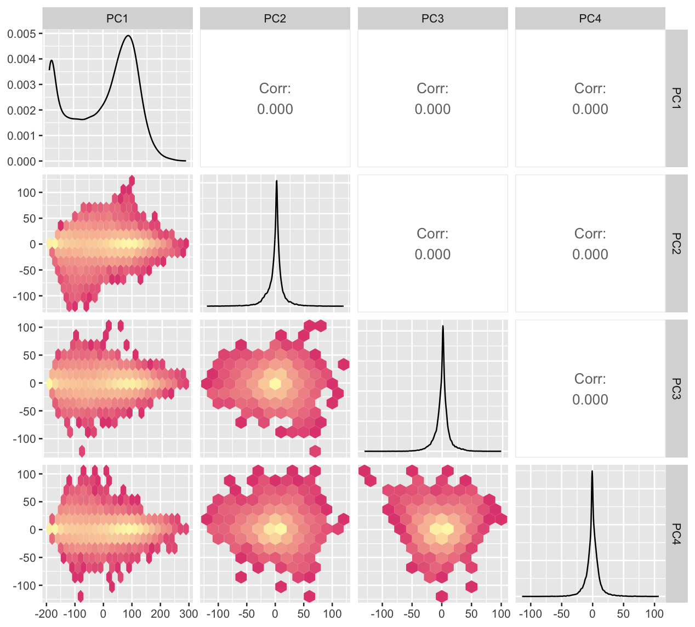
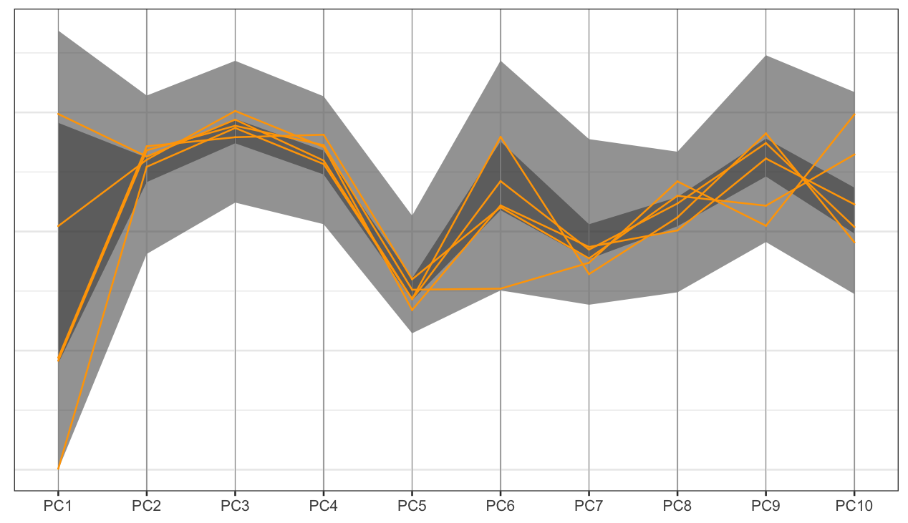

```{r}
#| echo: false
#| message: false
#| warning: false
source(here::here("knitr-setup.R"))
source(here::here("libraries.R"))
```

```{r}
#| include: false

library(dplyr)
select <- dplyr::select
```

```{r}
#| echo: false
# Better formatted penguins data
# data(penguins, package="palmerpenguins")
# Use default penguins
stdd <- function(x) (x-mean(x))/sd(x)
penguins_std <- penguins |>
  filter(!is.na(bill_len)) |>
  rename(bl = bill_len,
         bd = bill_dep,
         fl = flipper_len,
         bm = body_mass) |>
  mutate_at(vars(bl:bm), stdd) |>
  select(species, bl:bm)

```

## Your turn {.inverse}

- What is multivariate data?
- What makes multivariate analysis different from univariate analysis?


::: {.content-visible when-format="revealjs"}
```{r}
#| echo: false
countdown::countdown(1,0)
```
:::

::: notes
- data is multivariate if we have more information than a single aspect for each entity/person/experimental unit.
- multivariate analysis takes relationships between these different aspects into account.
:::

## Main types of plots

- __pairwise plots__: explore association between pairs of variables
- __parallel coordinate plots__: use parallel axes to lay out many variables on a page
- __heatmaps__: represent data value using colour, present as a coloured table
- __tours__: sequence of projections of high-dimensional data, good for examining shape and distribution between many variables

## Scatterplot matrix: GGally {.smaller}

:::: columns
::: column
The basic plot plot for multivariate data is a scatterplot matrix. 

Use the GGally package function `ggpairs`.

```{r}
#| label: scatterplot-matrix
#| echo: true
#| eval: false
ggpairs(penguins_std, columns=c(2:5)) + theme(aspect.ratio = 1)
```

*What do we learn?*

- clustering
- linear dependence
- outlier(s)
:::

::: column

```{r}
#| echo: false
#| ref-label: scatterplot-matrix
#| fig-width: 6
#| fig-height: 6
```
:::
::::

## Scatterplot matrix {.smaller}

:::: columns
::: column

```{r}
#| label: scatterplot-matrix-with-colour
#| echo: true
#| fig-show: hide
# Re-make mapping colour to species (class)
ggpairs(penguins_std, columns=c(2:5), 
        ggplot2::aes(colour=species)) +
  scale_color_viridis_d(option = "plasma", begin=0.2, end=0.8) +
  scale_fill_viridis_d(option = "plasma", begin=0.2, end=0.8)
```

*What do we learn?*

- clustering is due to the class variable
:::

::: column
```{r}
#| echo: false
#| ref-label: scatterplot-matrix-with-colour
#| fig-width: 6
#| fig-height: 6
```
:::
::::

## Heatmaps ⚠️

:::: {.columns}
::: {.column}

```{r}
#| label: p-heatmap
#| echo: true
#| fig-show: hide
# remotes::install_github("rlbarter/superheat")
library(superheat)
superheat(penguins_std[,2:5], 
          pretty.order.rows = T,
          pretty.order.cols = T)
```

How many clusters do you see?

::: {.fragment .smaller}

Mapping numeric values to color is *sub-optimal*, as we know from the hierarchy. 

It is possible to *NOT see* clusters, and also *imagine* clusters that don't exist when using heatmaps of multivariate data.

:::

:::
::: {.column}

```{r}
#| eval: true
#| echo: false
#| ref-label: p-heatmap
#| fig-width: 3
#| fig-height: 7
#| out-width: 50%
```

:::
::::

## Heatmaps of correlation {.smaller}

:::: columns
::: column
Only show correlation. `r anicon::nia("This is dangerous!", animate="float")`

Only appropriate if correlation is a good summary of the association.

```{r}
#| label: correlation-heatmap
#| echo: true
#| fig-show: hide
# Look at one species only
adelie <- penguins_std |> 
  filter(species == "Adelie") |>
  select(bl:bm)
ggcorr(adelie)
```
:::

::: column
```{r}
#| echo: false
#| ref-label: correlation-heatmap
#| fig-width: 4
#| fig-height: 4
#| out-width: 90%
```
:::
::::

## Corrgrams {.smaller}

- can be dangerous ⚠️
- useful for a broad overview IF correlation is a good summary

```{r}
#| label: corrgram
#| echo: true
#| output-location: "column"
corrgram(adelie, 
  lower.panel=
    corrgram::panel.ellipse)
```

The `corrgram` package has numerous correlation display capabilities.


## Large sample size {.smaller}

:::: {.columns}
::: {.column}

```{r}
#| label: hexbin scatterplot
#| echo: true
#| eval: false
#| fig-width: 6
#| fig-height: 6
# Data downloaded from https://archive.ics.uci.edu/dataset/401/gene+expression+cancer+rna+seq
# This chunk takes some time to run, so evaluated off-line
if (!file.exists(here("data", "TCGA-PANCAN-HiSeq-801x20531", "data.csv"))) {
  download.file(url = "https://archive.ics.uci.edu/static/public/401/gene+expression+cancer+rna+seq.zip", 
                destfile = here::here("data", "TCGA-PANCAN-HiSeq-801x20531.zip"), mode = "wb")
  unzip(here::here("data", "TCGA-PANCAN-HiSeq-801x20531.zip"), 
        exdir = here::here("data/TCGA-PANCAN-HiSeq-801x20531/"))
  # Untar into folder
  untar(here::here("data/TCGA-PANCAN-HiSeq-801x20531/TCGA-PANCAN-HiSeq-801x20531.tar.gz"), 
        exdir = here("data"))
}

tcga <- tibble(read.csv(here("data", "TCGA-PANCAN-HiSeq-801x20531", "data.csv")))

tcga_t <- t(as.matrix(tcga[,2:20532]))
colnames(tcga_t) <- tcga$X
tcga_t_pc <- prcomp(tcga_t, scale = FALSE)$x
ggally_hexbin <- function (data, mapping, ...)  {
    p <- ggplot(data = data, mapping = mapping) + geom_hex(binwidth=20, ...)
    p
}
ggpairs(tcga_t_pc, columns=c(1:4),
        lower = list(continuous = "hexbin")) +
  scale_fill_gradient(trans="log", 
    low="#E24C80", high="#FDF6B5")
```
:::
::: {.column}

{width=500}
:::
::::

## Generalized pairs plot {.smaller}

The pairs plot can also incorporate non-numerical variables, and different types of two variable plots.

```{r}
#| label: generalised-pairs-plot
#| error: false
#| message: false
#| warning: false
#| echo: true
#| fig-width: 6
#| fig-height: 6
#| output-location: "column"
# Matrix plot when variables are not numeric
data(australia_PISA2012)
australia_PISA2012 <- australia_PISA2012 |>
  mutate(across(desk:dishwasher, factor))
australia_PISA2012 |> 
  filter(!is.na(dishwasher)) |> 
  ggpairs(columns=c(3, 15, 16, 21, 26))
```

## Generalized Pairs Plots {.smaller}

```{r}
#| label: generalised-pairs-plot-enhance-plots
#| echo: true
#| fig-width: 6
#| fig-height: 6
#| output-location: 'column'
# Modify the defaults, set the transparency of points since there is a lot of data
australia_PISA2012 |> 
  filter(!is.na(dishwasher)) |> 
  ggpairs(
    columns=c(3, 15, 16, 21, 26), 
    lower = list(
      continuous = wrap("points", 
                        alpha=0.05)))
```

## Customized Generalized Pairs Plots {.smaller}

:::: columns
::: column
*What do we learn?*

- moderate increase in all scores as more time is spent on homework
- test scores all have a very regular bivariate normal shape - is this simulated data? yes.
- having a dishwasher in the household corresponds to small increase in homework time
- very little but slight increase in scores with a dishwasher in household
:::

::: column
```{r}
#| echo: false
#| outwidth: 90%
#| fig-width: 6
#| fig-height: 6
# Make a special style of plot to put in the matrix
my_fn <- function(data, mapping, method="loess", ...){
      p <- ggplot(data = data, mapping = mapping) + 
      geom_point(alpha=0.2, size=1) + 
      geom_smooth(method="lm", ...)
      p
}

australia_PISA2012 |> 
  filter(!is.na(dishwasher)) |> 
  ggpairs(columns=c(3, 15, 16, 21, 26), 
          lower = list(continuous = my_fn))

```
:::
::::

## Your turn {.inverse}

Re-make the plot with 

- side-by-side boxplots on the lower triangle, for the combo variables, 
- and the density plots in the upper triangle.

::: {.content-visible when-format="revealjs"}
```{r}
#| echo: false
countdown::countdown(5,0)
```
:::

```{r}
#| echo: false
#| eval: false
australia_PISA2012 |> 
  filter(!is.na(dishwasher)) |> 
  ggpairs(columns=c(3, 15, 16, 21, 26), 
          lower = list(combo = "box_no_facet"),
          upper = list(continuous = "density"))
```

## Regression setting {.smaller}

<!-- An alternative pairs plot that better matches this sort of data, where there is a response variable and explanatory variables. For this data, plot house price against all other variables. -->

```{r}
#| label: wrangle-housing-data-and-make-a-regression-style-pairs-plot
#| out-width: 80%
#| fig-width: 8
#| fig-height: 3
housing <- read_csv(here::here("data/housing.csv")) |>
  mutate(date = dmy(date)) |>
  mutate(year = year(date)) |>
  filter(year == 2016) |>
  filter(!is.na(bedroom2), !is.na(price)) |>
  filter(bedroom2 < 7, bathroom < 5) |>
  mutate(bedroom2 = factor(bedroom2), 
         bathroom = factor(bathroom)) 
ggduo(housing[, c(4,3,8,10,11)], 
      columnsX = 2:5, columnsY = 1, 
      aes(colour=type, fill=type), 
      types = list(continuous = 
                     wrap("smooth", 
                       alpha = 0.10)))
```

## Parallel coordinate plots {.smaller}

```{r}
#| label: generalised-pcp
#| fig-width: 6
#| fig-height: 6
#| output-location: "column"
# install.packages("ggpcp")
library(ggpcp)
penguins_std |>
  pcp_select(species, bl:bm) |>
  pcp_arrange() |>
  ggplot(aes_pcp()) +
    geom_pcp(aes(colour=species)) +
    geom_pcp_boxes() +
    geom_pcp_labels() +
    scale_colour_discrete_divergingx(
      palette = "Zissou 1") +
    theme_pcp() +
    theme(legend.position = "none")
```

Axes are parallel, observations are connecting lines.

## PCP: large sample size {.smaller}

```{r}
#| label: organise data pcp
#| eval: false
#| echo: false
tcga_t_pc_pcp <- tcga_t_pc |>
  as_tibble() |>
  pcp_select(PC1:PC10) |>
  pcp_scale() |>
  pcp_arrange() 
probs <- c(0.025, 0.25, 0.75, 0.975)

dframe <- tcga_t_pc_pcp |>
  summarise(
    value = quantile(pcp_y, prob = probs),
    quantile = probs,
    lower = probs < 0.5,
    level = round(10 * abs(quantile - 0.5), digits = 1)
  ) |>
  select(-quantile) |>
  mutate(lower = factor(lower, labels = c("upper", "lower"))) |>
  pivot_wider(names_from = "lower", values_from = "value") |>
  ungroup() |>
  mutate(
    level = ifelse(level > 2.5, "Inner 95%", "Inner 50%"),
    level = factor(level, levels = c("Inner 50%", "Inner 95%"))
  )

tcga_t_pc_pcp_sub <- tcga_t_pc_pcp |>
  slice_head(n=5)
```

```{r}
#| label: ribbon-pcp
#| eval: false
ggplot() +
    geom_ribbon(data = dframe, aes(x=pcp_x, ymin = lower, ymax = upper, group = level), alpha=0.5) +
    geom_pcp_axes(data=tcga_t_pc_pcp_sub, aes_pcp()) +
    geom_pcp_boxes(data=tcga_t_pc_pcp_sub, aes_pcp(), boxwidth = 0.1) +
    geom_pcp(data=tcga_t_pc_pcp_sub, aes_pcp(), colour="orange") +
    theme_pcp()
```

{width=500}

With large data, aggregate to get an overview, and select some observations to show.

## Big biological data {.smaller}

::: columns
::: {.column width="90%"}
The Bioconductor package `bigPint` has tools for working with larger amounts of data, as seen in RNA-Seq experiments. It has variations of scatterplot matrices, parallel coordinate plots and interactivity with these displays.

More info at [https://lindsayrutter.github.io/bigPint/](https://lindsayrutter.github.io/bigPint/)

```{r}
#| eval: false
#| echo: false
if (!requireNamespace("remotes", quietly = TRUE))
    install.packages("remotes")
remotes::install_github("lindsayrutter/bigPint")
```

{width=400}

:::
::: {.column width="10%"}

:::
:::

## Resources {.smaller}

- [Cook and Laa (2025)](https://dicook.github.io/mulgar_book/)
- Emerson et al (2013) The Generalized Pairs Plot, Journal of Computational and Graphical Statistics, 22:1, 79-91
- [Natalia da Silva](http://natydasilva.com/) [PPForest](https://cran.r-project.org/web/packages/PPforest/index.html) and [shiny app](https://natydasilva.shinyapps.io/shinyV03/).
- Eunkyung Lee [PPtreeViz](https://www.jstatsoft.org/article/view/v083i08)
- Wickham, Cook, Hofmann (2015) [Visualising Statistical Models: Removing the blindfold](http://dicook.org/publication/blindfold_2015/)
- Cook and Swayne (2007) [Interactive and Dynamic Graphics for Data Analysis](http://ggobi.org/book/)
- Wickham et al (2011) [tourr: An R Package for Exploring Multivariate Data with Projections](https://www.jstatsoft.org/article/view/v040i02/v40i02.pdf) and the R package [tourr](https://cran.r-project.org/web/packages/tourr/index.html)
- Schloerke et al (2016) [Escape from Boxland](https://journal.r-project.org/archive/2016/RJ-2016-044/index.html), [the web site zoo](http://schloerke.com/geozoo/) and  [geozoo](https://cran.r-project.org/web/packages/geozoo/index.html)


::: bottom
<span style="display:inline-block;"><a rel="license" href="http://creativecommons.org/licenses/by-nc-sa/4.0/"></a></span><span style="display:inline-block;"> This work is licensed under a <a rel="license" href="http://creativecommons.org/licenses/by-nc-sa/4.0/">Creative Commons Attribution-NonCommercial-ShareAlike 4.0 International License</a>.</span>
:::

