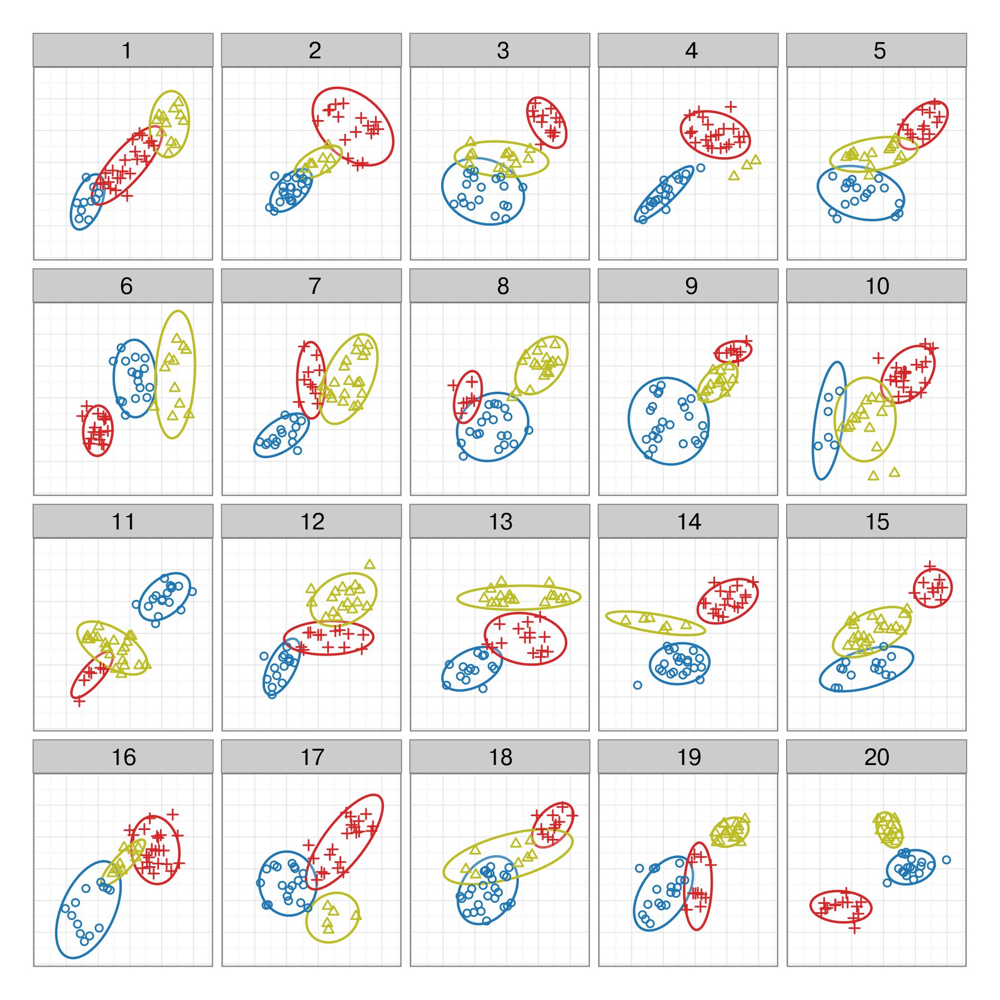

```{r}
#| echo: false
#| message: false
#| warning: false
# source(here("knitr-setup.R"))
# source(here("libraries.R"))

library(ggplot2)
library(vinference)
library(nullabor)
library(readr)
library(dplyr)
library(tidyr)
library(forecast)
library(stringr)
library(here)
library(readxl)
library(purrr)
library(fiftystater)
theme_set(theme_bw())
```

## Tidy data and random variables {.smaller}


::: columns
::: column

- Tidy data mirrors elementary statistics
- Tabular form puts variables in columns and observations in rows
- Not all tabular data is in this form
- In this form, we can think about  $X_1 \sim N(0,1), ~~X_2 \sim \text{Exp}(1) ...$
:::

::: column

$$\begin{align}X &= \left[ \begin{array}{rrrr}
           X_1 & X_2 & ... & X_p 
           \end{array} \right] \\
  &= \left[ \begin{array}{rrrr}
           X_{11} & X_{12} & ... & X_{1p} \\
           X_{21} & X_{22} & ... & X_{2p} \\
           \vdots & \vdots & \ddots& \vdots \\
           X_{n1} & X_{n2} & ... & X_{np}
           \end{array} \right]\end{align}$$
:::
:::

## Grammar of graphics and statistics {.smaller}

::: {.incremental}

- A statistic is a function on the values of items in a sample, e.g. for $n$ iid random variates $\bar{X}_1=\displaystyle\sum_{i=1}^n X_{i1}$, $s_1^2=\displaystyle\frac{1}{n-1}\displaystyle\sum_{i=1}^n(X_{i1}-\bar{X}_1)^2$
- We study the behaviour of the statistic over all possible samples of size $n$. 
- The grammar of graphics is the mapping of (random) variables to graphical elements, making plots of data into statistics

:::

## What is inference?


::: columns
::: column
Inferring that what we see in the data at hand holds more broadly in life, society and the world.


**Why do we need it for graphics?**

::: smaller
Here's an example tweeted by David Robinson based on [an analysis in Tick Tock blog](https://ticktocksaythehandsoftheclock.wordpress.com/2018/01/11/capitals-and-good-governance/) by Graham Tierney
:::

::: 
::: column
](images/drob_twitter.png){width="100%"}

::: 
::: notes

From the blog: 
> I ran linear regressions of government rank on the percentage of each state’s population living in the capital city, state population (in 100,000s), and state GDP (in $100,000s).... The coefficient is not significant for any regression at the traditional 5% level.

- A simple scatterplot of the two variables of interest. 
- A slight negative slope is observed, but it does not look very large. 
- There are a lot of states whose capitals are less than 5% of the total population. 
- The two outliers are Hawaii (government rank 33 and capital population 25%) and Arizona (government rank 26 and capital population 23%). 
- Without those two the downward trend (an improvement in ranking) would be much stronger.


... I'm not convinced that the lack of significance is itself significant.
:::
::: 

## To do *statistical* inference

You need a:

- statistic computed from the data
- null and alternative hypothesis
- reference distribution on which to measure the statistic
    - if it is extreme on this scale, reject the null

## Inference with *data plots*

You need a:

::: incremental

- plot description provided by the grammar [(a statistic)]{.blue .fragment}
    - This implies one or more null hypotheses
-  null generating mechanism, e.g. permutation, simulation from a distribution or model
-  visual evaluation: is one plot in the array different?

:::

## Some examples

Here are several plot descriptions.    
What would be the null hypothesis in each?

```{r}
#| eval: false
ggplot(data) + geom_point(aes(x=x1, y=x2))            #  A
ggplot(data) + geom_point(aes(x=x1, y=x2, colour=cl)) #  B
ggplot(data) + geom_histogram(aes(x=x1))              #  C
ggplot(data) + geom_boxplot(aes(x=cl, y=x1))          #  D
```

Which plot definition would best match    
[$H_0:$ **there is no difference in the distribution between the groups?**]{.orange}

::: notes
A - doesn't show by group, so not useful. Would allow testing association between x1, x2 across groups.
B - could be useful to show differences in mean on (x1, x2) by cl
C - might allow testing whether distribution of x1 is symmetric
D - Might show differences in distribution for x1
:::

## Some examples

Here are several null hypotheses.    
What type of plot would you use to test each?


a. $H_0:$ no association between `x1` and `x2`
b. $H_0:$ no difference between levels of `cl`
c. $H_0:$ the distribution of `x1` is XXX
d. $H_0:$ no difference in the distribution of `x1` b/w levels of `cl`

::: notes
a. Scatterplot of x = x1, y = x2
b. Scatterplot of x = x1, y= x2, color = cl
c. Histogram of x1
d. violin plot of x1 with different colors
:::

## Let's do it 

{.absolute top=30 right=30 width="50px"}

```{r}
#| label: lineup 1
#| echo: true
#| fig-height: 6
#| fig-width: 6
#| output-location: "column"
# Make a lineup of mtcars data
# 20 plots, one data, 19 nulls
# Which one is different?
set.seed(20190709)
library(ggplot2)
ggplot(
  lineup(
    null_permute('mpg'), 
    mtcars), 
  aes(mpg, wt)
) +
  geom_point() +
  facet_wrap(~ .sample)
```

::: notes

Example from the nullabor package. The data plot is embedded randomly in a field of null plots, this is a **lineup**. Can you see which one is different?

When you run the example yourself, you get a `decrypt` code line, that you run after deciding on a plot to print the location of the data plot amongst the nulls. 

- plot is a scatterplot, null hypothesis is *there is no association between the two variables mapped to the x, y axes*
- null generating mechanism: permutation
:::

## Lineup
::: columns
::: column
 Mix the data plot    
into a field of null plots

```{r}
#| label: embed the data plot in a field of null plots
#| eval: false
pos <- sample(1:20, 1)
df_null <- lineup(
  null_permute('v1'), 
  df, pos=pos)
ggplot(
  df_null, 
  aes(x=v2, y=v1, fill=v2)
) + 
  geom_boxplot() +
  facet_wrap(~.sample, ncol=5) + 
  coord_flip()
```
:::

::: column

```{r}
#| label: penguins-lineup-ex
#| echo: false
#| message: false
#| warning: false
set.seed(203482093)
data(penguins)
pos <- sample(1:20, 1)
df_null <- lineup(null_permute('bill_len'), penguins, pos=pos)
ggplot(df_null, aes(x=bill_dep, y=bill_len, fill=species)) + 
  geom_boxplot() +
  facet_wrap(~.sample, ncol=5) + coord_flip() + 
  guides(fill = 'none') +
  theme(axis.text = element_blank(), axis.title = element_blank(), axis.ticks = element_blank())
```

Which plot is different?
:::
:::

## Null-generating mechanisms

- Permutation: randomizing the order of one of the variables breaks association, but keeps marginal distributions the same
- Simulation: from a given distribution, or model. Assumption is that the data comes from that model.

### Evaluation

- Compute $p$-value
- Power $=$ signal strength


## p-values

- $K$ independent observers
- $x$ individuals pick the data plot from $m$ plots

Assuming that all plots in a lineup are equally likely to be selected,

$$P(X\geq x) = \sum_{i=x}^{K} \binom{K}{i} \left(\frac{1}{m}\right)^i\left(\frac{m-1}{m}\right)^{K-i}$$


## p-values

$$P(X\geq x) = \sum_{i=x}^{K} \binom{K}{i} \left(\frac{1}{m}\right)^i\left(\frac{m-1}{m}\right)^{K-i}$$

[This is a Binomial model]{.orange}

For $x=4$ picks, $K=17$ observers, $m=20$ plots

```{r}
#| label: compute pvalue
library(nullabor)
pvisual(4, 17, m=20)
```


## p-values
But... some null plots are more visually salient!

{width="50%"}


## p-values

Introduce a parameter $\alpha$: visual salience of null plot dist

$$\begin{align}P(X \geq x) = &\sum_{i = x}^{K} \binom{K}{x} \frac{1}{B(\alpha, (m-1)\alpha)}\times \\ &B(x+\alpha, K-x+(m-1)\alpha),\end{align}$$

where $B(.,.)$ is the Beta function.

[This is a Beta-Binomial mixture model]{.orange}

## p-values

::: tightlist
- Large $\alpha$: several null plots are 'interesting'
- $\alpha \approx 0.15$: 1 or 2 null plots are interesting enough to get some picks
:::

Computing p-values with $\alpha$:

```{r}
#| label: adjusted for variability in the plots
library(vinference)
c("alpha = 0.01" = pVis(4,17,m=20, alpha=0.01, lower.tail=FALSE),
  "alpha = 0.15" = pVis(4,17,m=20, alpha=0.15, lower.tail=FALSE),
  "alpha = 1" = pVis(4,17,m=20, alpha=1, lower.tail=FALSE))
```


## Goodness-of-fit  & residuals

- plot is a residual vs fitted scatterplot
- null hypothesis is *no association between the two statistics*
- null generating mechanism: residual rotation

```{r}
#| label: lineup 2
#| message: false
#| warning: false
#| eval: false
#| fig-height: 6
# Assessing model fit, using a lineup of residual plots: 19 nulls + 1 resid plot
# Structure in the residual plot corresponding to less than random variation?
# Nulls are generated by `rotating` residuals after model fit.
tips <- read_csv("http://www.ggobi.org/book/data/tips.csv")
x <- lm(tip ~ totbill, data = tips)
tips.reg <- data.frame(tips, .resid = residuals(x), .fitted = fitted(x))
ggplot(lineup(null_lm(tip ~ totbill, method = 'rotate'), tips.reg)) +
  geom_point(aes(x = totbill, y = .resid)) +
  facet_wrap(~ .sample)
```


## Goodness-of-fit  & residuals

```{r}
#| label: lineup 2
#| message: false
#| warning: false
#| echo: false
#| fig-height: 6
```

## Assessing temporal dependence

- line plot: $H_0$ is *there is no temporal trend*
- nulls generated  via simulation from a time series model

```{r}
#| label: lineup 3
#| fig-height: 6
# Assessing time series model fit 
# Use simulation to produce null plots.
# Auto arima model used to match 
# the dependence structure in the data.
data(aud)
l <- lineup(null_ts("rate", auto.arima), aud)
```

## Assessing temporal dependence

```{r}
#| echo: true
#| output-location: "column"
ggplot(l, aes(x=date, y=rate)) + 
  geom_line() +
  facet_wrap(~.sample, 
             scales="free_y") +
  theme(axis.text = 
          element_blank()) +
  xlab("") + ylab("")
```


## Let's talk TB {.smaller}

```{r}
#| label: lets talk TB
#| echo: false
#| message: false
#| warning: false
tb <- read_csv(here("data/TB_notifications_2020-07-01.csv")) |> 
  select(country, iso3, year, new_sp_m04:new_sp_fu) |>
  pivot_longer(cols=new_sp_m04:new_sp_fu, names_to="sexage", values_to="count") |>
  mutate(sexage = str_replace(sexage, "new_sp_", "")) |>
  mutate(sex=substr(sexage, 1, 1), 
         age=substr(sexage, 2, length(sexage))) |>
  select(-sexage)

# Filter years between 1997 and 2012 due to missings
tb_us <- tb |> 
  filter(country == "United States of America") |>
  filter(!(age %in% c("04", "014", "514", "u"))) |>
  filter(year > 1996, year < 2013)
```

```{r}
#| echo: false
#| fig-width: 10
#| fig-height: 3
ggplot(tb_us, aes(x = year, y = count, fill = sex)) +
  geom_bar(stat = "identity", position = "fill") +
  facet_grid(~ age) +
  scale_fill_brewer(palette="Dark2")
```

Earlier:

- *Across all ages, and years, the proportion of males having TB is higher than females*
- These proportions tend to be higher in the middle age groups, for all years.
- Relatively similar proportions occur across years.

## Null hypothesis

Plot count against year, separately for each age group, coloured by sex. 

- Colouring by sex $\Rightarrow$ primary comparison
- Plot shows [proportion of sex, given age group and year]{.orange}

$H_0$: TB occurs equally among men and women, regardless of age and year.

$H_A$: It doesn't.

## TB Lineup

```{r}
#| label: generate a lineup of three binomial simulations
#| echo: true
# Make expanded rows of categorical variables matching the 
# counts of aggregated data. Sex needs to be converted to 0, 1
# to match binomial output.
tb_us_long <- uncount(tb_us, count)
tb_us_long <- tb_us_long |>
  mutate(sex01 = ifelse(sex=="m", 0, 1)) |>
  select(-sex)

# Generate a lineup of n=3, randomly choose the data position.
# Compute counts again.
pos = sample(1:3, 1)
l <- lineup(null_dist(var="sex01", dist="binom", 
                      list(size=1, p=0.5)), 
            true=tb_us_long, n=3, pos=pos)
l <- l |>
  group_by(.sample, year, age) |>
  count(sex01)
```

## TB Lineup

```{r}
#| label: tb-lineup-1
#| eval: false
#| echo: true
ggplot(l, aes(x = year, y = n, fill = factor(sex01))) +
  geom_bar(stat = "identity", position = "fill") +
  facet_grid(.sample ~ age) +
  scale_fill_brewer(palette="Dark2") + 
  theme(legend.position="none")
```

## TB Lineup

```{r}
#| label: tb-lineup-1
#| echo: false
#| fig-height: 6
#| fig-width: 10
```

## A more complicated null

$H_0$: Rates are the same across sex, regardless of age and year.    
$H_A$: They aren't.

```{r}
#| label: a more complicated null
#| echo: true
#| code_copy: false
tbl <- tb_us |> group_by(sex) |> summarise(count=sum(count)) # <1>
tbl # <1>
p <- tbl$count[1]/sum(tbl$count) # <1>

pos = sample(1:3, 1) # <2>
l <- lineup(null_dist(var="sex01", dist="binom",  # <2>
                      list(size=1, p=p)),  # <2>
            true=tb_us_long, n=3, pos=pos) # <2>
l <- l |> # <3>
  group_by(.sample, year, age) |>  # <3>
  count(sex01)  # <3>
```
1. Compute proportion across all data
2. Create lineup, with null data sampled from a Binomial() distribution with the sample proportion as $p$
3. Compute aggregate results 

## TB Lineup

```{r}
#| label: tb-lineup-2
#| eval: false
#| echo: true
ggplot(l, aes(x = year, y = n, fill = factor(sex01))) +
  geom_bar(stat = "identity", position = "fill") +
  facet_grid(.sample ~ age) +
  scale_fill_brewer(palette="Dark2") + 
  theme(legend.position="none")
```

## TB Lineup

```{r}
#| label: tb-lineup-2
#| echo: false
#| fig-height: 6
#| fig-width: 10
```

## Danger zone {.inverse}

- $H_0$ is determined based on the plot type

- $H_0$ is not based on the structure seen in the data set

- Null data creation method does not match characteristics of original sample other than that in $H_0$

## A map lineup example {.smaller}

Does one map show a spatial trend?

```{r}
#| label: make a map lineup
#| fig-height: 6
#| fig-width: 16
#| fig-cap: 'Cancer incidence across the US 2010-2014, Melanoma cases per 100k. [Data
#|   source: American Cancer Society](https://cancerstatisticscenter.cancer.org).'
# Read xlsx spreadsheet on cancer incidence in USA, for a more
# complex lneup example, a lineup of maps
incd <- read_xlsx(here("data/IncRate.xlsx"), skip=6, sheet=2) |>
  filter(!(State %in% c("All U.S. combined", "Kansas"))) |>
  select(State, `Melanoma of the skin / Both sexes combined`) |>
  rename(Incidence=`Melanoma of the skin / Both sexes combined`) |>
  mutate(Incidence = as.numeric(substr(Incidence, 1, 3)))

# State names need to coincide between data sets
incd <- incd |> mutate(State = tolower(State))

# Choose a position 
pos <- 6

# Make lineup of cancer incidence
incd_lineup <- lineup(null_permute('Incidence'), incd, n=18, pos=pos)

# Join cancer incidence data to map polygons
incd_map <- left_join(fifty_states, filter(incd_lineup, .sample==1),
                      by=c("id"="State"))
for (i in 2:18) {
  x <- left_join(fifty_states, filter(incd_lineup, .sample==i),
                      by=c("id"="State"))
  incd_map <- bind_rows(incd_map, x)
}
# Remove Kansas - it was missing the cancer data
incd_map <- incd_map |> filter(!is.na(.sample))

# Plot the maps as a lineup
ggplot(incd_map) + 
  geom_polygon(aes(x=long, y=lat, fill = Incidence, group=group)) + 
  expand_limits(x = incd_map$long, y = incd_map$lat) +
  coord_map() +
  scale_x_continuous(breaks = NULL) + 
  scale_y_continuous(breaks = NULL) +
  labs(x = "", y = "") +
  scale_fill_viridis_b(option = "D") + 
  theme(legend.position = "none", 
        panel.background = element_blank()) +
  facet_wrap(~.sample, ncol=6)
```

## Your turn {.smaller}
{.absolute width="12%" top=0 right=0}

::: columns
::: column

1. run this code, 
2. look at **your** lineup (and only your lineup)
3. choose a plot
4. run the `decrypt` line
5. calculate `x` for your group
6. use the `pvisual` function to compute the p-value, `K=` group size, `m=18`
7. Try different $\alpha$ values with `pVis` - how much difference does it make?

::: {.content-visible when-format="revealjs"}
`r countdown::countdown(5)`
:::

::: 
::: column
```{r}
#| eval: false
#| echo: true
data(wasps)
lda_pred <- function(x) {
  d <- predict(lda(Group~., 
                   data=x[,-43]))$x[,1:2] |>
  as_tibble() |>
  mutate(Group = x$Group)
  return(d)
}
wasps_lineup <- lineup(null_permute('Group'), 
                       wasps[,-1], n=12) |>
  as_tibble()
wasps_lineup_lda <- wasps_lineup |>
  split(.$.sample) |>
  map_df(~lda_pred(.)) |>
  mutate(.sample = wasps_lineup$.sample)
ggplot(wasps_lineup_lda, aes(x=LD1, y=LD2, 
                             colour=Group)) + 
  geom_point() +
  facet_wrap(~.sample, ncol=4) +
  scale_colour_brewer(palette="Dark2") +
  theme(legend.position="none")
```
::: 
::: 

[Enter the p-value in the chat!]{.orange}

## Resources {.smaller}

- VanderPlas S., Röttger C., Cook D., Hofmann H.: Statistical Significance Calculations for Scenarios in Visual Inference, STAT, 2020, doi:[http://dx.doi.org/10.1002/sta4.337](http://dx.doi.org/10.1002/sta4.337).
- Hofmann, H., Follett, L., Majumder, M. and Cook, D. (2012) Graphical Tests for Power Comparison of Competing Designs, [http://doi.ieeecomputersociety.org/10.1109/TVCG.2012.230](http://doi.ieeecomputersociety.org/10.1109/TVCG.2012.230).
- Wickham, H., Cook, D., Hofmann, H. and Buja, A. (2010) Graphical Inference for Infovis,  [http://doi.ieeecomputersociety.org/10.1109/TVCG.2010.161](http://doi.ieeecomputersociety.org/10.1109/TVCG.2010.161). 
- Sievert, C. (2019) Interactive web-based data visualization with R, plotly, and shiny, [https://plotly-r.com/index.html](https://plotly-r.com/index.html)


::: bottom
<span style="display:inline-block;"><a rel="license" href="http://creativecommons.org/licenses/by-nc-sa/4.0/"></a></span><span style="display:inline-block;"> This work is licensed under a <a rel="license" href="http://creativecommons.org/licenses/by-nc-sa/4.0/">Creative Commons Attribution-NonCommercial-ShareAlike 4.0 International License</a>.</span>
:::

