```{r echo = FALSE}
knitr::opts_chunk$set(
  echo=TRUE, 
  message = FALSE,
  warning = FALSE,
  error = FALSE,
  collapse = TRUE,
  comment = "",
  fig.height = 4,
  fig.width = 8,
  fig.align = "center",
  fig.retina = 3,
  cache = FALSE
 )
source("../code/utils.R")
```

```{r echo=FALSE}
#library(tidyverse)
library(tidyr)
library(dplyr)
library(ggplot2)
library(readr)
library(lubridate)
library(GGally)
library(tourr)
library(plotly)
library(palmerpenguins)
library(viridis)
library(wesanderson)
library(colorspace)

theme_set(theme_bw())
```

```{r, echo = FALSE, message = FALSE, warning = FALSE, warning = FALSE}
# source(here::here("knitr-setup.R"))
source(here::here("libraries.R"))
```

```{r}
# Pre-process the data
penguins_std <- penguins %>%
  rename(bl = bill_length_mm,
         bd = bill_depth_mm, 
         fl = flipper_length_mm, 
         bm = body_mass_g) %>%
  select(species, bl:bm) %>%
  na.omit() %>%
  mutate_if(is.numeric, function(x) (x-mean(x))/sd(x))


clrs <- divergingx_hcl(3, palette = "Zissou1")
col <- clrs[as.numeric(penguins_std$species)]
```

Penguins data: See https://allisonhorst.github.io/palmerpenguins/ for more details.

<br>
<br>

<table>
<tr> <td width="40%">  </td> <td width="30%">  </td> <td width="30%">  </td> </tr>
<tr> <td> Adélie .footnote[[Wikimedia Commons](https://upload.wikimedia.org/wikipedia/commons/thumb/d/dc/Adélie_Penguin.jpg/320px-Adélie_Penguin.jpg)]  </td> <td> Gentoo .footnote[[Wikimedia Commons](https://upload.wikimedia.org/wikipedia/commons/thumb/0/04/Pygoscelis_papua_-Jougla_Point%2C_Wiencke_Island%2C_Palmer_Archipelago_-adults_and_chicks-8.jpg/273px-Pygoscelis_papua_-Jougla_Point%2C_Wiencke_Island%2C_Palmer_Archipelago_-adults_and_chicks-8.jpg)] </td> 
<td> Chinstrap .footnote[[Wikimedia Commons](https://upload.wikimedia.org/wikipedia/commons/thumb/0/09/A_chinstrap_penguin_%28Pygoscelis_antarcticus%29_on_Deception_Island_in_Antarctica.jpg/201px-A_chinstrap_penguin_%28Pygoscelis_antarcticus%29_on_Deception_Island_in_Antarctica.jpg)]</td> </tr>
</table>


##

::: columns
::: column
```{r penguins, echo=TRUE, eval=FALSE, fig.show='hide',out.extra='.smaller'}
ggplot(penguins_std, 
   aes(x=fl, 
       y=bm,
       colour=species,
       shape=species)) +
  xlab("Flipper Length (mm)") + 
  ylab("Body Mass (g)") + 
  geom_point(alpha=0.7, 
             size=2) +
  scale_color_discrete_divergingx(palette = "Zissou 1")+
  theme(aspect.ratio=1,
  legend.position="bottom")
```
:::
::: column

```{r ref.label='penguins', echo=FALSE, fig.width=5, fig.height=5, out.width="100%"}
```
:::
:::

# Pairwise plots

:::: columns
::: column

```{r scatterplot matrix, echo=FALSE, eval=TRUE, fig.width=6, fig.height=6}
# Make a simple scatterplot matrix of the new penguins data
ggpairs(penguins_std, columns=c(2:5), 
        ggplot2::aes(colour=species)) +
  scale_color_discrete_divergingx(palette = "Zissou 1") +
  scale_fill_discrete_divergingx(palette = "Zissou 1")
```
:::
::: column

What don't you see? Unless you have tours, you'll never know 🫣
:::
::::

## Our first tour

`r anicon::nia("What patterns do you see?", animate="rotate")` 

`r countdown::countdown(1,30)`

##

::: columns
::: column

```{r echo=TRUE, eval=FALSE}
# Run the tour
animate_xy(penguins_std[,2:5], 
           col=penguins_std$species, 
           axes="off", 
           fps=15)
```
::: 
::: column


```{r eval=FALSE, echo=FALSE}
# This code was used to make the animated gif
set.seed(20200622)
render_gif(penguins_std[,2:5], grand_tour(), 
           display_xy(col=col, axes="bottomleft"), 
           "images/penguins2d.gif", frames=100, width=400, height=400)
```

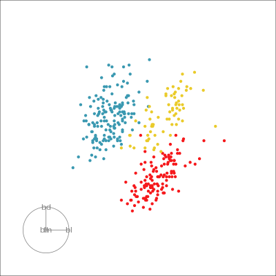 
:::
:::


## What did you see? {.inverse .incremental}

- clusters `r emo::ji("white_check_mark")` 
- outliers `r emo::ji("white_check_mark")`
- linear dependence `r emo::ji("white_check_mark")`
- elliptical clusters with slightly different shapes `r emo::ji("white_check_mark")`
- separated elliptical clusters with slightly different shapes `r emo::ji("white_check_mark")`

## Which shows better separation?

::: columns
::: column
 
:::
::: column
```{r echo=FALSE, out.width="100%", fig.width=6, fig.height=6, fig.retina=5}
ggscatmat(penguins_std, columns = 2:5, color="species") +  
    scale_colour_discrete_divergingx(palette = "Zissou 1") + 
  theme(legend.position="bottom")
```
:::
:::


## What is a tour?

::: columns
::: column

A grand tour is by definition a movie of low-dimensional projections constructed in such a way that it comes arbitrarily close to showing all possible low-dimensional projections; in other words, a grand tour is a space-filling curve in the manifold of low-dimensional projections of high-dimensional data spaces.

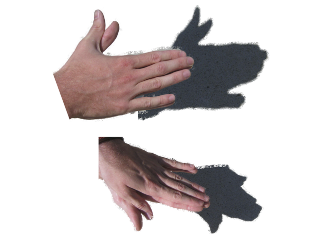{width="80%"} 
:::
::: column
${\mathbf x}_i \in \mathcal{R}^p$, $i^{th}$ data vector

$F$ is a $p\times d$ orthonormal basis, $F'F=I_d$, where $d$ is the projection dimension.

The projection of ${\mathbf x_i}$ onto $F$ is ${\mathbf y}_i=F'{\mathbf x}_i$.

Tour is indexed by time, $F(t)$, where $t\in [a, z]$. Starting and target frame denoted as $F_a = F(a), F_z=F(t)$.

The animation of the projected data is given by a path ${\mathbf y}_i(t)=F'(t){\mathbf x}_i$.

:::
:::

## Geodesic interpolation between planes

::: columns
::: column
Tour is indexed by time, $F(t)$, where $t\in [a, z]$. Starting and target frame denoted as $F_a = F(a), F_z=F(t)$.

The animation of the projected data is given by a path ${\mathbf y}_i(t)=F'(t){\mathbf x}_i$.

:::
::: column

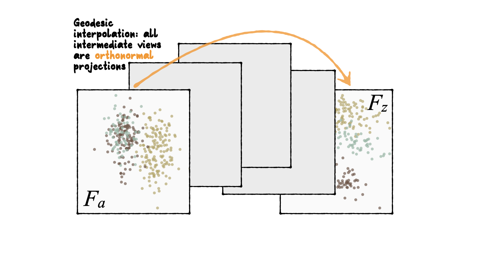{width="120%"}

:::
:::

## Reading axes - interpretation {.inverse}

Length and direction of axes relative to the  pattern of interest

## Reading axes - interpretation
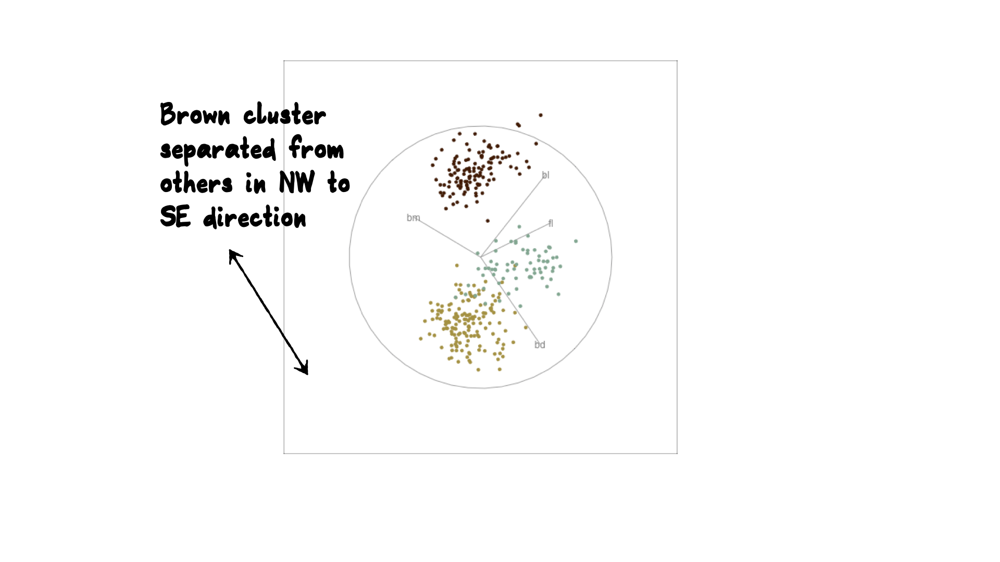{width="100%"} 

## Reading axes - interpretation
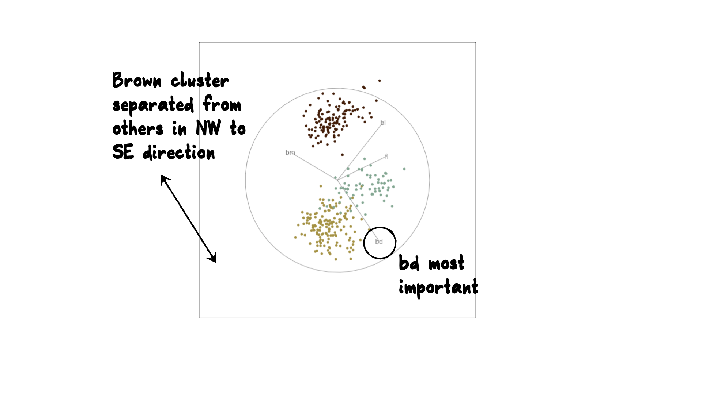{width="100%"} 

## Reading axes - interpretation

```{r reading axes, eval=FALSE, echo=FALSE}
# Generate a plotly animation to demonstrate
library(plotly)
library(htmltools)

# Generate sequence of bases
# set.seed(3)
set.seed(4)
random_start <- basis_random(4)
bases <- save_history(penguins_std[,2:5], grand_tour(2), 
    start=random_start, max = 5)
class(bases) <- "history_array"
# bases[,,1] <- random_start # something needs fixing
tour_path <- tourr::interpolate(bases, 0.1)
d <- dim(tour_path)

# Make really big data of all projections
penguins_d <- NULL; penguins_axes <- NULL
for (i in 1:d[3]) {
  fp <- as.matrix(penguins_std[,2:5]) %*% 
    matrix(tour_path[,,i], ncol=d[2])
  fp <- tourr::center(fp)
  colnames(fp) <- c("d1", "d2")
  penguins_d <- rbind(penguins_d, cbind(fp, rep(i+10, nrow(fp))))
  fa <- cbind(matrix(0, d[1], d[2]), 
              matrix(tour_path[,,i], ncol=d[2]))
  colnames(fa) <- c("origin1", "origin2", "d1", "d2") 
  penguins_axes <- rbind(penguins_axes, 
                         cbind(fa, rep(i+10, nrow(fa))))
}
colnames(penguins_d)[3] <- "indx"
colnames(penguins_axes)[5] <- "indx"

df <- as_tibble(penguins_d) |> 
  mutate(species = rep(penguins_std$species, d[3]))
dfaxes <- as_tibble(penguins_axes) |>
  mutate(labels=rep(colnames(penguins_std[,2:5]), d[3]))
dfaxes_mat <- dfaxes |>
  mutate(xloc = rep(max(df$d1)+1, d[3]*d[1]), 
         yloc=rep(seq(-1.2, 1.2, 0.8), d[3]), 
         coef=paste(round(dfaxes$d1, 2), ", ", 
                    round(dfaxes$d2, 2)))
p <- ggplot() +
       geom_segment(data=dfaxes, 
                    aes(x=d1*2-5, xend=origin1-5, 
                        y=d2*2, yend=origin2, 
                        frame = indx), colour="grey70") +
       geom_text(data=dfaxes, aes(x=d1*2-5, y=d2*2, label=labels, 
                                  frame = indx), colour="grey70") +
       geom_point(data = df, aes(x = d1, y = d2, colour=species, 
                                 frame = indx), size=1) +
       geom_text(data=dfaxes_mat, aes(x=xloc, y=yloc, 
                                  label=coef, frame = indx)) + 
       scale_colour_discrete_divergingx(palette = "Zissou 1") + 
       theme_void() +
       coord_fixed() +
  theme(legend.position="none")
pg <- ggplotly(p, width=700, height=400) |>
  animation_opts(200, redraw = FALSE, 
                 easing = "linear", transition=0)
save_html(pg, file="html/penguins.html")
```

<iframe src="html/penguins.html" width="800" height="500" scrolling="yes" seamless="seamless" frameBorder="0"> </iframe>

##

::: columns
::: column
```{r runthis1, fig.width=4, fig.height=4, out.width="90%"}
ggplot(penguins_std, 
   aes(x=fl, 
       y=bd,
       colour=species,
       shape=species)) +
  geom_point(alpha=0.7, 
             size=2) +
  scale_colour_discrete_divergingx(palette = "Zissou 1") + 
  theme(aspect.ratio=1,
  legend.position="bottom") 
```

Gentoo from others in contrast of fl, bd
:::
::: column

```{r runthis2, fig.width=4, fig.height=4, out.width="90%"}
ggplot(penguins_std, 
   aes(x=bl, 
       y=bm,
       colour=species,
       shape=species)) +
  geom_point(alpha=0.7, 
             size=2) +
  scale_colour_discrete_divergingx(palette = "Zissou 1") + 
  theme(aspect.ratio=1,
  legend.position="bottom")
```

Chinstrap from others in contrast of bl, bm

:::
:::

## {.inverse}

There may be multiple and different combinations of variables that reveal similar structure. `r emo::ji("frowning_face")` 

The tour can help to discover these, too. `r emo::ji("joy")` 

## Other tour types

-[guided]{.orange}: follows the optimisation path for a projection pursuit index.
-[little]{.orange}: interpolates between all variables. 
-[local]{.orange}: rocks back and forth from a given projection, so shows all possible projections within a radius.
-[dependence]{.orange}: two independent 1D tours
-[frozen]{.orange}: fixes some variable coefficients, others vary freely. 
-[manual]{.orange}: control coefficient of one variable, to examine the sensitivity of structure this variable. (In the[spinifex]{.orange} package)
-[slice]{.orange}: use a section instead of a projection.
-[sage]{.orange}: transform a 2D projection, to avoid data  piling.

## Guided tour 

New target bases are chosen using a projection pursuit index function

$$\mathop{\text{maximize}}_{F} g(xF) ~~~\text{ subject to }
F \text{ being orthonormal}$$

- `holes`: This is an inverse Gaussian filter, which is optimised when there is not much data in the center of the projection, i.e. a "hole" or donut shape in 2D.
- `central mass`: The opposite of holes, high density in the centre of the projection, and often "outliers" on the edges. 
- `LDA`/`PDA`: An index based on the linear discriminant dimension reduction (and penalised), optimised by projections where the named classes are most separated.


##

```{r eval=FALSE, echo=FALSE}
set.seed(20694727)
render_gif(penguins_std[,2:5], guided_tour(lda_pp(penguins_std$species)), 
           display_xy(col=penguins_std$species, 
                      axes="bottomleft"), 
           "images/penguins2d_guided.gif", 
           frames=34, width=400, height=400, loop=FALSE)
```

```{r runthis3, eval=FALSE, echo=FALSE}
animate_xy(penguins_std[,2:5], grand_tour(),
           axes = "bottomleft", col=penguins_std$species)
animate_xy(penguins_std[,2:5], 
           guided_tour(lda_pp(penguins_std$species)),
           axes = "bottomleft", col=penguins_std$species)
best_proj <- matrix(c(0.940, 0.058, -0.253, 0.767, 
                      -0.083, -0.393, -0.211, -0.504), ncol=2,
                    byrow=TRUE)
```

::: {.columns}
::: {.column width="50%"}

Grand

{width="80%"}


Might accidentally see best separation

:::

::: {.column width="50%"}


Guided, using LDA index

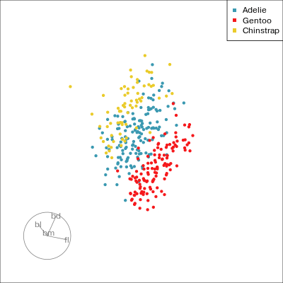{width="80%"}


Moves to the best separation

:::
:::


## Manual tour

```{r eval=FALSE}
render_gif(data=penguins_std[,2:5],
           tour_path = radial_tour(as.matrix(best_proj), mvar = 2),
           display = display_xy(col = col),
           gif_file = "images/penguins_rt_bd.gif",
           apf = 1/20, 
           frames = 100, 
           width = 400, height = 400)

render_gif(data=penguins_std[,2:5],
           tour_path = radial_tour(as.matrix(best_proj), mvar = 1),
           display = display_xy(col = col),
           gif_file = "images/penguins_rt_bl.gif",
           apf = 1/20, 
           frames = 100, 
           width = 400, height = 400)

render_gif(data=penguins_std[,2:5],
           tour_path = radial_tour(as.matrix(best_proj), mvar = 3),
           display = display_xy(col = col),
           gif_file = "images/penguins_rt_fl.gif",
           apf = 1/20, 
           frames = 100, 
           width = 400, height = 400)

render_gif(data=penguins_std[,2:5],
           tour_path = radial_tour(as.matrix(best_proj), mvar = 4),
           display = display_xy(col = col),
           gif_file = "images/penguins_rt_bm.gif",
           apf = 1/20, 
           frames = 100, 
           width = 400, height = 400)

<<<<<<< HEAD:slides/2-5-mvplot-tour.qmd
=======
```{r eval=FALSE, echo=FALSE}
render_gif(penguins_std[,2:5], 
           radial_tour(best_proj, mvar=3),
           display_xy(col=penguins_std$species, axes="bottomleft"),
           "penguins_manual_fl.gif", 
           frames=200, width=400, height=400)
render_gif(penguins_std[,2:5], 
           radial_tour(best_proj, mvar=1),
           display_xy(col=penguins_std$species, axes="bottomleft"),
           "penguins_manual_bl.gif", 
           frames=200, width=400, height=400)
>>>>>>> 4878b57bfe0f02cf286f5e601203113922ee28c5:slides/2.5-mvplot-tour/index.Rmd
```

```{r runthis4, eval=FALSE}
# Check contribution of bl, change mvar to switch variables
animate_xy(penguins_std[,2:5], 
           radial_tour(as.matrix(best_proj), mvar = 2),
           col = col)
```

::: {.columns}
::: {.column width="50%"}


- start from best projection, given by projection pursuit
- `bd` contribution controlled
- if `bd` is removed from projection, Gentoo separation disappears
- `bd` is important for distinguishing Gentoo

:::


::: {.column width="50%"}


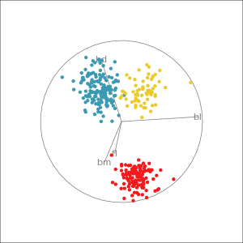{width="90%"}

:::
:::

## Manual tour

::: {.columns}
::: {.column width="50%"}


- start from best projection, given by projection pursuit
- `bl` contribution controlled
- `bl` is important for distinguishing Adelie from Chinstrap

:::


::: {.column width="50%"}


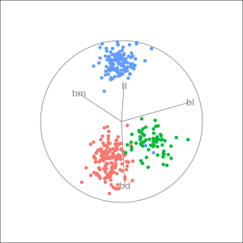{width="90%"}

<<<<<<< HEAD:slides/2-5-mvplot-tour.qmd
:::
:::

## Local tour

```{r eval=FALSE}
render_gif(penguins_std[,2:5], local_tour(start=best_proj, 0.9), 
           display_xy(col=col, axes="bottomleft"), 
           "images/penguins2d_local.gif", 
           frames=200, width=400, height=400)
```

```{r runthis5, eval=FALSE}
animate_xy(penguins_std[,2:5], local_tour(start=best_proj, 0.9),
           axes = "bottomleft", col=col)
=======
```{r eval=FALSE, echo=FALSE}
render_gif(penguins_std[,2:5], 
           local_tour(start=best_proj, 0.9), 
           display_xy(col=penguins_std$species, axes="bottomleft"), 
           "penguins2d_local.gif", 
           frames=200, width=400, height=400)
```

```{r runthis16, eval=FALSE, echo=FALSE}
animate_xy(penguins_std[,2:5], 
           local_tour(start=best_proj, 0.9),
           axes = "bottomleft", col=penguins_std$species)
>>>>>>> 4878b57bfe0f02cf286f5e601203113922ee28c5:slides/2.5-mvplot-tour/index.Rmd
```

::: {.columns}
::: {.column width="50%"}

Rocks from and to a given projection, in order to observe the neighbourhood

:::

::: {.column width="50%"}

<<<<<<< HEAD:slides/2-5-mvplot-tour.qmd
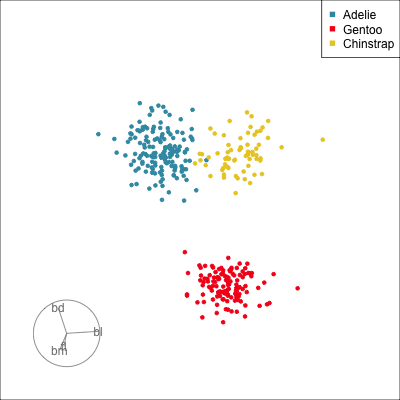{width="90%"}

:::
:::

## Slice tour

::: {.column width="45%"}

Solid 4D sphere

```{r runthis6, eval=FALSE}
library(geozoo)
sphere2 <- sphere.solid.random(p=4)$points %>% as_tibble()
animate_slice(sphere2, axes="bottomleft")
```
=======
]

---
class: inverse middle
# Your turn

Using the sample code from the tour package, check how many clusters in the example data.
>>>>>>> 4878b57bfe0f02cf286f5e601203113922ee28c5:slides/2.5-mvplot-tour/index.Rmd

```{r eval=FALSE}
render_gif(sphere2, grand_tour(), 
           display_slice(axes="bottomleft"), 
           "images/sphere4d_solid_slice.gif", frames=100, width=400, height=400)

```

{width="70%"}

:::

::: {.column width="5%"}
:::

::: {.column width="45%"}


```{r runthis7, eval=FALSE}
sphere1 <- sphere.hollow(p=4)$points %>% as_tibble()
animate_slice(sphere1, axes="bottomleft", half_range=0.6)
```

```{r eval=FALSE}
render_gif(sphere1, grand_tour(), 
           display_slice(axes="bottomleft", half_range=0.6), 
           "images/sphere4d_slice.gif", frames=100, width=400, height=400)
```


Hollow  4D sphere

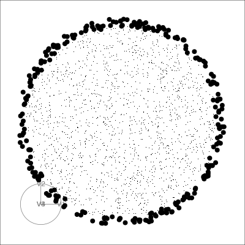{width="70%"}
:::

## Geometric shapes with slice tour

::: {.column width="45%"}

```{r runthis8, eval=FALSE}
torus <- torus(p = 4, n = 5000, radius=c(8, 4, 1))$points %>% as_tibble()
animate_slice(torus, axes="bottomleft", half_range=0.8)
```

```{r eval=FALSE}
render_gif(torus, grand_tour(), 
           display_slice(axes="bottomleft", half_range=0.8), 
           "images/torus4d_slice.gif", frames=100, width=400, height=400)
```

4D Torus

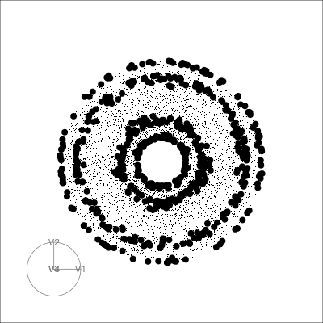{width="70%"}

:::

::: {.column width="5%"}

:::

::: {.column width="45%"}


```{r runthis9, eval=FALSE}
cube1 <- cube.face(p=4)$points %>% as_tibble()
# Slicing needs data to be on a standard scale
cube1_std <- cube1 %>% 
  mutate(across(where(is.numeric),  ~ scale(.)[,1]))
animate_slice(cube1_std, axes="bottomleft")
```

```{r eval=FALSE}
render_gif(cube1_std, grand_tour(), 
           display_slice(axes="bottomleft"), 
           "images/cube4d_slice.gif", frames=100, width=400, height=400)
```


4D Hollow Cube

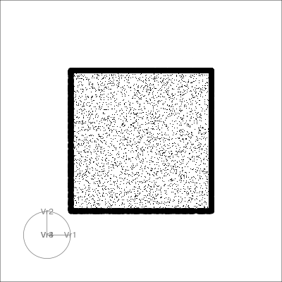{width="70%"}

:::

## PCA tour

::: {.column width="45%"}

Compute PCA, reduce dimension, show original variable axes in the reduced space.

```{r runthis10, eval=FALSE, echo=TRUE}
penguins_pca <- prcomp(penguins_std[,2:5], center = FALSE)
penguins_coefs <- penguins_pca$rotation[, 1:3]
penguins_scores <- penguins_pca$x[, 1:3]

animate_pca(penguins_scores, pc_coefs = penguins_coefs, col=col)
```

```{r eval=FALSE}
render_gif(penguins_scores, grand_tour(), 
           display_pca(pc_coefs = penguins_coefs, 
                       col=col, axes="bottomleft"), 
           "images/penguins2d_pca.gif", 
           frames=100, width=400, height=400)
```
:::

::: {.column width="5%"}
:::

::: {.column width="45%"}

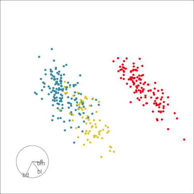{width="100%"}
:::


## Projection dimension and displays

```{r eval=FALSE}

render_gif(data=penguins_std[,2:5],
           tour_path = grand_tour(1),
           display = display_dist(half_range = 1.3),
           gif_file = "images/penguins1d.gif",
           apf = 1/20, 
           frames = 100, 
           width = 400, height = 400)
render_gif(penguins_std[,2:5], 
           tour_path = grand_tour(d=2), 
           display = display_density2d(col=col, axes="bottomleft"), 
           gif_file = "images/penguins2d_dens.gif", 
           apf = 1/20,
           frames=100,
           width=400, height=400)
```

```{r runthis11, eval=FALSE}
animate_dist_cl(penguins_std[,2:5], half_range=1.3)
animate_density2d(penguins_std[,2:5], col=col, axes="bottomleft")
```

::: {.columns}
::: {.column width="50%"}

1D projections displayed as a density

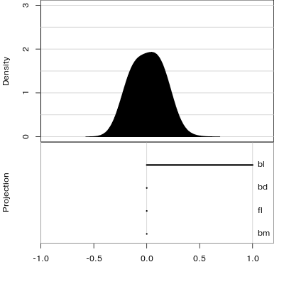{width="90%"}

:::

::: {.column width="50%"}

Density contours overlaid on a scatterplot

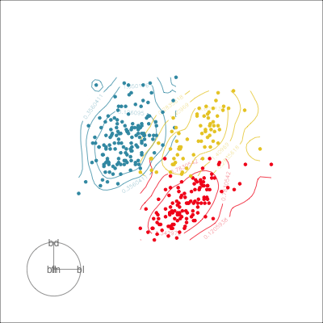{width="80%"}

:::
:::

## Your turn {.inverse}

Using the sample code from the tour package, check how many clusters are in the example data.

```{r, eval=FALSE}
library(tourr)
data(flea)
?animate_xy
<<<<<<< HEAD:slides/2-5-mvplot-tour.qmd
# On a Mac, start quartz window with:  quartz()
# On windows, start X11 window with:   X11()

animate_xy(flea[, 2:7])
# RStudio graphics windows: may want to reduce frame rate
animate_xy(flea[, 2:7], fps=10)
=======
animate_xy(flea[, 1:6])
>>>>>>> 4878b57bfe0f02cf286f5e601203113922ee28c5:slides/2.5-mvplot-tour/index.Rmd
```

```{r echo=FALSE}
countdown::countdown(2,0)
```

## Saving and sharing: Animated gif

::: columns
::: column


```{r eval=FALSE}
clrs <- scales::pal_hue()(3)
col <- clrs[as.numeric(penguins_std$species)]
render_gif(    
  penguins_std[,2:5], 
  grand_tour(), 
  display_xy(col=penguins_std$species, 
             axes="bottomleft"), 
  gif_file="images/penguins2d.gif", 
  frames=100, 
  width=400, 
  height=400)
```
:::
::: column
{width="80%"}
:::
:::

## Saving and sharing: Animation

::: columns
::: column


```{r eval=FALSE}
set.seed(209)
b <- basis_random(4, 2)
penguins_pct <- tourr::save_history(penguins_std[,2:5], 
                    tour_path = grand_tour(),
                    start = b,
                    max_bases = 5)
save(penguins_pct,
     file="../data/p_tour_path.rda")
penguins_pcti <- interpolate(penguins_pct, 0.2)
penguins_anim <- render_anim(penguins_std,
      vars = 2:5,
      frames=penguins_pcti,
      obs_labels=penguins_std$species)
```

:::
::: column

<iframe width="550" height="600" src="html/penguins.html" title="Animation of AFLW four PCs with interactive labelling."></iframe>

:::
:::

##

Code to draw this plot is complicated.

::: columns
::: column
```{r eval=FALSE}
penguins_gp <- ggplot() +
     geom_path(data=penguins_anim$circle, 
               aes(x=c1, y=c2,
                   frame=frame), linewidth=0.1) +
     geom_segment(data=penguins_anim$axes, 
                  aes(x=x1, y=y1, 
                      xend=x2, yend=y2, 
                      frame=frame), 
                  linewidth=0.1) +
     geom_text(data=penguins_anim$axes, 
               aes(x=x2, y=y2, 
                   frame=frame, 
                   label=axis_labels), 
               size=5) +
     geom_point(data=penguins_anim$frames, 
                aes(x=P1, y=P2, colour=species,
                    frame=frame, 
                    label=obs_labels), 
                alpha=0.8) +
```
:::
::: column
```{r eval=FALSE}
     xlim(-1,1) + ylim(-1,1) +
     coord_equal() +
     theme_bw() +
     theme(legend.position = "none",
           axis.text=element_blank(),
         axis.title=element_blank(),
         axis.ticks=element_blank(),
         panel.grid=element_blank())
penguins_tour <- ggplotly(penguins_gp,
                        width=500,
                        height=550) %>%
       animation_button(label="Go") %>%
       animation_slider(len=0.8, x=0.5,
                        xanchor="center") %>%
       animation_opts(
         easing="linear", 
         transition = 0)
penguins_tour

htmlwidgets::saveWidget(penguins_tour,
          file="html/penguins.html",
          selfcontained = TRUE)
```
:::
:::

## Saving and sharing: Single frame

::: columns
::: column
```{r}
load(here::here("data/p_tour_path.rda"))
penguins_pcti <- interpolate(penguins_pct, 0.2)
f27 <- matrix(penguins_pcti[,,27], ncol=2)
p27 <- render_proj(penguins_std[,2:5],
          f27,
          obs_labels=penguins_std$species)
```

Draw it with ggplot, and possibly pass to plotly.

```{r echo=FALSE}
p27$data_prj <- p27$data_prj |>
  mutate(species = penguins_std$species)
pg27 <- ggplot() +
  geom_path(data=p27$circle, aes(x=c1, y=c2)) +
  geom_segment(data=p27$axes, aes(x=x1, y=y1, xend=x2, yend=y2)) +
  geom_text(data=p27$axes, aes(x=x2, y=y2, label=rownames(p27$axes))) +
  geom_point(data=p27$data_prj, 
             aes(x=P1, y=P2,
                 colour=species,
                 label=obs_labels)) +
  scale_colour_discrete_divergingx(palette = "Zissou 1") +
  xlim(-1,1) + ylim(-1, 1) +
  ggtitle("Frame 27") +
  theme_bw() +
  theme(aspect.ratio=1,
    legend.position = "none",
    axis.text=element_blank(),
    axis.title=element_blank(),
    axis.ticks=element_blank(),
    panel.grid=element_blank())
```

:::
::: column

```{r echo=FALSE, out.width="80%", fig.width=7, fig.height=6}
# pg27
ggplotly(pg27, width=450, height=450)
```
:::
:::

## Resources {.smaller}

- [Cook and Laa (2025)](https://dicook.github.io/mulgar_book/)
- Emerson et al (2013) The Generalized Pairs Plot, Journal of Computational and Graphical Statistics, 22:1, 79-91
- [Natalia da Silva](http://natydasilva.com/) [PPForest](https://cran.r-project.org/web/packages/PPforest/index.html) and [shiny app](https://natydasilva.shinyapps.io/shinyV03/).
- Wickham et al (2011) [tourr: An R Package for Exploring Multivariate Data with Projections](https://www.jstatsoft.org/article/view/v040i02/v40i02.pdf) and the R package [tourr](https://cran.r-project.org/web/packages/tourr/index.html)
- Schloerke et al (2016) [Escape from Boxland](https://journal.r-project.org/archive/2016/RJ-2016-044/index.html), [the web site zoo](http://schloerke.com/geozoo/) and the R package [geozoo](https://cran.r-project.org/web/packages/geozoo/index.html)
- Spyrison and  Cook (2020). spinifex: Manual Tours, Manual
  Control of Dynamic Projections of Numeric Multivariate Data. https://CRAN.R-project.org/package=spinifex
- Stuart Lee [liminal](https://github.com/sa-lee/liminal) New tools to do linked brushing between tours and PCA/tSNE/PDS views


::: bottom
<span style="display:inline-block;"><a rel="license" href="http://creativecommons.org/licenses/by-nc-sa/4.0/"></a></span><span style="display:inline-block;"> This work is licensed under a <a rel="license" href="http://creativecommons.org/licenses/by-nc-sa/4.0/">Creative Commons Attribution-NonCommercial-ShareAlike 4.0 International License</a>.</span>
:::
