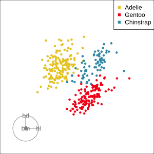
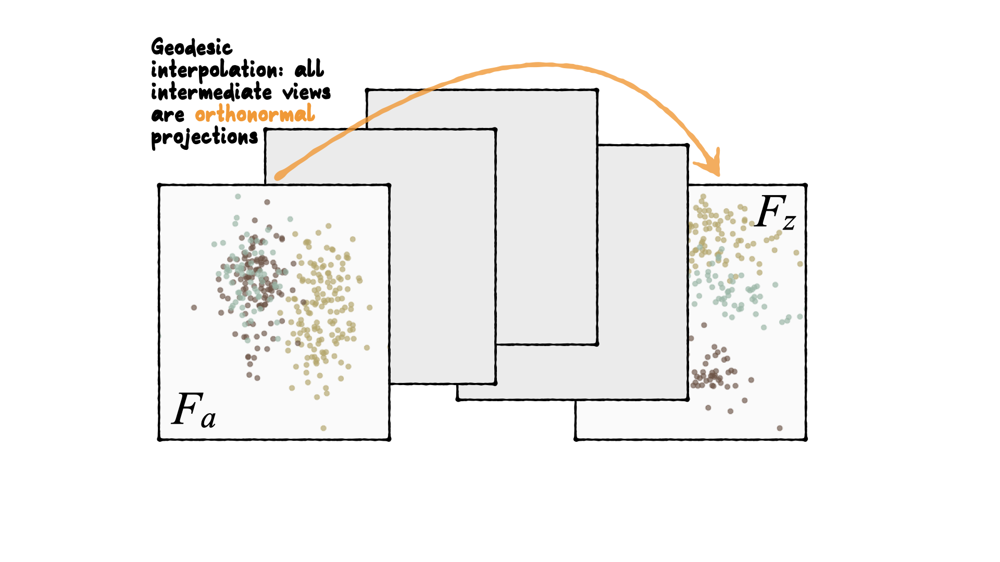
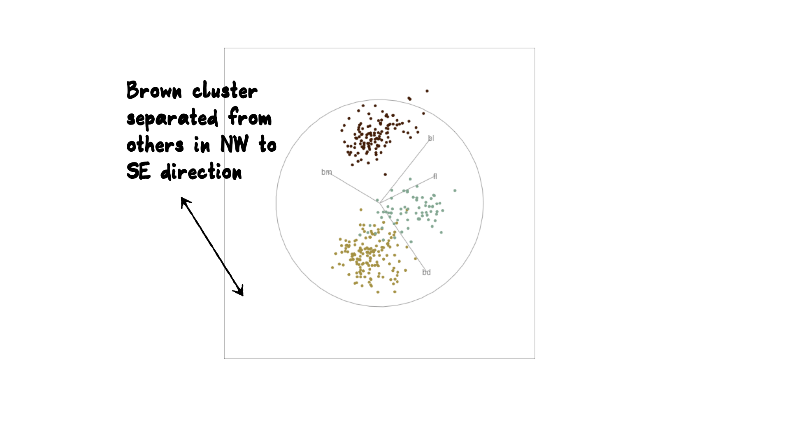
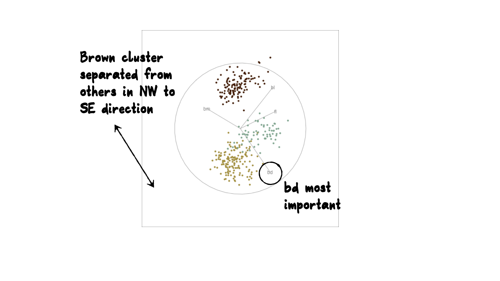
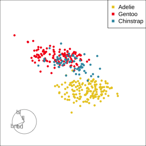
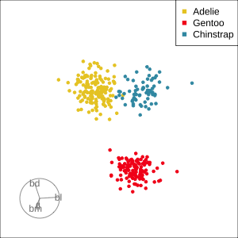
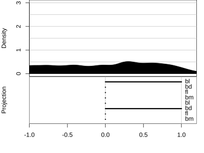
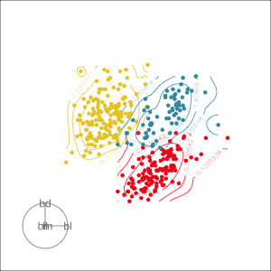

```{r echo = FALSE}
knitr::opts_chunk$set(
  echo=TRUE, 
  message = FALSE,
  warning = FALSE,
  error = FALSE,
  collapse = TRUE,
  comment = "",
  fig.height = 4,
  fig.width = 8,
  fig.align = "center",
  fig.retina = 3,
  cache = FALSE
 )
```

```{r echo=FALSE}
library(tidyverse)
library(lubridate)
library(GGally)
# remotes::install_github("ggobi/tourr")
library(tourr)
library(plotly)
library(palmerpenguins)
# remotes::install_github("ropenscilabs/ochRe")
library(ochRe)
```

Penguins data: See https://allisonhorst.github.io/palmerpenguins/ for more details.

<br>
<br>

<table>
<tr> <td width="40%">  </td> <td width="30%">  </td> <td width="30%">  </td> </tr>
<tr> <td> Adélie .footnote[[Wikimedia Commons](https://upload.wikimedia.org/wikipedia/commons/thumb/d/dc/Adélie_Penguin.jpg/320px-Adélie_Penguin.jpg)]  </td> <td> Gentoo .footnote[[Wikimedia Commons](https://upload.wikimedia.org/wikipedia/commons/thumb/0/04/Pygoscelis_papua_-Jougla_Point%2C_Wiencke_Island%2C_Palmer_Archipelago_-adults_and_chicks-8.jpg/273px-Pygoscelis_papua_-Jougla_Point%2C_Wiencke_Island%2C_Palmer_Archipelago_-adults_and_chicks-8.jpg)] </td> 
<td> Chinstrap .footnote[[Wikimedia Commons](https://upload.wikimedia.org/wikipedia/commons/thumb/0/09/A_chinstrap_penguin_%28Pygoscelis_antarcticus%29_on_Deception_Island_in_Antarctica.jpg/201px-A_chinstrap_penguin_%28Pygoscelis_antarcticus%29_on_Deception_Island_in_Antarctica.jpg)]</td> </tr>
</table>


---

.pull-left[
.small[
```{r penguins, echo=TRUE, eval=FALSE, fig.show='hide'}
ggplot(penguins, 
   aes(x=flipper_length_mm, 
       y=body_mass_g,
       colour=species,
       shape=species)) +
  geom_point(alpha=0.7, 
             size=2) +
  scale_colour_ochre(
    palette="nolan_ned") + 
  theme(aspect.ratio=1,
  legend.position="bottom")
```
]
]

.pull-right[


```{r ref.label='penguins', echo=FALSE, fig.width=5, fig.height=5, out.width="100%"}
```
]

---
class: inverse middle center

# Our first tour

`r anicon::nia("What patterns do you see?", animate="rotate")` 

`r countdown::countdown(1,30)`

---

.pull-left[
```{r echo=TRUE, eval=FALSE}
clrs <- ochre_pal(
  palette="nolan_ned")(3)
col <- clrs[
  as.numeric(
    penguins$species)]
animate_xy(penguins[,3:6], 
           col=col, 
           axes="off", 
           fps=15)
```
]


```{r eval=FALSE, echo=FALSE}
# This code was used to make the animated gif
set.seed(20200622)
clrs <- ochre_pal(palette="nolan_ned")(3)
col <- clrs[as.numeric(penguins$species)]
penguins <- penguins %>%
  rename(bl = bill_length_mm,
         bd = bill_depth_mm, 
         fl = flipper_length_mm, 
         bm = body_mass_g)
render_gif(penguins[,3:6], grand_tour(), 
           display_xy(col=col, axes="bottomleft"), 
           "penguins2d.gif", frames=100, width=300, height=300)
```

.pull-right[
 
]

---
class: inverse middle
# What did you see?

- clusters `r emo::ji("white_check_mark")`
--

- outliers `r emo::ji("white_check_mark")`
--

- linear dependence `r emo::ji("white_check_mark")`
--

- elliptical clusters with slightly different shapes `r emo::ji("white_check_mark")`
--

- separated elliptical clusters with slightly different shapes `r emo::ji("white_check_mark")`
--

---
# What is a tour?

.pull-left[

A grand tour is by definition a movie of low-dimensional projections constructed in such a way that it comes arbitrarily close to showing all possible low-dimensional projections; in other words, a grand tour is a space-filling curve in the manifold of low-dimensional projections of high-dimensional data spaces.

 
]

.pull-right[
${\mathbf x}_i \in \mathcal{R}^p$, $i^{th}$ data vector

$F$ is a $p\times d$ orthonormal basis, $F'F=I_d$, where $d$ is the projection dimension.

The projection of ${\mathbf x_i}$ onto $F$ is ${\mathbf y}_i=F'{\mathbf x}_i$.

Tour is indexed by time, $F(t)$, where $t\in [a, z]$. Starting and target frame denoted as $F_a = F(a), F_z=F(t)$.

The animation of the projected data is given by a path ${\mathbf y}_i(t)=F'(t){\mathbf x}_i$.

]

---

# Geodesic interpolation between planes

.pull-left[
Tour is indexed by time, $F(t)$, where $t\in [a, z]$. Starting and target frame denoted as $F_a = F(a), F_z=F(t)$.

The animation of the projected data is given by a path ${\mathbf y}_i(t)=F'(t){\mathbf x}_i$.

]
.pull-right[



]

---
class: inverse middle center

# Reading axes - interpretation

Length and direction of axes relative to the  pattern of interest

---

 

---

 

---
# Reading axes - interpretation

```{r reading axes, eval=FALSE, echo=FALSE}
# Generate a plotly animation to demonstrate
library(plotly)
library(htmltools)

# Standardise data
scale2 <- function(x) {(x-mean(x))/sd(x)}
penguins_s <- penguins %>% 
  mutate_if(is.numeric, scale2)

# Generate sequence of bases
# set.seed(3)
set.seed(4)
random_start <- basis_random(4)
bases <- save_history(penguins[,3:6], grand_tour(2), 
    start=random_start, max = 5)
bases[,,1] <- random_start # something needs fixing
tour_path <- interpolate(bases, 0.1)
d <- dim(tour_path)

# Make really big data of all projections
penguins_d <- NULL; penguins_axes <- NULL
for (i in 1:d[3]) {
  fp <- as.matrix(penguins_s[,3:6]) %*% 
    matrix(tour_path[,,i], ncol=d[2])
  fp <- tourr::center(fp)
  colnames(fp) <- c("d1", "d2")
  penguins_d <- rbind(penguins_d, cbind(fp, rep(i+10, nrow(fp))))
  fa <- cbind(matrix(0, d[1], d[2]), 
              matrix(tour_path[,,i], ncol=d[2]))
  colnames(fa) <- c("origin1", "origin2", "d1", "d2") 
  penguins_axes <- rbind(penguins_axes, 
                         cbind(fa, rep(i+10, nrow(fa))))
}
colnames(penguins_d)[3] <- "indx"
colnames(penguins_axes)[5] <- "indx"

df <- as_tibble(penguins_d) %>% 
  mutate(species = rep(penguins_s$species, d[3]))
dfaxes <- as_tibble(penguins_axes) %>%
  mutate(labels=rep(colnames(penguins_s[,3:6]), d[3]))
dfaxes_mat <- dfaxes %>%
  mutate(xloc = rep(max(df$d1)+1, d[3]*d[1]), 
         yloc=rep(seq(-1.2, 1.2, 0.8), d[3]), 
         coef=paste(round(dfaxes$d1, 2), ", ", 
                    round(dfaxes$d2, 2)))
p <- ggplot() +
       geom_segment(data=dfaxes, 
                    aes(x=d1*2-5, xend=origin1-5, 
                        y=d2*2, yend=origin2, 
                        frame = indx), colour="grey70") +
       geom_text(data=dfaxes, aes(x=d1*2-5, y=d2*2, label=labels, 
                                  frame = indx), colour="grey70") +
       geom_point(data = df, aes(x = d1, y = d2, colour=species, 
                                 frame = indx), size=1) +
       scale_colour_ochre(palette="nolan_ned") +
       geom_text(data=dfaxes_mat, aes(x=xloc, y=yloc, 
                                  label=coef, frame = indx)) + 
       theme_void() +
       coord_fixed() +
  theme(legend.position="none")
pg <- ggplotly(p, width=700, height=400) %>%
  animation_opts(200, redraw = FALSE, 
                 easing = "linear", transition=0)
save_html(pg, file="penguins.html")
```

<iframe src="penguins.html" width="800" height="500" scrolling="yes" seamless="seamless" frameBorder="0"> </iframe>

---

.pull-left[
```{r runthis13, fig.width=4, fig.height=4, out.width="90%"}
ggplot(penguins, 
   aes(x=flipper_length_mm, 
       y=bill_depth_mm,
       colour=species,
       shape=species)) +
  geom_point(alpha=0.7, 
             size=2) +
  scale_colour_ochre(
    palette="nolan_ned") + 
  theme(aspect.ratio=1,
  legend.position="bottom")
```

Gentoo from others in contrast of fl, bd
]
.pull-right[

```{r runthis14, fig.width=4, fig.height=4, out.width="90%"}
ggplot(penguins, 
   aes(x=bill_length_mm, 
       y=body_mass_g,
       colour=species,
       shape=species)) +
  geom_point(alpha=0.7, 
             size=2) +
  scale_colour_ochre(
    palette="nolan_ned") + 
  theme(aspect.ratio=1,
  legend.position="bottom")
```

Chinstrap from others in contrast of bl, bm

]

---
class: inverse middle left

There may be multiple and different combinations of variables that reveal similar structure. `r emo::ji("frowning_face")` 

The tour can help to discover these, too. `r emo::ji("joy")` 

---
# Other tour types

- .orange[guided]: follows the optimisation path for a projection pursuit index.
- .orange[little]: interpolates between all variables. 
- .orange[local]: rocks back and forth from a given projection, so shows all possible projections within a radius.
- .orange[dependence]: two independent 1D tours
- .orange[frozen]: fixes some variable coefficients, others vary freely. 
- .orange[manual]: control coefficient of one variable, to examine the sensitivity of structure this variable. (In the .orange[spinifex] package)
- .orange[slice]: use a section instead of a projection.
- .orange[sage]: transform a 2D projection, to avoid data  piling.

---
class: inverse middle center

# guided tour 

new target bases are chosen using a projection pursuit index function

---
$$\mathop{\text{maximize}}_{F} g(F'x) ~~~\text{ subject to }
F \text{ being orthonormal}$$

.font_small[
- `holes`: This is an inverse Gaussian filter, which is optimised when there is not much data in the center of the projection, i.e. a "hole" or donut shape in 2D.
- `central mass`: The opposite of holes, high density in the centre of the projection, and often "outliers" on the edges. 
- `LDA`/`PDA`: An index based on the linear discriminant dimension reduction (and penalised), optimised by projections where the named classes are most separated.
]

---

```{r eval=FALSE, echo=FALSE}
clrs <- ochre_pal(
  palette="nolan_ned")(3)
col <- clrs[
  as.numeric(
    penguins$species)]
set.seed(20200622)
render_gif(penguins[,3:6], guided_tour(lda_pp(penguins$species)), 
           display_xy(col=col, axes="bottomleft"), 
           "penguins2d_guided.gif", 
           frames=17, width=300, height=300, loop=FALSE)
```

```{r runthis15, eval=FALSE, echo=FALSE}
animate_xy(penguins[,3:6], grand_tour(),
           axes = "bottomleft", col=col)
animate_xy(penguins[,3:6], guided_tour(lda_pp(penguins$species)),
           axes = "bottomleft", col=col)
best_proj <- matrix(c(0.940, 0.058, -0.253, 0.767, 
                      -0.083, -0.393, -0.211, -0.504), ncol=2,
                    byrow=TRUE)
```

.pull-left[
Grand


.small[
Might accidentally see best separation
]
]

.pull-right[

Guided, using LDA index



.small[
Moves to the best separation
]
]

---
class: inverse middle center

# manual tour

control the coefficient of one variable, reduce it to zero, increase it to 1, maintaining orthonormality

---
# Manual tour

```{r eval=FALSE, echo=FALSE}
mtour1 <- manual_tour(basis = best_proj, manip_var = 3)
render_manual(penguins_s[,3:6], mtour1, "penguins_manual_fl.gif", col=col, dir = "images/manual1/")
mtour2 <- manual_tour(basis = best_proj, manip_var = 1)
render_manual(penguins_s[,3:6], mtour2, "penguins_manual_bl.gif", col=col, dir = "images/manual2")
```

.pull-left[

- start from best projection, given by projection pursuit
- bl contribution controlled
- if bl is removed form projection, Adelie and chinstrap are mixed
- bl is important for Adelie

]


.pull-right[


]

---
# Manual tour


.pull-left[

- start from best projection, given by projection pursuit
- fl contribution controlled
- cluster less separated when fl is fully contributing
- fl is important, in small amounts, for Gentoo

]


.pull-right[



]
---
# Local tour

```{r eval=FALSE, echo=FALSE}
render_gif(penguins[,3:6], local_tour(start=best_proj, 0.9), 
           display_xy(col=col, axes="bottomleft"), 
           "penguins2d_local.gif", 
           frames=200, width=300, height=300)
```

```{r runthis16, eval=FALSE, echo=FALSE}
animate_xy(penguins[,3:6], local_tour(start=best_proj, 0.9),
           axes = "bottomleft", col=col)
```

.pull-left[
Rocks from and to a given projection, in order to observe the neighbourhood

]

.pull-right[


]
---
# Projection dimension and displays

```{r eval=FALSE, echo=FALSE}
render_gif(penguins[,3:6], grand_tour(), 
           display_dist(half_range=1.3), 
           "penguins1d.gif", 
           frames=100, width=400, height=300)
render_gif(penguins[,3:6], grand_tour(), 
           display_density2d(col=col, axes="bottomleft"), 
           "penguins2d_dens.gif", 
           frames=100, width=300, height=300)
```

```{r runthis17, eval=FALSE, echo=FALSE}
animate_dist(penguins[,3:6], half_range=1.3)
animate_density2d(penguins[,3:6], col=col, axes="bottomleft")
```
.pull-left[


]

.pull-right[


]

---
class: inverse middle
# Your turn

Using the sample code from the tour package, check how many clusters in the example data.

```{r eval=FALSE}
library(tourr)
data(flea)
?animate_xy
# On a Mac, you may need to start a quartz graphics window
# quartz()
# On windows, you may need to start an X11 graphics window
# X11()
animate_xy(flea[, 1:6])
# If you want to use your RStudio graphics window, it might show up better 
# if you reduce the frame rate for drawing.
animate_xy(flea[, 1:6], fps=10)
```

```{r echo=FALSE}
countdown::countdown(2,0)
```

---
# Resources

- [GGobi web site](http://www.ggobi.org), [ggobi book](http://www.ggobi.org/book)
- Emerson et al (2013) The Generalized Pairs Plot, Journal of Computational and Graphical Statistics, 22:1, 79-91
- [Natalia da Silva](http://natydasilva.com/) [PPForest](https://cran.r-project.org/web/packages/PPforest/index.html) and [shiny app](https://natydasilva.shinyapps.io/shinyV03/).
- Wickham et al (2011) [tourr: An R Package for Exploring Multivariate Data with Projections](https://www.jstatsoft.org/article/view/v040i02/v40i02.pdf) and the R package [tourr](https://cran.r-project.org/web/packages/tourr/index.html)
- Schloerke et al (2016) [Escape from Boxland](https://journal.r-project.org/archive/2016/RJ-2016-044/index.html), [the web site zoo](http://schloerke.com/geozoo/) and the R package [geozoo](https://cran.r-project.org/web/packages/geozoo/index.html)
- Spyrison and  Cook (2020). spinifex: Manual Tours, Manual
  Control of Dynamic Projections of Numeric Multivariate Data. https://CRAN.R-project.org/package=spinifex
- Stuart Lee [liminal](https://github.com/sa-lee/liminal) New tools to do linked brushing between tours and PCA/tSNE/PDS views

---
# Share and share alike

<a rel="license" href="http://creativecommons.org/licenses/by-nc-sa/4.0/"></a><br />This work is licensed under a <a rel="license" href="http://creativecommons.org/licenses/by-nc-sa/4.0/">Creative Commons Attribution-NonCommercial-ShareAlike 4.0 International License</a>.
