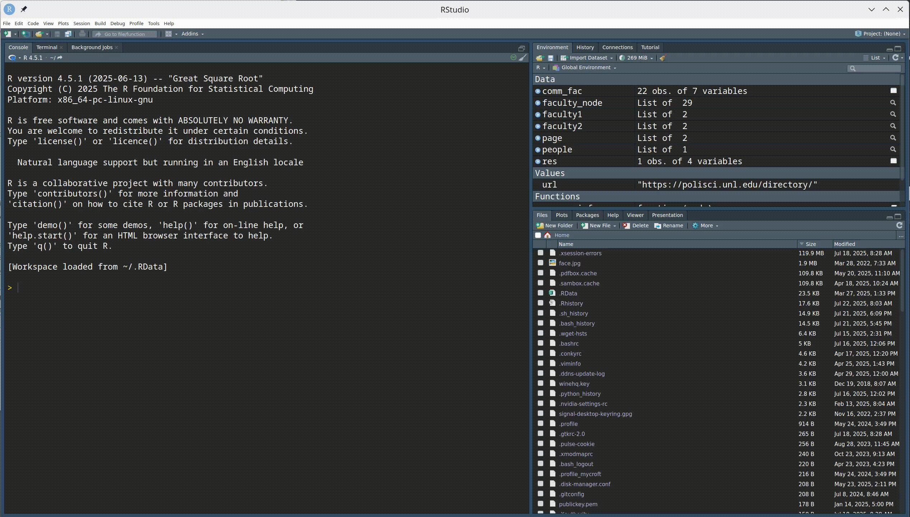

```{r}
#| echo: false
#| message: false
#| warning: false
#| warning: false
# source(here::here("knitr-setup.R"))
# source(here::here("libraries.R"))
library(shiny)
library(bsicons)
library(showtext)
library(ragg)
library(thematic)
```

# Shiny Apps in R

- `shiny` package developed and supported by RStudio (Winston Chang, Joe Cheng, JJ Allaire and others)
- Resources for shiny: https://shiny.rstudio.com/: 
    - [Gallery](https://shiny.rstudio.com/gallery/) of great examples,
    - [Tutorials](https://shiny.rstudio.com/tutorial/) at different levels

```{r}
#| eval: !expr F
# Additional packages for Shiny
install.packages(c("bsicons", "showtext", "ragg", "thematic"))
remotes::install_github("rstudio/bslib") # Get the latest version
```


```{r}
#| echo: false
#| warning: false
#| message: false
knitr::opts_chunk$set(
  message = FALSE,
  warning = FALSE,
  collapse = TRUE,
  comment = "#>",
  fig.height = 4,
  fig.width = 8,
  fig.align = "center",
  cache = FALSE
)
#library(tidyverse)
library(tidyr)
library(dplyr)
library(ggplot2)
library(readr)
```

## Next five minutes

- Create a new shiny app in RStudio
- Run it
- Stop it

## Create your first app {.inverse}

- In RStudio, `File` menu, `New file`, `Shiny web app` to start a new app
- The easiest start is the `Single file`, which will put both server and ui functions in the same file, `app.R`

{width="50%" fig-alt="A gif showing how to create a new Shiny web app, using the instructions above" .lightbox}

## Two main parts

::: columns
::: column
- What we see and interact with: 
  - user interface: layout with user input and (plot) output
```{r}
#| eval: !expr F
ui <- fluidPage(
)
```

:::

::: column
- What is going on underneath: 
  - the server: glue between user input and output

```{r}
server <- function(input, output, session) {
}
```

:::
:::

## A Minimal Example

```{r}
#| eval: false
#| echo: !expr T
library(shiny)

ui <- fluidPage(
)

server <- function(input, output, session) {
}

shinyApp(ui, server)
```


## A bit more fancy

```{r}
#| eval: false
#| echo: !expr T
library(shiny)
sidebar <-  sidebarPanel(width = 3, "Fun inputs")

main_col <- column(width = 9, "Some results")

ui <- fluidPage(
  title = "App Title",
  sidebar, 
  main_col
)

server <- function(input, output, session) {
}

shinyApp(ui, server)
```

## A bit more fancy

```{r}
#| eval: false
#| echo: !expr T
library(shiny)
sidebar <-  sidebarPanel(
  width = 3, 
  textInput("name", "Enter your name:", value = "Susan")
)

main_col <- column(width = 9, "Some results")

ui <- fluidPage(
  title = "App Title",
  sidebar, 
  main_col
)

server <- function(input, output, session) {
}

shinyApp(ui, server)
```

## Shiny Inputs {.smaller}

Shiny has many different input options, see the [widget gallery](https://shiny.rstudio.com/gallery/widget-gallery.html):

- `actionButton()` - creates a clickable button
- `selectInput()` create a select list 
- `checkboxInput()` and `checkboxGroupInput()`
- `dateInput()` - calendar to select a date
- `dateRangeInput()` - select a range of dates
- `fileInput()` - upload a file
- `numericInput()` - input a numeric value
- `radioButtons()` - select one or more items
- `sliderInput()` - slide along a range of values
- `textInput()` - input a string

## Your Turn {.inverse}

Add a list of your favorite countries to the sidebar panel:

```{r}
#| eval: false
#| echo: !expr T
library(shiny)

sidebar <-  sidebarPanel(
  width = 3, 
  textInput("name", "Enter your name:", value = "Susan")
)

main_col <- column(width = 9, "Some results")

ui <- fluidPage(
  title = "App Title",
  sidebar, 
  main_col
)

server <- function(input, output, session) {
}

shinyApp(ui, server)
```

```{r}
#| label: your-turn-solution
#| echo: false
#| eval: false

library(shiny)

sidebar <-  sidebarPanel(
  width = 3, 
  selectInput(
    "country", "Pick your favorite country:", 
    choices = c("Australia", "Brazil", "China"))
)

main_col <- column(width = 9, "Some results")

ui <- fluidPage(
  title = "App Title",
  sidebar, 
  main_col
)

server <- function(input, output, session) {
}

shinyApp(ui, server)
```

::: {.content-visible when-format="revealjs"}
`r countdown::countdown(5)`
:::

## Adding Output

- Output needs to be specified in two places: 
  - in the `ui` function we need to create a placeholder to reserve space for the output
  - in the `server` function, we need to create the output.


1. `ui` components are usually `xxxOutput (outputID)`    
Output can be in form of tables, plots, text, ...

2. `server` components are `renderXXX`, where `xxx` is a table, plot, text, etc.


## Shiny Outputs {.smaller}

Shiny also has a variety of different output options:

- `renderDataTable()` - outputs an interactive, sortable data table
- `htmlOutput()` - output html elements
- `renderPlot()` - output an R plot
- `renderPrint()` - output text from print() in R
- `renderTable()` - output an HTML table
- `renderText()` - output text from R
- `renderUI()` - output a custom part of the user interface
- `renderImage()` - print an image to the page

## Adding a plot {.smaller}

```{r}
#| eval: false
#| echo: !expr T
#| code-line-numbers: "13-16,23-27"
#| class-source: "numberLines"
library(shiny)
library(ggplot2)
library(dplyr)

sidebar <-  sidebarPanel(
  width = 3, 
  selectInput(
    "country", "Pick your favorite country:", 
              choices = c("Australia", "Brazil", "China")
  )
)

main_col <- column(                               #<<
  width = 9,                                      #<<
  plotOutput("scatter")                           #<<
)                                                 #<<

ui <- fluidPage(
  title = "App Title", sidebar, main_col
)

server <- function(input, output, session) {
  output$scatter <- renderPlot({                  #<<
    mtcars %>% ggplot(aes(x = disp, y = mpg)) +   #<<
      geom_point() +                              #<<
      ggtitle(input$country)                      #<<
  })                                              #<<
}

shinyApp(ui, server)
```

## Your turn {.inverse}

- Add an interactive plot of the TB data into your app.
- Change the select box, so that the user can choose any country. Think of `unique(tb$country)` for defining the choices


::: {.content-visible when-format="revealjs"}
`r countdown::countdown(7)`
:::

```{r}
#| label: your-turn-solutions-2
#| echo: false
#| eval: false
library(shiny)
library(ggplot2)
library(dplyr)
library(tidyr)
tb <- read.csv(
  here::here(
    "data/TB_notifications_2025-07-22.csv"
  )
)

sidebar <-  sidebarPanel(
  width = 3, 
  selectInput(
    "country", "Pick a country:", 
    choices = unique(tb$country),
    multiple = TRUE,
    selected = "United States of America")
)

main_col <- column(
  width = 9, 
  plotOutput("scatter", height = "600px")
)

ui <- fluidPage(
  title = "App Title",
  sidebar, main_col
)

server <- function(input, output, session) {
  output$scatter <- renderPlot({
    tb %>% 
      filter(country %in% input$country) %>% 
      pivot_longer(new_sp_m04:new_sp_fu, 
                   values_to="cases", names_to="sex_age") %>%
      filter(!is.na(cases)) %>%
      ggplot(aes(x = year, y = cases)) + 
      geom_line(aes(colour=sex_age)) +
      facet_grid(country~.)
  })
}

shinyApp(ui, server)
```


## Deploy an app

- Sign up for an account on [https://www.shinyapps.io/](https://www.shinyapps.io/)
- Authenticate your account
- You may need to do some setup in your session, e.g. install the library `rsconnect`


## Resources

- [RStudio Tutorial](http://shiny.rstudio.com/tutorial/)  
- [Deploy your app for others to use](https://www.shinyapps.io/)
- [Shiny Setup, Showcase, and Server](http://shiny.rstudio.com)  
- [Community discussion](https://community.rstudio.com)


::: bottom
<span style="display:inline-block;"><a rel="license" href="http://creativecommons.org/licenses/by-nc-sa/4.0/"></a></span><span style="display:inline-block;"> This work is licensed under a <a rel="license" href="http://creativecommons.org/licenses/by-nc-sa/4.0/">Creative Commons Attribution-NonCommercial-ShareAlike 4.0 International License</a>.</span>
:::

