```{r, echo = FALSE, message = FALSE, warning = FALSE, warning = FALSE}
source(here::here("knitr-setup.R"))
source(here::here("libraries.R"))
```


# Elements of Reactivity
::: columns
::: column

- Sources
    - Any input widget is a source<br/>
- Conductors
    - Use input and pass values to another component<br/>
- Observers
    - Any output is an observer
    
:::
::: column
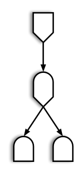
:::
:::

## Two Conductors

- Reactive expressions and reactive events are two types of conductors<br/>
- Reactive expressions are the archetypical conductor: <br/>
    - envelope functionality used in multiple places of an app
    - run evaluations only once
    - store current values
    - update when inputs change<br/>
- Reactive events are only triggered by specific events (e.g. click on an action button)

## Reactive Expressions

```{r, eval = F}
rval <- reactive({
  ...
})
```

Called like a function as `rval()`

- Reactive expressions are executed **lazily** and values are **cached**<br/><br/>
- **Lazy**: Evaluated on demand as requested by a reactive endpoint<br/><br/>
- **Cached**: (re-)evaluated only when the value of a dependency changed


## Reactive Events

```{r, eval = F}
rval <- eventReactive(actionbutton, {
  ...
})
```

Called like a function as `rval()`

- reactive events are executed even more **lazily**<br/><br/>
    - only on demand<br/><br/>
    - requested by an actionButton (usually)
    
## Example: Submission Form

::: columns
::: column
- In RStudio open file `app.R` in `03_submission`<br/><br/>
- Run the app (a couple of times) <br/><br/>
- Turn on showcase mode:    
```{r eval = F}
runApp("code/3.3-apps/03_submission/", 
       display.mode = "showcase")
```
:::
::: column
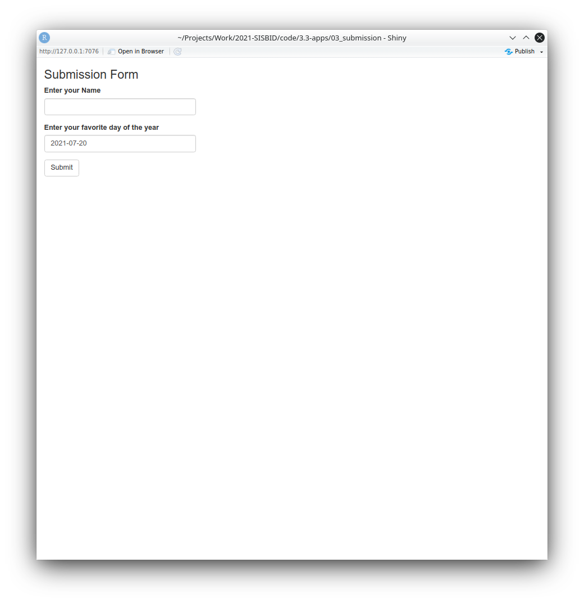

:::
:::

## Your turn {.inverse}

::: columns
::: column
- Open the file `03_submission.R`
- The package `colourpicker` implements a color wheel as an input widget
- Allow users to change the color of the dots in the dot plot
- What other interactive elements can you think of adding?

Answers are in `03b_submission.R`
:::
::: column


::: {.content-visible when-format="revealjs"}
`r countdown::countdown(5)`
:::

:::
:::

## Conditional Panels

::: columns
::: column


:::
::: column
- Showing a color picker before it is needed could confuse app users <br/><br/>
- `conditionalPanel(condition, ...)` allows us to encapsulate elements of the UI and only show them when `condition` is fulfilled<br/><br/>
- Here, a condition of `condition = 'input.submit > 0'` is true when the submit button was pressed at least once.<br/><br/>
- This is implemented in `03c_submission.R`
:::
:::

## App Layout

::: columns
::: column
- The body is laid out using a responsive grid
    - responsive: adapts to different screen sizes
    - different on a cell phone than a laptop
    - boxes are rearranged automatically
- Structure is introduced by cards

```{r, eval = F}
card1 <- card(
  card_header("Hi, I'm a card"),
  class = "bg-primary",
  "I contain some information - ",
  "text, plot, image, input area...",  
  "your choice!")
```

:::
::: column


:::
:::

## Cards

::: columns
::: column
[`04_layout.R`]{.move-up .center .huge}    

- Cards help with structuring output
- Cards have a `class` parameter 
    - `bg-xxx` produces a colored box
    - `border-xxx` produces a box with a colored outline
    - `card_header(..., class = "bg-xxx")` produces a box with a colored header
    - `?validStatuses`, represented by `xxx` above, are `primary`, `secondary`, `success`, `info`, `warning`, `danger`, `light`, `dark`

:::
::: column
[]{.move-up}
:::
:::

## Nested Layouts

::: columns
::: column
- Body is wrapped in a `page_fillable` function
- Cards are aligned using columns
- Additional rows can be created by nesting `layout_columns()` functions

```{r, eval = F}
body <- page_fillable(
  layout_columns(
    col_widths = c(2, 4, 4, 2), # 12 cols per row
    row_heights = "600px",
    card1,
    layout_columns(card2, card3, card5,
                   col_widths = c(12, 12, 12),
                   row_heights = "auto"),
    card4, card6)
)
```
:::
::: column
[`04_layout2.R`]{.move-up .center .huge}    

:::
:::

## Nested Layouts

::: columns
::: column
- Body is wrapped in a `page_fillable` function
- Cards are aligned using columns
- Additional rows can be created by nesting `layout_columns()` functions

```{r, eval = F}
body <- page_fillable(
  layout_columns(
    col_widths = c(2, 4, 4, 2), # 12 cols per row
    row_heights = "600px",
    card1,
    layout_columns(card2, card3, card5,
                   col_widths = c(12, 12, 12),
                   row_heights = "auto"),
    card4, card6)
)
```
:::
::: column
[`04_layout2.R`]{.move-up .center .huge}    

:::
:::

## Other Layouts

- `page_fillable()` has different behavior from `page_fluid()` and `page_fixed()` - see [this article](https://rstudio.github.io/bslib/articles/filling.html) for more information about fillable containers.
- `page_navbar()` can be used to create tabs across the top (more on this in a minute)
    - `sidebar()` allows for common inputs across all tabs
- `layout_column_wrap()` can accomplish some [very neat tricks](https://rstudio.github.io/bslib/articles/column-layout.html)    
```{r, eval = F}
layout_column_wrap(
  width = NULL, height = 300, fill = FALSE,
  style = css(grid_template_columns = "2fr 1fr 2fr"),
  card1, card2, card3
)
```

- [Shiny UI Editor](https://rstudio.github.io/shinyuieditor/) is currently in Alpha but allows UI creation without writing code


## Tab Layouts

```{r xaringan-panelset, echo=FALSE}
xaringanExtra::use_panelset()
```
Code: 05_tabsets.R
[
[[tab1]{.panel-name}
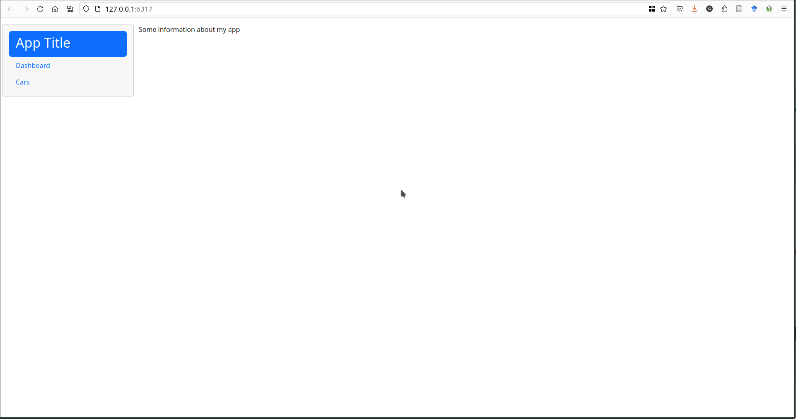
]{.panel}
[[tab2]{.panel-name}
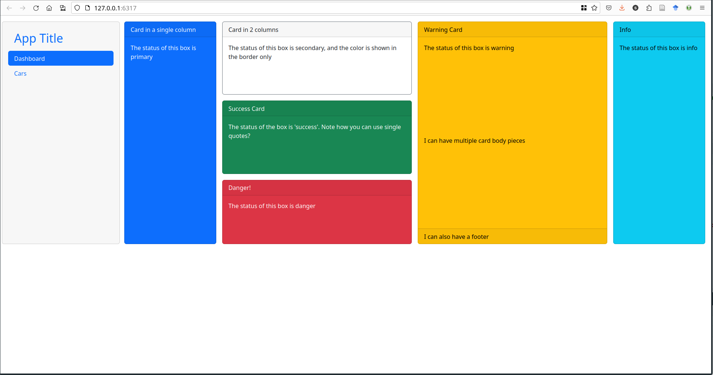
]{.panel}
[[tab3]{.panel-name}
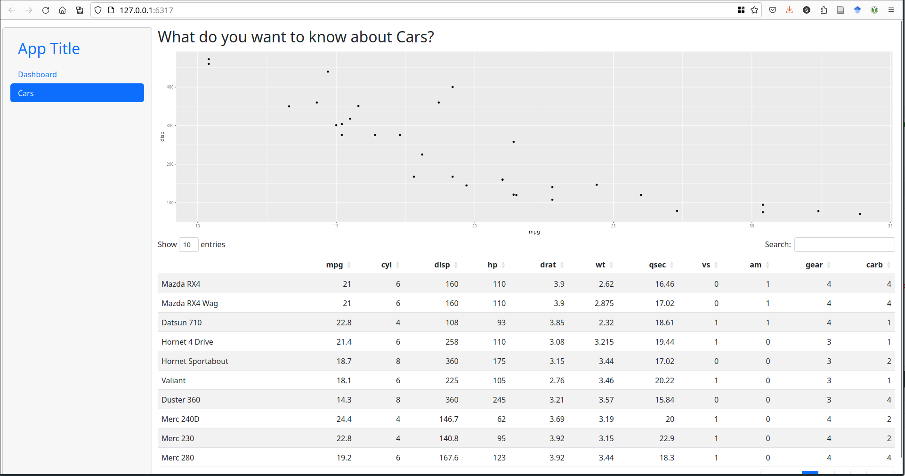
]{.panel}
]{.panelset.sideways}


## Tabs 
- Different options for multi-page applets:
[
[[`navset_tab()`]{.panel-name}
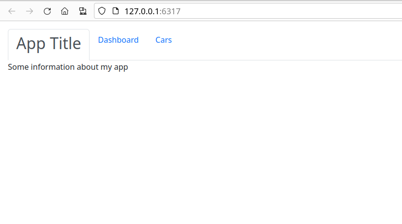
]{.panel}
[[`navset_pill()`]{.panel-name}
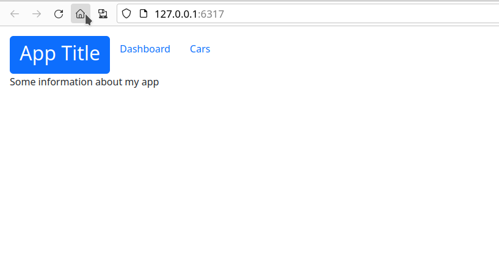
]{.panel}
[[`navset_bar()`]{.panel-name}
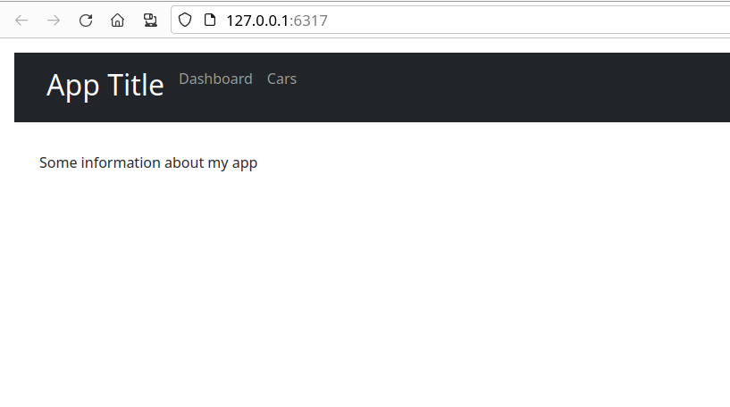
]{.panel}
[[`navset_pill_list()`]{.panel-name}
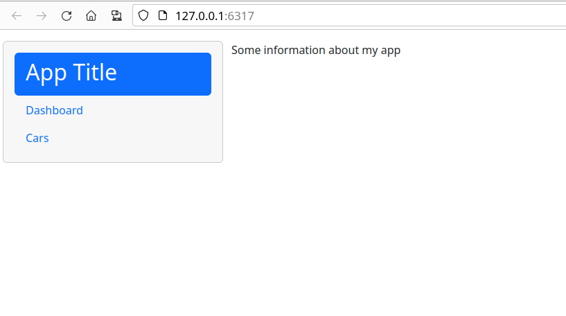
]{.panel}
[[`navset_card_tab()`]{.panel-name}
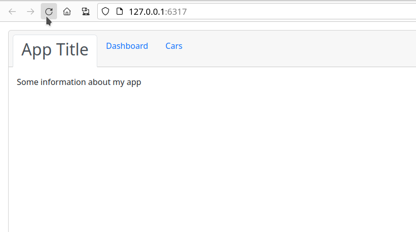
]{.panel}
[[`navset_card_pill()`]{.panel-name}
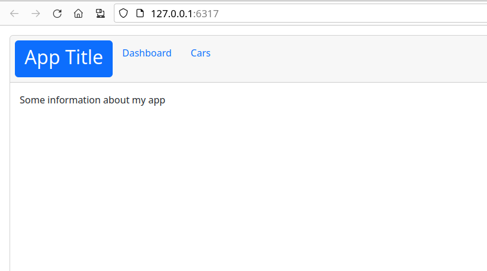
]{.panel}
]{.panelset.sideways}


## Your Turn {.inverse}

Modify the code in `05_tabsets.R` to use a `page_navbar()`. 

- What modifications do you have to make?
- Can you add a sidebar using the `sidebar()` function?

::: {.content-visible when-format="revealjs"}
`r countdown::countdown(5)`
:::

## Resources

- RStudio Tutorial: https://shiny.rstudio.com/articles/reactivity-overview.html<br/><br/>
- Shiny Cheat Sheet: https://raw.githubusercontent.com/rstudio/cheatsheets/master/shiny.pdf<br/><br/>
- Gallery of Shiny Apps: https://shiny.rstudio.com/gallery/
- bslib documentation: https://rstudio.github.io/bslib/


::: bottom
<span style="display:inline-block;"><a rel="license" href="http://creativecommons.org/licenses/by-nc-sa/4.0/"></a></span><span style="display:inline-block;"> This work is licensed under a <a rel="license" href="http://creativecommons.org/licenses/by-nc-sa/4.0/">Creative Commons Attribution-NonCommercial-ShareAlike 4.0 International License</a>.</span>
:::

