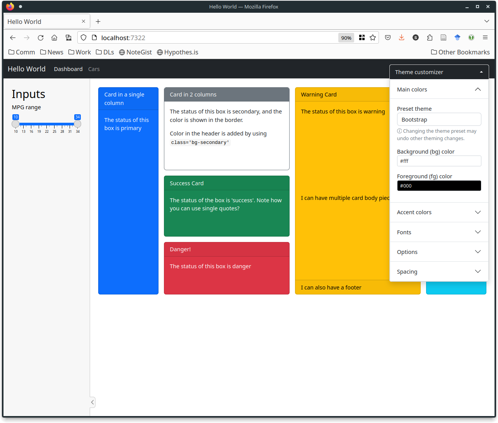
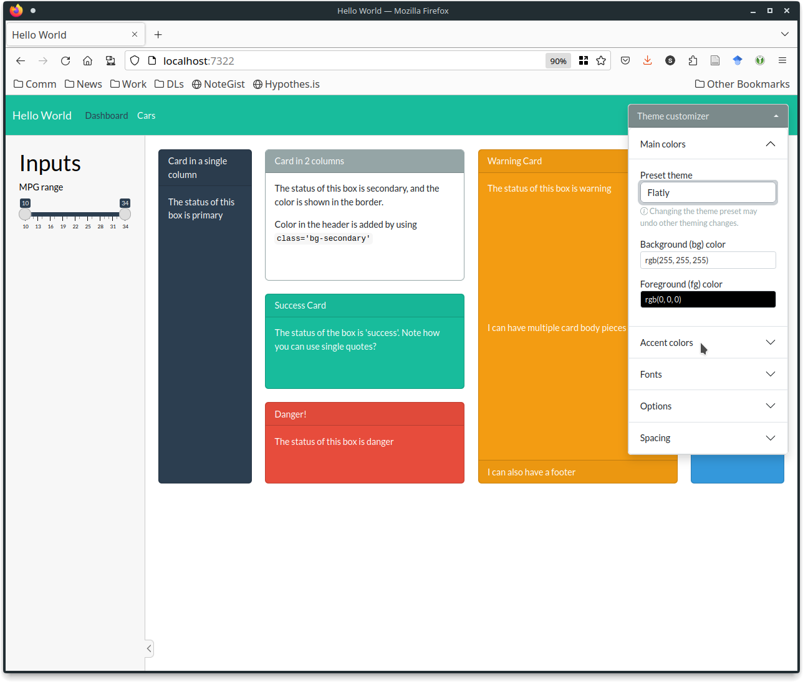
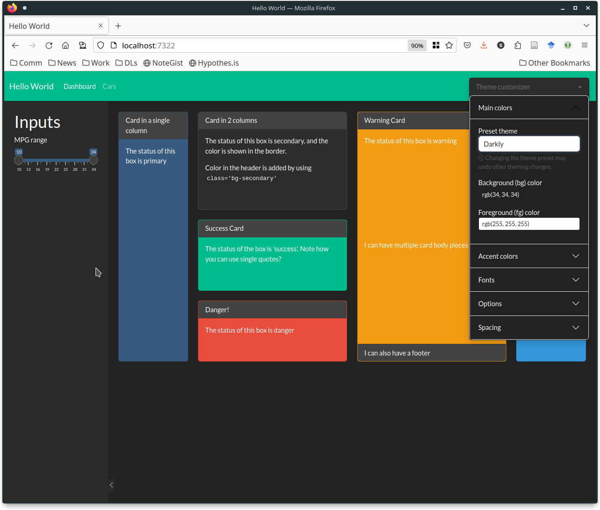
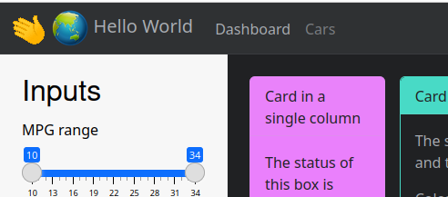
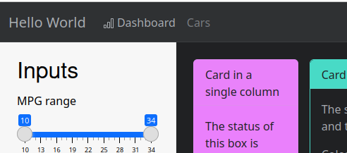
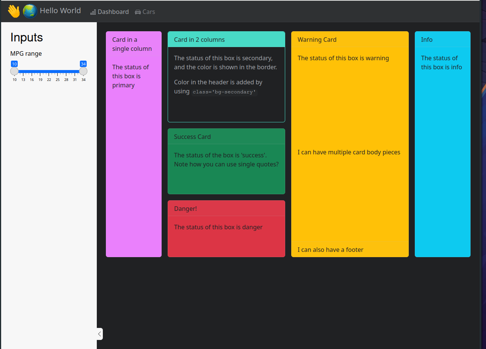
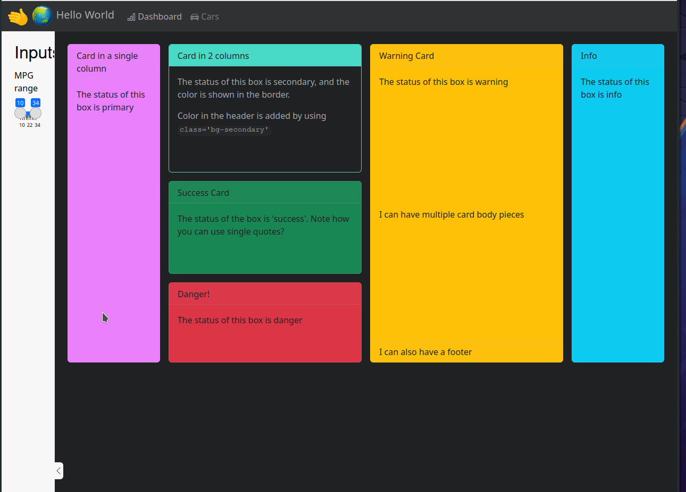
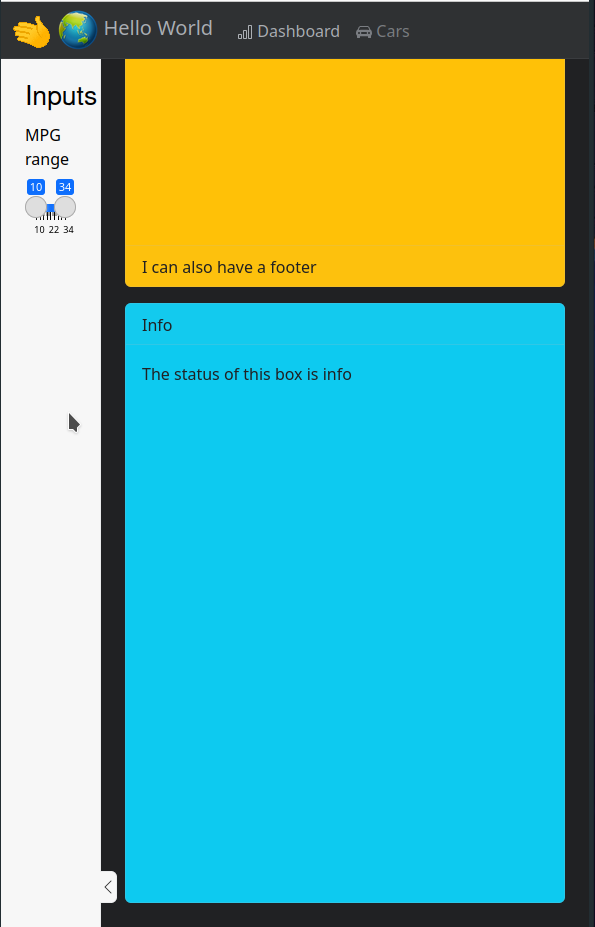

```{r, echo = FALSE, message = FALSE, warning = FALSE, warning = FALSE}
# source(here::here("knitr-setup.R"))
# source(here::here("libraries.R"))
```

## Theming your Shiny App

- `bslib` has many options available for theming and customizing your app <br/><br/>
- We'll cover the easily available options here<br/><br/>
    - Exponentially more powerful with CSS and a bit of tinkering

## Preset Themes


- Bootswatch provides preset themes
- `bs_themer()` lets you choose interactively

Try it out in `code/3.4-theme/bs_themer.R`

::: {layout-ncol=3}






:::

## Your Turn {.inverse .smaller}

- Run the code in `code/3.4-theme/bs_themer.R`
- Pick a theme you like. 
- Get the console output corresponding to that theme
- modify `bs_themed.R` to use your theme code

Hint: Use the `theme = ...` argument in one of the `page_xxx` functions.


::: {.content-visible when-format="revealjs"}
`r countdown::countdown(5)`
:::

## Customizing Your Navbar

- You may want to add a logo to your title area
- pictures should be placed in the `www/` folder

::: columns
::: column
```{r, eval = F}
title = div(
  img(src = "wave.gif", 
      width = "40px"),
  img(src = "globe.png", 
      width = "40px"),
  "Hello World", 
  style = "display: inline;"),
```
:::
::: column

:::
:::

## Adding Icons

- You can add icons to your `nav_panels()` with the `icon` argument
    - [Bootstrap Icons](https://icons.getbootstrap.com/) 
    - Match the version of Bootstrap your app uses
    
::: columns
::: column
```{r, eval = F}
nav_panel(
  title = "Dashboard", body, 
  icon = bs_icon("bar-chart", 
                 a11y = "deco") 
  # marks icon as decorative 
  # for screen readers
),
```
:::
::: column

:::
:::

## Your Turn {.inverse}

Customize the title and icons on the `nav_panels` in `title_customization.R`.

Choose appropriate icons and decide if they are decorative or semantic. 

::: {.content-visible when-format="revealjs"}
`r countdown::countdown(5)`
:::

## Change the width of the sidebar

```{r eval = F, echo = T}
#| code-line-numbers: "2"
#| class-source: "numberLines"
side <- sidebar(
  width = "20%", h2("Inputs"), #<<
  sliderInput(
    "mpg", label = "MPG range", step = 1, value = range(mtcars$mpg)
    min = min(floor(mtcars$mpg), na.rm = T), max = max(ceiling(mtcars$mpg), na.rm = T),
))
```

::: {layout-ncol=4}






 
:::


## Resources

- [Theming](https://shiny.posit.co/r/getstarted/build-an-app/customizing-ui/theming.html) Shiny documentation
- [Shiny Apps with bslib](https://ploomber.io/blog/shiny-bslib/)
- [Unified Theming with brand.yml](https://rstudio.github.io/bslib/articles/brand-yml/index.html)
- [Professional Interface Development](https://www.datanovia.com/learn/tools/shiny-apps/ui-design/index.html)


::: bottom
<span style="display:inline-block;"><a rel="license" href="http://creativecommons.org/licenses/by-nc-sa/4.0/"></a></span><span style="display:inline-block;"> This work is licensed under a <a rel="license" href="http://creativecommons.org/licenses/by-nc-sa/4.0/">Creative Commons Attribution-NonCommercial-ShareAlike 4.0 International License</a>.</span>
:::
