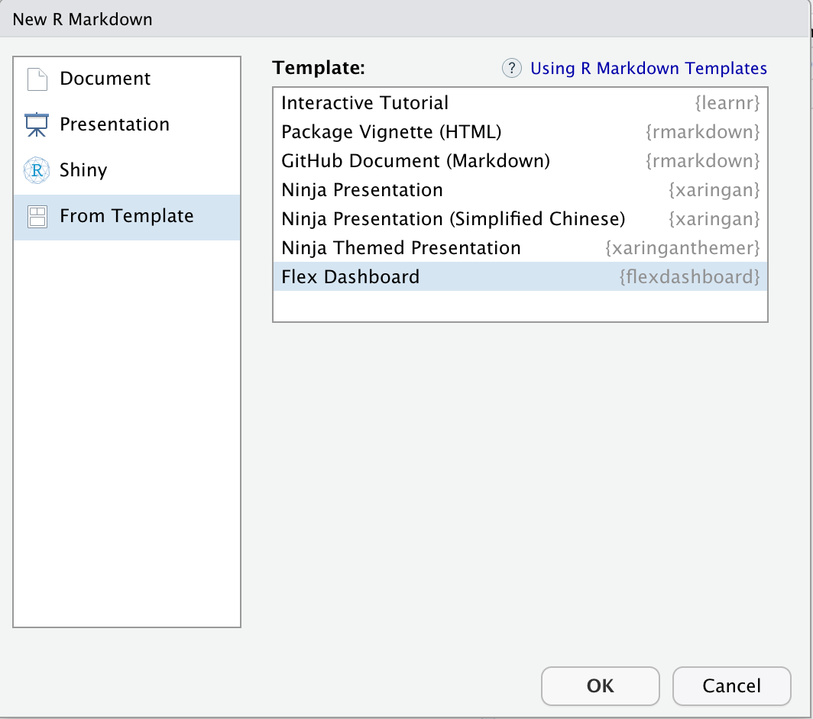
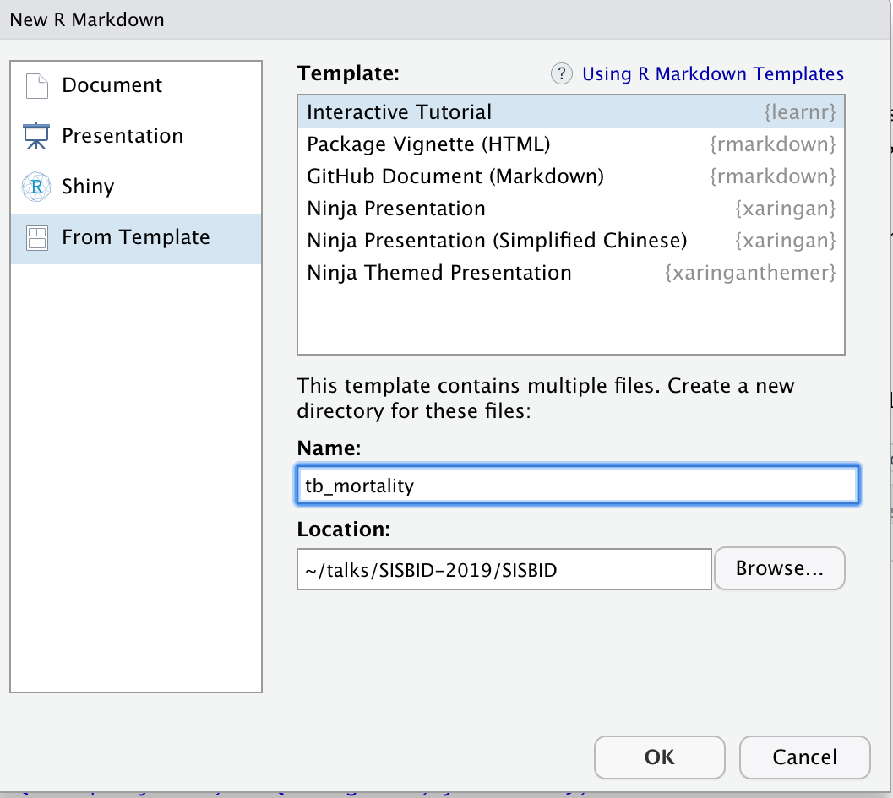

```{r, echo = FALSE, message = FALSE, warning = FALSE, warning = FALSE}
source(here::here("knitr-setup.R"))
source(here::here("libraries.R"))
```

```{r load packages, echo=FALSE}
#library(tidyverse)
library(ggplot2)
library(ggmap)
library(plotly)
library(gganimate)
```

## Data dashboard {.inverse}

A dashboard is a `rmarkdown` format `shiny` app. It adds more control over plot elements and is more focused on the data analysis than on a study or instructional materials. 

## Data dashboard {.smaller}

::: columns
::: column
A dashboard 

- allows you to create an interactive interface to a data set
- communicates a lot of information visually and numerically
- provides flexibility for the user to explore their own choice of aspects of the data.

Make sure you have the `flexdashboard` package installed on your computer.

```{r, eval = F}
install.packages("flexdashboard")
```
:::
::: column
Create a "New R Markdown" document -> "Interactive"

{width="80%"}
:::
:::

## Basic dashboard {.smaller}

- Check that the document compiles, by clicking `Knit`
- Modify the title and author 

````
---
title: "TB incidence around the globe"
author: "by Di Cook"
output: 
  flexdashboard::flex_dashboard:
    orientation: columns
    vertical_layout: fill
---
````

## Components  {.smaller}

This creates a box or a pane for a plot or results

````{md}
### Chart 1
````

This sets up columns

````{md}
Column {data-width=600}
-------------------------------------
````

## Your turn! {.inverse .smaller}

- Change the default layout in your flexdashboard to have two plots in the left column.
- Make each column equal width
- Pick four countries and create the interactive chart of temporal trend. 
- Change the tab titles to reflect what country is displayed.
- Add several sentences on each pane about the data, and some things they should learn about TB incidence in that country.


## Adding pages and tabs  {.smaller}

A new page (tab) can be added using

````
Page 1
===================================== 
````

Add a second page to your flexdashboard that focuses on one country and has

- a data table showing counts for year, age, sex 
- a facetted barchart of counts by year, by age and sex

## Upload your dashboard to your shiny.apps.io account {.inverse .middle}


## Interactive tutorial {.inverse}

A set of notes with interactive plots, quizzes, and coding exercises.

## `learnr` interactive tutorial {.smaller}

::: columns
::: {.column width="75%"}
- Simple way to build plots into an online document
- Features:
    - interactive multiple choice quizzes, 
    - coding exercises, 
    - incorporate interactive shiny elements like scrollbars on plots

`r emo::ji("stop_sign")` To get started, make sure you have the `learnr` package installed on your computer.

```
install.packages("learnr")
```

`r emo::ji("white_check_mark")` Then create a new "R Markdown" document, "From Template", "Interactive Tutorial". 
:::
::: {.column width="25%"}
{width="100%"}
:::
:::

## Basic tutorial  {.smaller}

`r emo::ji("stop_sign")`  Check that the document compiles, by clicking `Run Document`

`r emo::ji("white_check_mark")` Modify the title and author 

```{md}
---
title: "TB Incidence Around the Globe"
author: "Di Cook"
output: learnr::tutorial
runtime: shiny_prerendered
---
```

`r emo::ji("stop_sign")`  Check that the document compiles, by clicking `Run Document`

## Write the first section  {.smaller}

`r emo::ji("white_check_mark")` Set the first section to be a description of the data

```{md}
## Data description

This is current tuberculosis data taken from [WHO](http://www.who.int/tb/country/data/download/en/), 
the case notifications table. The data looks like this:
```

`r emo::ji("stop_sign")`  Check that the document compiles, by clicking `Run Document`

`r emo::ji("white_check_mark")` Create a `data` directory in your tutorial folder, and add the `TB_burden_countries_2025-07-22.csv` data into this. 

## Basic Tutorial {.smaller}

`r emo::ji("white_check_mark")` Next, add a block of R code to read the data, and display the data in the page.    
Here, we use the `DT` package to display the data in the output html. 

```{r eval=F, echo = T}
library(tidyverse)
library(DT)
tb <- read_csv(here::here("data/TB_burden_countries_2025-07-22.csv")) |> 
  select(country, iso3, year, e_inc_100k) 

datatable(tb)
```

`r emo::ji("stop_sign")`  Check that the document compiles, by clicking `Run Document`

## Add a plot  {.smaller}

`r emo::ji("white_check_mark")` Make a separate section titled "Incidence", and add the code to make a plot, like the following

```{r, eval=F}
ggplot(tb, aes(x=year)) +
  geom_bar(aes(weight = e_inc_100k)) +
  xlab("") +
  ylab("TB incidence per 100k")
```

`r emo::ji("stop_sign")`  Check that the document compiles, by clicking `Run Document`

## Polishing the data description  {.smaller}

Loading the libraries generates some messages and warnings on the page.

This is good interactively, but distracting in the finished page. 

```
## ── Attaching packages ──────────────────────────────────────────── tidyverse 1.2.1 ──
## ✔ ggplot2 3.2.0     ✔ purrr   0.3.2
## ✔ tibble  2.1.3     ✔ dplyr   0.8.3
...
## Google's Terms of Service: https://cloud.google.com/maps-platform/terms/.
## Please cite ggmap if you use it! See citation("ggmap") for details.
## Warning: Removed 619 rows containing missing values (geom_point).
```

We need to change the setup chunk options to turn these off:

## Polishing the data description  {.smaller}

```{r, eval = F}
library(learnr)
knitr::opts_chunk$set(
  echo = FALSE,
  message = FALSE, 
  warning = FALSE,
  error = FALSE)
```

`r emo::ji("stop_sign")`  Check that the document compiles, by clicking `Run Document`

## Building quizzes {.smaller}

:::: {.columns}
::: {.column}

An example quiz is provided in the template. Note that the format of the R code is 

- `quiz()` wraps a set of questions.
- `question()` contains the text of the question, and is coupled with multiple `answer()` elements with possible choices. 
- At least one of the answers needs to be noted as correct with `, correct = TRUE`. There can be more than one correct answer. 
:::
::: {.column}
```{r, eval = F}
quiz(
  question("Which package contains functions for installing other R packages?",
    answer("base"),
    answer("tools"),
    answer("utils", correct = TRUE),
    answer("codetools")
  )
)
```

`r anicon::nia("Try making a question about the TB data on the Incidence tab.", colour="#FA700A", anitype="hover")`

`r emo::ji("stop_sign")`  Check that the document compiles, by clicking `Run Document`
:::
::::

## Exercises in coding {.smaller}

Adding `exercise = TRUE` on a code chunk provides an R console window where readers can type R code, and check for correctness. 

1. Move these into a second section of the document. 
2. Add a coding challenge that asks the reader to make a filter for the data to select just a single year. Click the "Run document" to make sure it works
3. Add a hint, "you want to use the filter function" 
4. Change the hint to a solution, that provides the correct code

`r emo::ji("stop_sign")`  Check that the document compiles, by clicking `Run Document`

## Adding a shiny element  {.smaller}

Because this is an html document, interactive graphics can be incorporated.     
We'll add a section to use interactive plots to examine the temporal trend in TB incidence. 

```{r, eval=F}
library(plotly)
p <- tb |> 
  filter(iso3 %in% c("AUS", "USA", "CAN", "KEN", "IND", "COL", "ASM")) |>
  ggplot() +
    geom_point(aes(x=iso3, y=e_inc_100k, frame=year))
ggplotly(p)
```

`r emo::ji("stop_sign")`  Check that the document compiles, by clicking `Run Document`

## Styling and cuteness  {.smaller}

Use your emoji and anicon skills to add some friendly elements to the notes. 

```{r, eval=F}
set.seed(20190709)
emo::ji("fantasy")
emo::ji("clock")
```

```{r, eval=F}
anicon::nia("You've got 30 seconds!", colour="#FA700A", anitype="hover")
anicon::faa("hand-paper", animate="spin", grow=20, color="#B78ED2",
  position=c(0,0,0,200))
```

`r emo::ji("stop_sign")`  Check that the document compiles, by clicking `Run Document`

## Upload your tutorial to your shiny.apps.io account {.inverse .middle .center}

## Resources  {.smaller}

- [Introducing learnr, Garret Grolemund](https://blog.rstudio.com/2017/07/11/introducing-learnr/)
- [flexdashboard: Easy interactive dashboards for R](https://rmarkdown.rstudio.com/flexdashboard/)
- [R Markdown](https://rmarkdown.rstudio.com/)
- [Interactive web-based data visualization with R, plotly, and shiny, Carson Sievert](https://plotly-r.com/index.html)


::: bottom
<span style="display:inline-block;"><a rel="license" href="http://creativecommons.org/licenses/by-nc-sa/4.0/"></a></span><span style="display:inline-block;"> This work is licensed under a <a rel="license" href="http://creativecommons.org/licenses/by-nc-sa/4.0/">Creative Commons Attribution-NonCommercial-ShareAlike 4.0 International License</a>.</span>
:::

