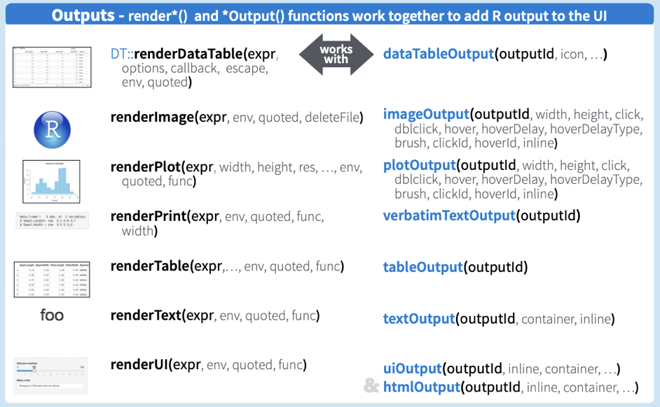

```{r, echo = FALSE, warning = FALSE, message = FALSE}
knitr::opts_chunk$set(
  message = FALSE,
  warning = FALSE,
  collapse = TRUE,
  comment = "#>",
  fig.height = 4,
  fig.width = 8,
  fig.align = "center",
  cache = FALSE
)
library(tidyverse)
```
# Example: An app on exploring Covid-19 reproduction rates and cases

https://hofmann.shinyapps.io/covid-predict/

---
# Next five minutes

- Create a new shiny app in RStudio
- Run it
- Stop it

---
class: inverse middle 
# Create your first app

- In RStudio, `File` menu, `New file`, `Shiny web app` to start a new app
- The easiest start is the `One file`, which will put both server and ui functions in the same file, `app.R`

---
# Two main parts

- What we see and interact with: <br/><br/>
  - user interface: layout with user input and (plot) output <br/><br/>
- What is going on underneath: <br/><br/>
  - the server: glue between user input and output
  
---
# A Minimal Example

```{r eval = FALSE}
library(shiny)

ui <- fluidPage(
)

server <- function(input, output, session) {
}

shinyApp(ui, server)
```


---
# A bit more fancy

```{r eval = FALSE}
library(shiny)
library(shinydashboard)

ui <- dashboardPage(
  dashboardHeader(),
  dashboardSidebar(),
  dashboardBody()
)

server <- function(input, output, session) {
}

shinyApp(ui, server)
```
---
# A bit more fancy

```{r eval = FALSE}
library(shiny)
library(shinydashboard)

sidebar <- dashboardSidebar(
  textInput("name", "Enter your name:", value = "Heike")
)

ui <- dashboardPage(
  dashboardHeader(),
  sidebar = sidebar,
  dashboardBody()
)

server <- function(input, output, session) {
}

shinyApp(ui, server)
```
---

# Shiny Inputs

Shiny has many different [input options](https://shiny.rstudio.com/tutorial/written-tutorial/lesson3/):

- `actionButton()` - creates a clickable button
- `selectInput()` create a select list 
- `checkboxInput()` and `checkboxGroupInput()`
- `dateInput()` - calendar to select a date
- `dateRangeInput()` - select a range of dates
- `fileInput()` - upload a file
- `numericInput()` - input a numeric value
- `radioButtons()` - select one or more items
- `sliderInput()` - slide along a range of values
- `textInput()` - input a string

---
class: inverse
# Your Turn

In the shiny app below add a list of your favorite states to the sidebar panel:

```{r eval=FALSE}
library(shiny)
library(shinydashboard)

sidebar <- dashboardSidebar(
  textInput("name", "Enter your name:", value = "Heike")
)

ui <- dashboardPage(
  dashboardHeader(),
  sidebar = sidebar,
  dashboardBody()
)

server <- function(input, output, session) {
}

shinyApp(ui, server)
```
```{r echo=FALSE, eval=FALSE}
sidebar <- dashboardSidebar(
  textInput("name", "Enter your name:", value = "Heike"),
  selectInput("state", "Pick your favorite state:", 
              choices = c("Iowa", "Washington", "Michigan"))
)

ui <- dashboardPage(
  dashboardHeader(),
  sidebar = sidebar,
  dashboardBody()
)

server <- function(input, output, session) {
}

shinyApp(ui, server)
```

`r countdown::countdown(5)`

---
# Adding Output

- Output typically goes into the body of an app
- Output functions have the form
  `xxxOutput (outputID)`
- Output can be in form of tables, plots, text, ...

---
# Shiny Outputs

Shiny also has many output options:

- `renderDataTable()` - outputs an interactive, sortable data table
- `htmlOutput()` - output html elements
- `renderPlot()` - output an R plot
- `renderPrint()` - output text from print() in R
- `renderTable()` - output an HTML table
- `renderText()` - output text from R
- `renderUI()` - output a custom part of the user interface
- `renderImage()` - print an image to the page

---
# Adding a plot 

```{r eval=FALSE}
sidebar <- dashboardSidebar(
  textInput("name", "Enter your name:", value = "Heike"),
  selectInput("state", "Pick your favorite state:", 
              choices = c("Iowa", "Washington", "Michigan"))
)

ui <- dashboardPage(
  dashboardHeader(),
  sidebar = sidebar,
  dashboardBody()
)

server <- function(input, output, session) {
}

shinyApp(ui, server)
```

```{r echo=FALSE, eval=FALSE}
sidebar <- dashboardSidebar(
  textInput("name", "Enter your name:", value = "Heike"),
  selectInput("state", "Pick your favorite state:", 
              choices = c("Iowa", "Washington", "Michigan"))
)

body <- dashboardBody(
  plotOutput("scatter")
)

ui <- dashboardPage(
  dashboardHeader(),
  sidebar = sidebar,
  body = body
)

server <- function(input, output, session) {
  output$scatter <- renderPlot({
    mtcars %>% ggplot(aes(x = disp, y = mpg)) + 
      geom_point() +
      ggtitle(input$state)
  })
}

shinyApp(ui, server)
```

---
class: inverse middle 
# Your turn

- Add an interactive plot of the TB data into your app.
- Change the select box, so that the user can choose a country to display. Think of `unique(tb$country)` for defining the choices

`r countdown::countdown(7)`

```{r echo=FALSE, eval=FALSE}
library(ggplot2)
library(dplyr)
tb <- read_csv(here::here("data/tb.csv"))
sidebar <- dashboardSidebar(
  selectInput("country", "Pick a country:", 
              choices = unique(tb$iso2))
)

body <- dashboardBody(
  plotOutput("scatter")
)

ui <- dashboardPage(
  dashboardHeader(),
  sidebar = sidebar,
  body = body
)

server <- function(input, output, session) {
  output$scatter <- renderPlot({
    tb %>% filter(iso2 == input$country) %>% 
      pivot_longer(m_04:f_u, 
                   values_to="cases", names_to="sex_age") %>%
      filter(!is.na(cases)) %>%
      ggplot(aes(x = year, y = cases)) + 
      geom_line(aes(colour=sex_age)) 
  })
}

shinyApp(ui, server)
```

---
# Output in an app



---
# Deploy an app

- Sign up for an account on [https://www.shinyapps.io/](https://www.shinyapps.io/)
- Authenticate your account
- You may need to do some setup in your session, e.g. install the library `rsconnect`


---
# Resources

- [RStudio Tutorial](http://shiny.rstudio.com/tutorial/)  
- [Deploy your app for others to use](https://www.shinyapps.io/)
- [Shiny Setup, Showcase, and Server](http://shiny.rstudio.com)  
- [Community discussion](https://community.rstudio.com)

---
# Share and share alike

<a rel="license" href="http://creativecommons.org/licenses/by-nc-sa/4.0/"></a><br />This work is licensed under a <a rel="license" href="http://creativecommons.org/licenses/by-nc-sa/4.0/">Creative Commons Attribution-NonCommercial-ShareAlike 4.0 International License</a>.
