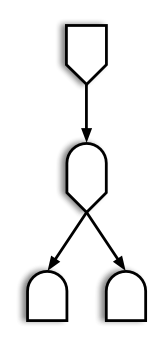
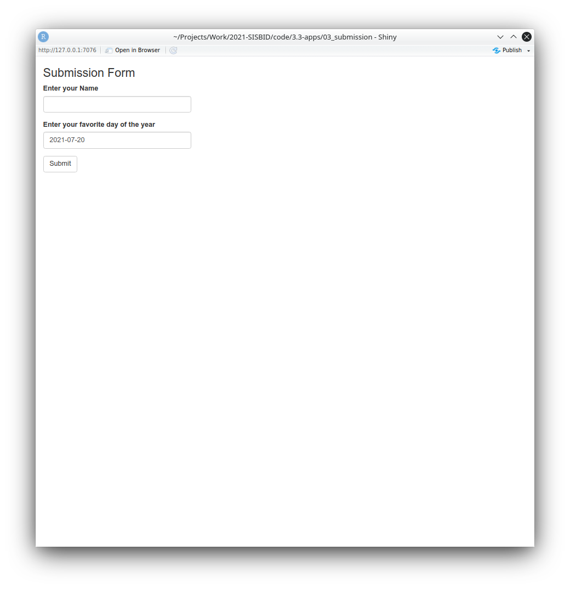
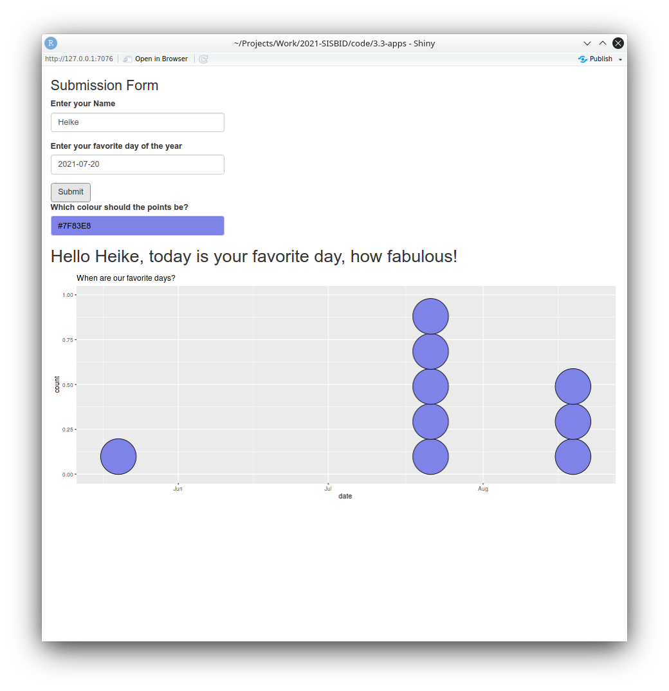
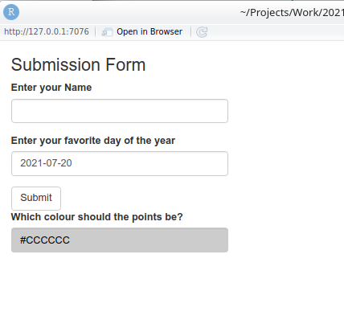
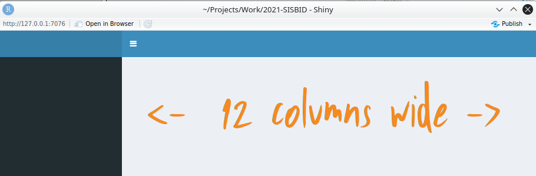
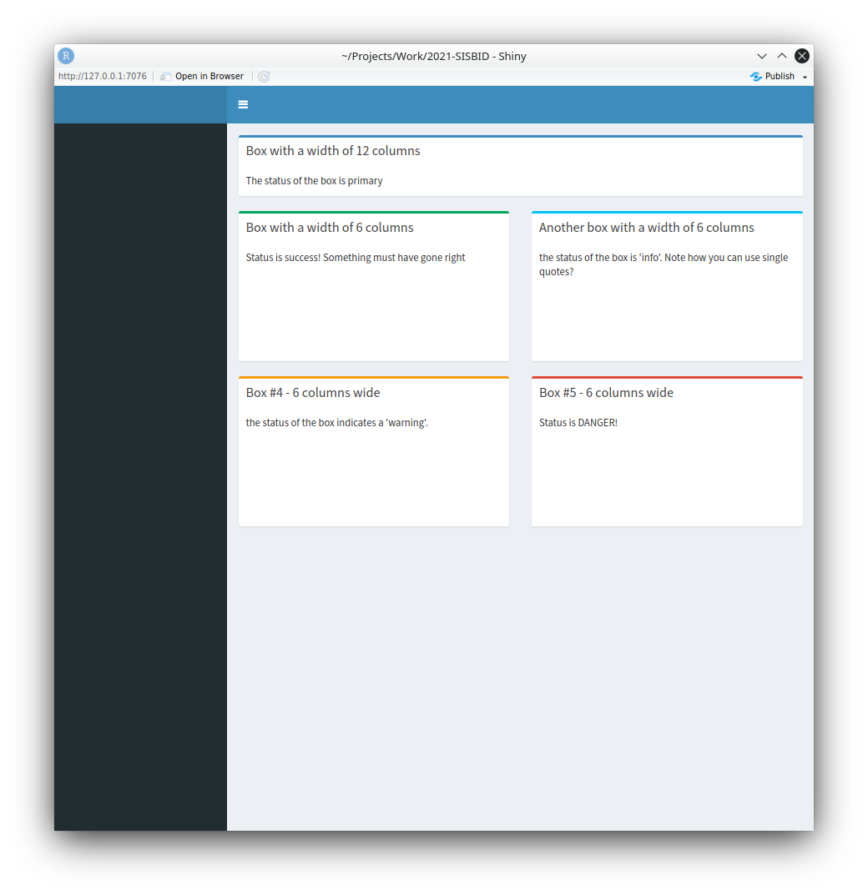
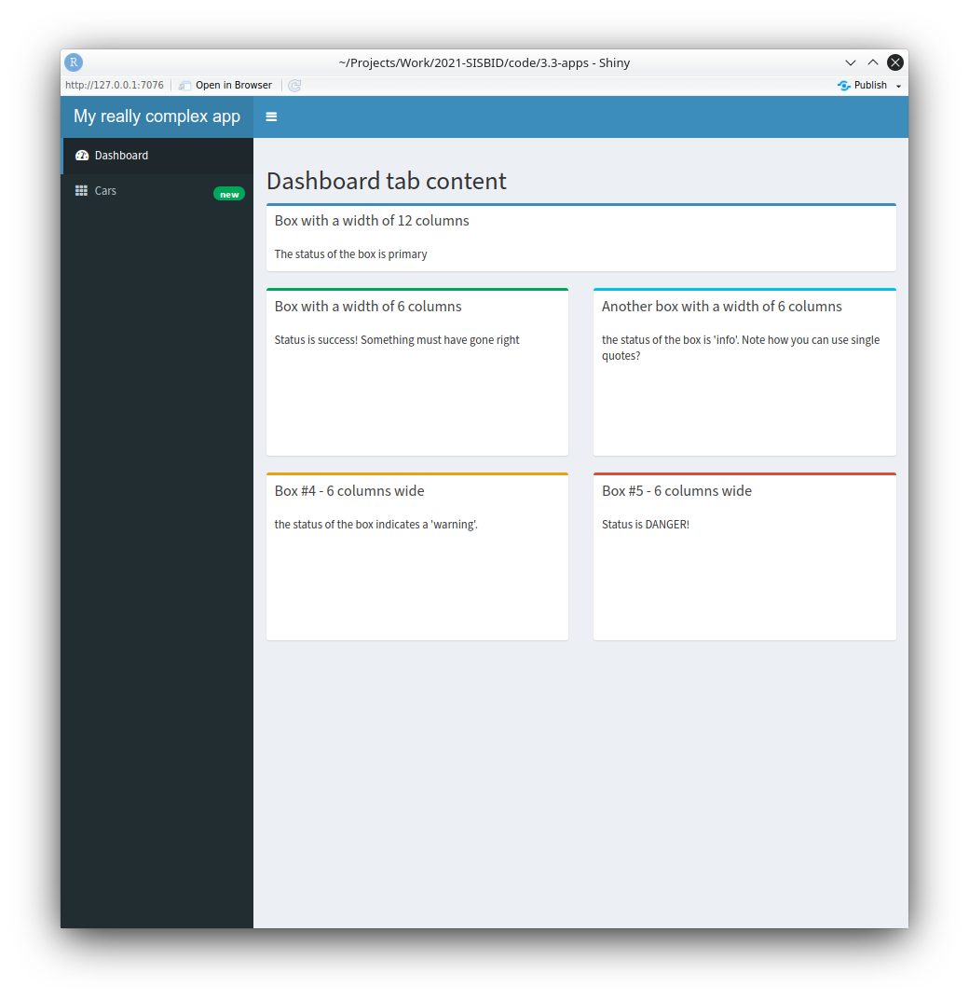
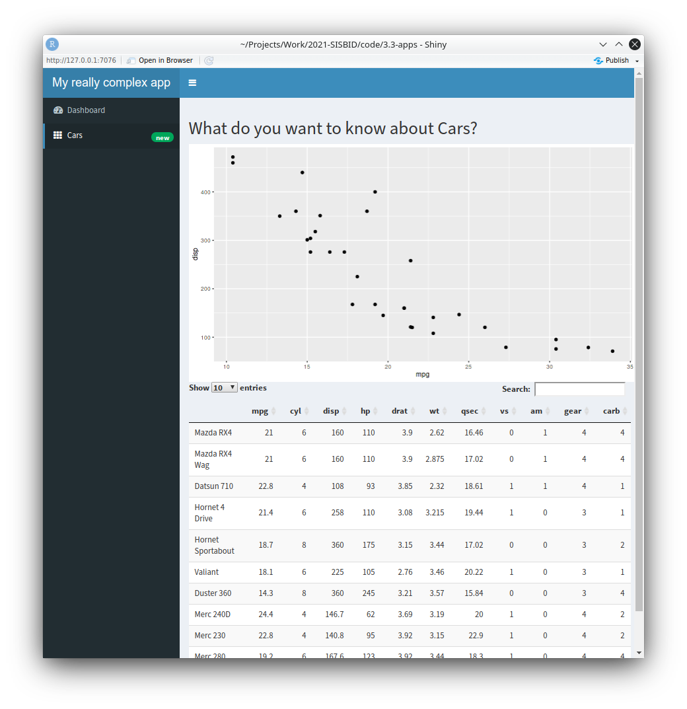
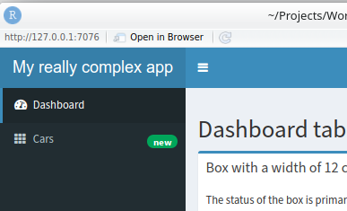

```{r, echo = FALSE, warning = FALSE, message = FALSE}
knitr::opts_chunk$set(
  message = FALSE,
  warning = FALSE,
  collapse = TRUE,
  comment = "#>",
  fig.height = 4,
  fig.width = 8,
  fig.align = "center",
  cache = FALSE
)
library(tidyverse)
```


# Elements of Reactivity

.pull-left[
- Sources
    - Any input widget is a source<br/><br/>
- Conductors
    - Use input and pass values to another component<br/><br/>
- Observers
    - Any output is an observer
]
.pull-right[

]

---
# Two Conductors

- Reactive expressions and reactive events are two types of conductors<br/><br/>
- Reactive expressions are the archetypical conductor: <br/><br/>
    - envelope functionality used in multiple places of an app
    - run evaluations only once
    - store current values
    - update when inputs change<br/><br/>
- Reactive events are only triggered by specific events (e.g. click on an action button)

---
# Reactive Expressions

```{r, eval = F}
rval <- reactive({
  ...
})
```

Called like a function as `rval()`

- Reactive expressions are executed **lazily** and values are **cached**<br/><br/>
- **Lazy**: Evaluated on demand as requested by a reactive endpoint<br/><br/>
- **Cached**: (re-)evaluated only when the value of a dependency changed


---
# Reactive Events

```{r, eval = F}
rval <- eventReactive(actionbutton, {
  ...
})
```

Called like a function as `rval()`

- reactive events are executed even more **lazily**<br/><br/>
    - only on demand<br/><br/>
    - requested by an actionButton (usually)
    
---
# Example: Submission Form

.pull-left[
- In RStudio open file `app.R` in `03_submission`<br/><br/>
- Run the app (a couple of times) <br/><br/>
- Turn on showcase mode:    
```{r eval = F}
runApp("03_submission/", display.mode = "showcase")
```
]
.pull-right[

]


---
class: inverse middle 
# Your turn

.pull-left[
- Open the file `03_submission.R`
- The package `colourpicker` implements a color wheel as an input widget
- Allow users to change the color of the dots in the dot plot
- What other interactive elements can you think of adding?

Answers are in `03b_submission.R`
]
.pull-right[

]
`r countdown::countdown(5)`


---
# Conditional Panels

.left-column[


]
.right-column[
- Showing a color picker before it is needed could confuse app users <br/><br/>
- `conditionalPanel(condition, ...)` allows us to encapsulate elements of the UI and only show them when `condition` is fulfilled<br/><br/>
- Here, a condition of `condition = 'input.submit > 0'` is true when the submit button was pressed at least once.<br/><br/>
- This is implemented in `03c_submission.R`
]

---
# Layout of Dashboards

.pull-left[
- The body can be laid out in a grid - either row based or column based<br/><br/>
- Structure is introduced by boxes    
```{r, eval = F}
box(..., title = NULL, width = 6, height = NULL)
```



]
.pull-right[

]

---
# Boxes

.pull-left[
- Boxes help with structuring output<br/><br/>
- Boxes have a `status` parameter 
    - a colored bar along the top of a box
    - `?validStatuses` are `primary`, `success`, `info`, `warning`, `danger`
]
.pull-right[
.move-up[]
]

---
# Row Based Layout

.pull-left[
- Body is wrapped in a `fluidRow` function<br/><br/>
- Tops of boxes are aligned<br/><br/>
- Bottom of the boxes can be aligned by setting height in pixels<br/><br/>

```{r, eval = F}
body <- dashboardBody(
  fluidRow(
    box(title = "Box with a width of 12 columns", 
        width = 12),
    box(title = "Box with a width of 6 columns", 
        width = 6, height = 200),
    box(title = "Another box with a width of 6 cols", 
        width = 6, height = 200), ...
  )
)
```
]
.pull-right[
.move-up.center.huge[`04_layout.R`]    

]

---
# Other Layouts

- In **column** based layouts, the body is wrapped in a fluidRow function <br/><br/>
    - Height of boxes are aligned<br/><br/>
    - Each column has to define a width<br/><br/>
    - Boxes are aligned in width<br/><br/>
- In **mixed** layouts fluidRow and column can be used sequentially


---
# Tabs in Dashboards 

- `05_tabsets.R`
- The sidebar menu can be used to introduce tabs for quick navigation

.pull-left[

].pull-right[

]

---
# Tabs in Dashboards
.right-column[
```{r, eval = F}
sidebar <- dashboardSidebar(
  sidebarMenu(
    menuItem("Dashboard", tabName = "dashboard", 
             icon = icon("dashboard")),
    menuItem("Cars", icon = icon("th"), tabName = "cars",
             badgeLabel = "new", badgeColor = "green")
  )
)
```
].left-column[
.move-up.move-up.huge[`05_tabsets.R`]


]

---
# Tabs in Dashboards
.right-column[
```{r, eval = F}

sidebar <- dashboardSidebar(
  sidebarMenu(
    menuItem("Dashboard", tabName = "dashboard", icon = icon("dashboard")),
    menuItem("Cars", icon = icon("th"), tabName = "cars",
             badgeLabel = "new", badgeColor = "green")
  )
)


body <- dashboardBody(
  tabItems(
    tabItem(tabName = "dashboard",
            h2("Dashboard tab content"),
            fluidRow(
              # Boxes
              ...
            )
    ),
    
    tabItem(tabName = "cars",
            h2("What do you want to know about Cars?"),
            plotOutput("myplot"),
            DTOutput("mytable")
    )
  )
)
```

].left-column[
.move-up.move-up.huge[`05_tabsets.R`]


]

---
# Resources

- RStudio Tutorial: https://shiny.rstudio.com/articles/reactivity-overview.html<br/><br/>
- Shiny Cheat Sheet: https://raw.githubusercontent.com/rstudio/cheatsheets/master/shiny.pdf<br/><br/>
- Gallery of Shiny Apps: https://shiny.rstudio.com/gallery/
