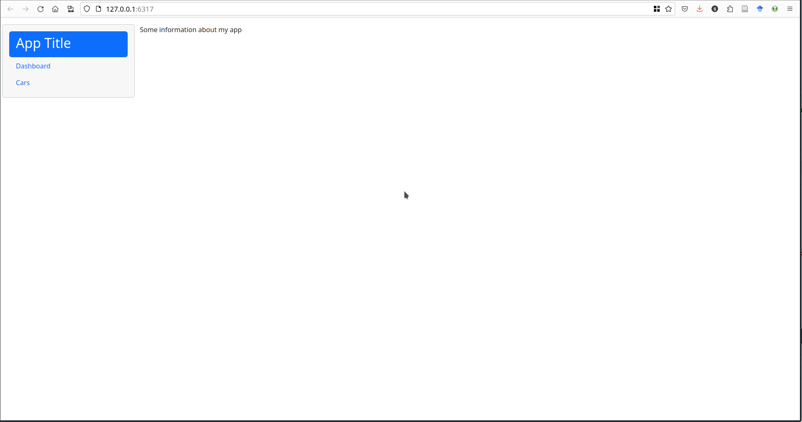

```{r, echo = FALSE, warning = FALSE, message = FALSE}
knitr::opts_chunk$set(
  message = FALSE,
  warning = FALSE,
  collapse = TRUE,
  comment = "#>",
  fig.height = 4,
  fig.width = 8,
  fig.align = "center",
  cache = FALSE
)
#library(tidyverse)
library(tidyr)
library(dplyr)
library(ggplot2)
library(readr)
library(xaringanExtra)

use_xaringan_extra(
  include = c("panelset")
)
```


# Elements of Reactivity

.pull-left[
- Sources
    - Any input widget is a source<br/><br/>
- Conductors
    - Use input and pass values to another component<br/><br/>
- Observers
    - Any output is an observer
]
.pull-right[

]

---
# Two Conductors

- Reactive expressions and reactive events are two types of conductors<br/><br/>
- Reactive expressions are the archetypical conductor: <br/><br/>
    - envelope functionality used in multiple places of an app
    - run evaluations only once
    - store current values
    - update when inputs change<br/><br/>
- Reactive events are only triggered by specific events (e.g. click on an action button)

---
# Reactive Expressions

```{r, eval = F}
rval <- reactive({
  ...
})
```

Called like a function as `rval()`

- Reactive expressions are executed **lazily** and values are **cached**<br/><br/>
- **Lazy**: Evaluated on demand as requested by a reactive endpoint<br/><br/>
- **Cached**: (re-)evaluated only when the value of a dependency changed


---
# Reactive Events

```{r, eval = F}
rval <- eventReactive(actionbutton, {
  ...
})
```

Called like a function as `rval()`

- reactive events are executed even more **lazily**<br/><br/>
    - only on demand<br/><br/>
    - requested by an actionButton (usually)
    
---
# Example: Submission Form

.pull-left[
- In RStudio open file `app.R` in `03_submission`<br/><br/>
- Run the app (a couple of times) <br/><br/>
- Turn on showcase mode:    
```{r eval = F}
runApp("03_submission/", display.mode = "showcase")
```
]
.pull-right[

]


---
class: inverse middle 
# Your turn

.pull-left[
- Open the file `03_submission.R`
- The package `colourpicker` implements a color wheel as an input widget
- Allow users to change the color of the dots in the dot plot
- What other interactive elements can you think of adding?

Answers are in `03b_submission.R`
]
.pull-right[

]
`r countdown::countdown(5)`


---
# Conditional Panels

.left-column[


]
.right-column[
- Showing a color picker before it is needed could confuse app users <br/><br/>
- `conditionalPanel(condition, ...)` allows us to encapsulate elements of the UI and only show them when `condition` is fulfilled<br/><br/>
- Here, a condition of `condition = 'input.submit > 0'` is true when the submit button was pressed at least once.<br/><br/>
- This is implemented in `03c_submission.R`
]

---
.pull-left[
# App Layout

- The body is laid out using a responsive grid
    - responsive: adapts to different screen sizes
    - different on a cell phone than a laptop
    - boxes are rearranged automatically
- Structure is introduced by cards

```{r, eval = F}
card1 <- card(
  card_header("Hi, I'm a card"),
  class = "bg-primary",
  "I contain some information - ",
  "text, plot, image, input area...",  
  "your choice!")
```


]
.pull-right[
.move-up[.move-up[]]


]

---
# Cards

.pull-left[
.move-up.center.huge[`04_layout.R`]    

- Cards help with structuring output<br/><br/>
- Cards have a `class` parameter 
    - `bg-xxx` produces a colored box
    - `border-xxx` produces a box with a colored outline
    - `card_header(..., class = "bg-xxx")` produces a box with a colored header
    - `?validStatuses`, represented by `xxx` above, are `primary`, `secondary`, `success`, `info`, `warning`, `danger`, `light`, `dark`

]
.pull-right[
.move-up[]
]

---
# Nested Layouts

.pull-left[
- Body is wrapped in a `page_fillable` function<br/><br/>
- Cards are aligned using columns<br/><br/>
- Additional rows can be created by nesting `layout_columns()` functions<br/><br/>

```{r, eval = F}
body <- page_fillable(
  layout_columns(
    col_widths = c(2, 4, 4, 2), # 12 cols per row
    row_heights = "600px",
    card1,
    layout_columns(card2, card3, card5,
                   col_widths = c(12, 12, 12),
                   row_heights = "auto"),
    card4, card6)
)
```
]
.pull-right[
.move-up.center.huge[`04_layout2.R`]    

]

---
# Nested Layouts

.pull-left[
- Body is wrapped in a `page_fillable` function<br/><br/>
- Cards are aligned using columns<br/><br/>
- Additional rows can be created by nesting `layout_columns()` functions<br/><br/>

```{r, eval = F}
body <- page_fillable(
  layout_columns(
    col_widths = c(2, 4, 4, 2), # 12 cols per row
    row_heights = "600px",
    card1,
    layout_columns(card2, card3, card5,
                   col_widths = c(12, 12, 12),
                   row_heights = "auto"),
    card4, card6)
)
```
]
.pull-right[
.move-up.center.huge[`04_layout2.R`]    

]

---
# Other Layouts

- `layout_column_wrap()` can accomplish some [very neat tricks](https://rstudio.github.io/bslib/articles/column-layout.html)    
```{r, eval = F}
layout_column_wrap(
  width = NULL, height = 300, fill = FALSE,
  style = css(grid_template_columns = "2fr 1fr 2fr"),
  card1, card2, card3
)
```

- [Shiny UI Editor](https://rstudio.github.io/shinyuieditor/) is currently in Alpha but allows UI creation without writing code
- `page_fillable()` has different behavior from `page_fluid()` and `page_fixed()` - see [this article](https://rstudio.github.io/bslib/articles/filling.html) for more information about fillable containers.

---
# Tab Layouts

```{r xaringan-panelset, echo=FALSE}
xaringanExtra::use_panelset()
```
Code: 05_tabsets.R
.panelset.sideways[
.panel[.panel-name[tab1]

]
.panel[.panel-name[tab2]

]
.panel[.panel-name[tab3]

]
]


---
# Tabs 
- Different options for multi-page applets:
.panelset.sideways[
.panel[.panel-name[`navset_tab()`]

]
.panel[.panel-name[`navset_pill()`]

]
.panel[.panel-name[`navset_bar()`]

]
.panel[.panel-name[`navset_pill_list()`]

]
.panel[.panel-name[`navset_card_tab()`]

].panel[.panel-name[`navset_card_pill()`]

]
]


---
# Resources

- RStudio Tutorial: https://shiny.rstudio.com/articles/reactivity-overview.html<br/><br/>
- Shiny Cheat Sheet: https://raw.githubusercontent.com/rstudio/cheatsheets/master/shiny.pdf<br/><br/>
- Gallery of Shiny Apps: https://shiny.rstudio.com/gallery/
- bslib documentation: https://rstudio.github.io/bslib/
