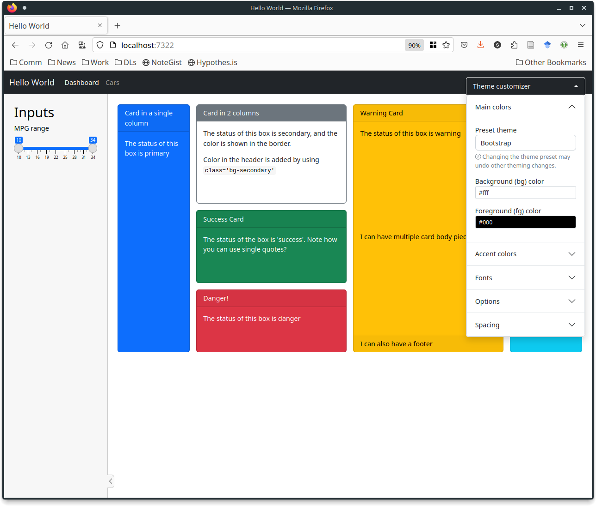
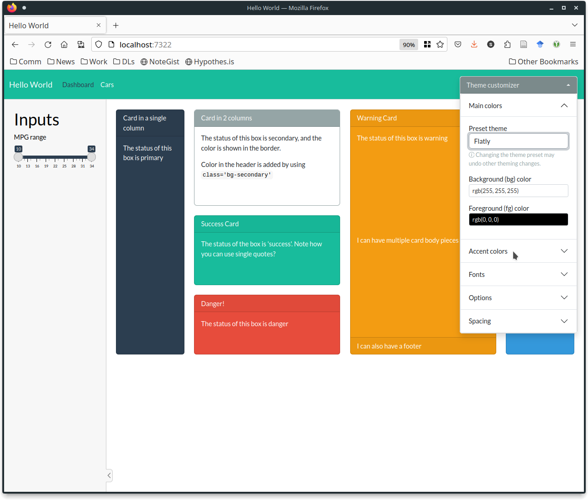
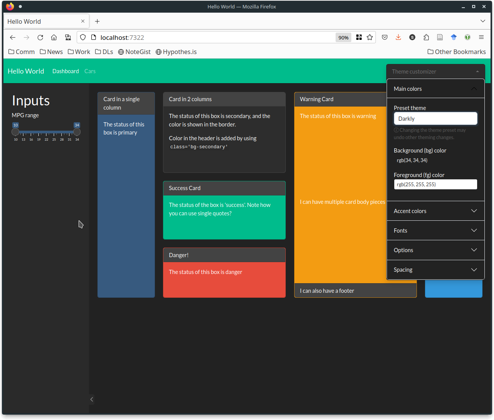
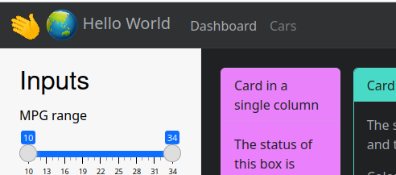
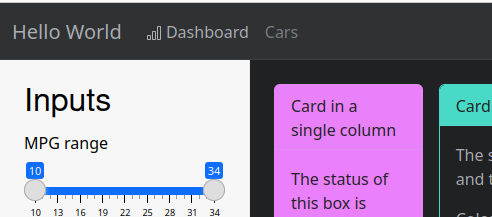
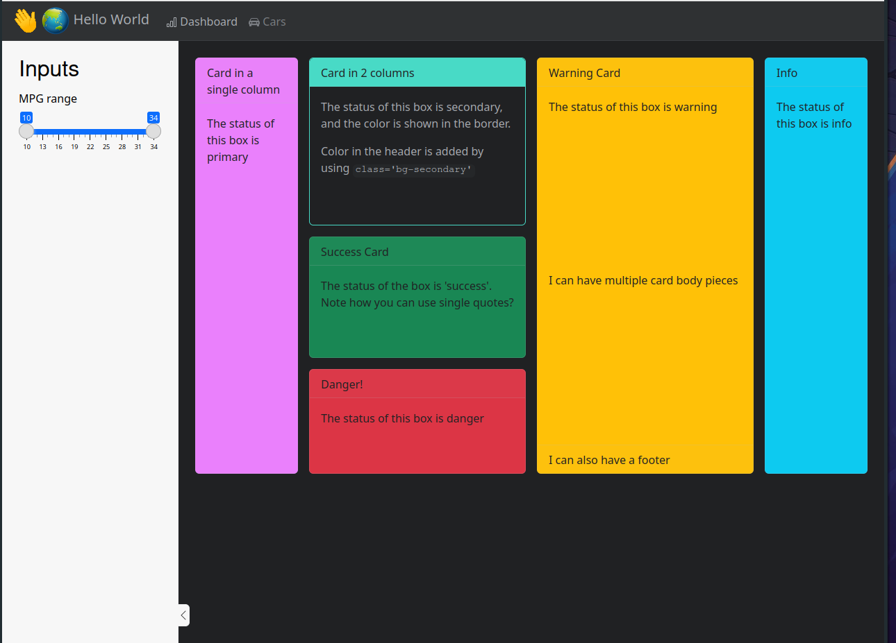
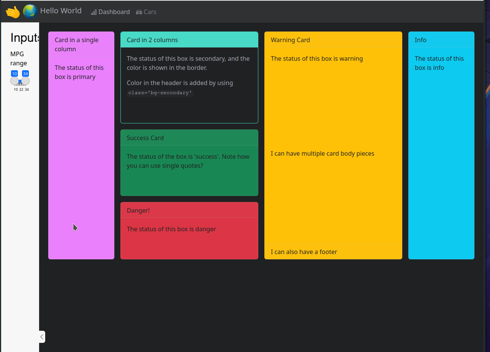
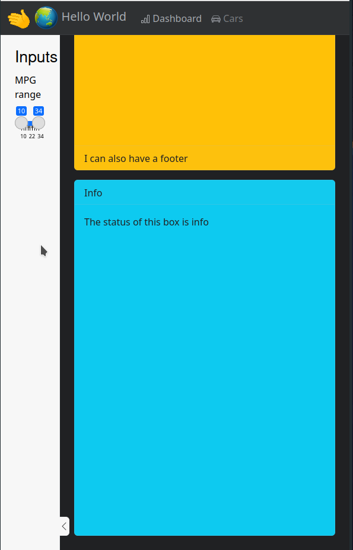

```{r, echo = FALSE, warning = FALSE, message = FALSE}
knitr::opts_chunk$set(
  message = FALSE,
  warning = FALSE,
  collapse = TRUE,
  comment = "#>",
  fig.height = 4,
  fig.width = 8,
  fig.align = "center",
  cache = FALSE
)
library(ggplot2)
library(shiny)
library(bslib)

xaringanExtra::use_xaringan_extra(
  include = c("panelset")
)
```

# Theming your Shiny App

- `bslib` has many options available for theming and customizing your app <br/><br/>
- We'll cover the easily available options here<br/><br/>
    - Exponentially more powerful with CSS and a bit of tinkering

---
# Preset Themes
.pull-left[
- Bootswatch provides preset themes
- `bs_themer()` lets you choose interactively

.center.large[`bs_themer.R`]
].pull-right[
.panelset.sideways[
.panel[.panel-name[default]

]
.panel[.panel-name[flatly]

]
.panel[.panel-name[darkly]

]
]
]

---
class: inverse middle
# Your Turn

Run the code in `bs_themer.R` and pick a theme you like. 

Get the console output corresponding to that theme and modify `bs_themed.R` to use your theme code.

Hint: Use the `theme = ...` argument in one of the `page_xxx` functions.


`r countdown::countdown(5)`

---
# Customizing Your Navbar

- You may want to add a logo to your title area
- pictures should be placed in the `www/` folder

.pull-left[
```{r, eval = F}
title = div(
  img(src = "wave.gif", width = "40px"),
  img(src = "globe.png", width = "40px"),
  "Hello World", style = "display: inline;"),
```
].pull-right[



]

---
# Adding Icons

- You can add icons to your `nav_panels()` with the `icon` argument
    - [Bootstrap Icons](https://icons.getbootstrap.com/) 
    - Match the version of Bootstrap your app uses
    

.pull-left[
```{r, eval = F}
nav_panel(
  title = "Dashboard", body, 
  icon = bs_icon("bar-chart", a11y = "deco") 
  # marks icon as decorative for screen readers
),
```
].pull-right[

]

---
class: inverse middle
# Your Turn

Customize the title and icons on the `nav_panels` in `title_customization.R`.

Choose appropriate icons and decide if they are decorative or semantic. 

`r countdown::countdown(5)`

---
# Change the width of the sidebar

```{r eval = F}
side <- sidebar(
  width = "20%",
  h2("Inputs"),
  sliderInput(
    "mpg", label = "MPG range",
    min = min(floor(mtcars$mpg), na.rm = T),
    max = max(ceiling(mtcars$mpg), na.rm = T),
    step = 1, value = range(mtcars$mpg))
)
```

.panelset.sideways[
.panel[.panel-name[10%]

]
.panel[.panel-name[20%]

]
.panel[.panel-name[100px]

]
.panel[.panel-name[100px (small window)]

]
]


---
# Share and share alike

<a rel="license" href="http://creativecommons.org/licenses/by-nc-sa/4.0/"></a><br />This work is licensed under a <a rel="license" href="http://creativecommons.org/licenses/by-nc-sa/4.0/">Creative Commons Attribution-NonCommercial-ShareAlike 4.0 International License</a>.
